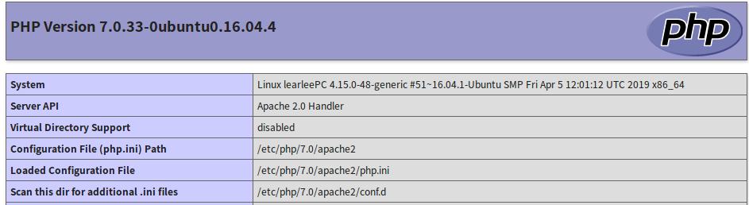
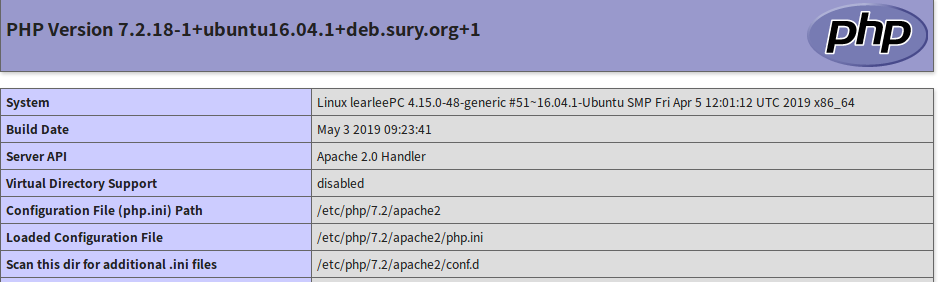

# 清理磁盘占用空间

- Step1：查看磁盘占用率 ```df -h```
- Step2：进入根目录```cd /```，执行```du -sm * | sort -n```（磁盘占用的升序排列） 或```du -h --max-depth=1```
- Step3：进入占用空间较大的目录，继续执行```du -sm * | sort -n```，删除不重要的文件(rm命令)

可能遇到的删除文件之后空间没有释放,极有可能是文件被占用所以没有释放空间。lsof -n|grep deleted 查找占用文件的应用。然后杀掉（kill -9 pid）对应进程让系统清掉数据。

```
du : 显示每个文件和目录的磁盘使用空间~~~文件的大小。
命令参数：
-a  #显示目录中文件的大小  单位 KB 。
-b  #显示目录中文件的大小，以字节byte为单位。
-c  #显示目录中文件的大小，同时也显示总和；单位KB。
-k 、 -m  、#显示目录中文件的大小，-k 单位KB，-m 单位MB.
-s  #仅显示目录的总值，单位KB。
-h  #以K  M  G为单位显示，提高可读性~~~（最常用的一个~也可能只用这一个就满足需求了）


df：显示磁盘分区上可以使用的磁盘空间
这里只记住两个参数就好：
-a  #查看全部文件系统，单位默认KB
-h  #使用-h选项以KB、MB、GB的单位来显示，可读性高~~~（最常用）
```

# linux程序被Killed，如何精准查看日志

- Step1: cd /var/log/

- Step2: dmesg | egrep -i -B100 'killed process' 或: egrep -i -r 'killed process' /var/log 或: journalctl -xb | egrep -i 'killed process'

**dmesg文件**过滤后输出如下：

Killed process 11935 (python3) total-vm:2601976kB, anon-rss:652292kB, file-rss:0kB, shmem-rss:0kB

参数说明：      
- total-vm：进程总共使用的虚拟内存； 
- anon-rss：虚拟内存实际占用的物理内存； 
- file-rss：虚拟内存实际占用的磁盘空间； 

```
OOM killer感念说明：

LINUX内核Out-Of-Memory killer机制是一种防止内存耗尽影响系统运行而采用的一种自我保护机制。
根据内核源码oom_kill.c中的定义，系统会依据“进程占用的内存”，“进程运行的时间”，“进程的优先级”，“是否为 root 用户进程“，”子进程个数和占用内存“，”用户控制参数oom_adj ”等计算一个oom_score值，分数越高就越会被内核优先杀掉。
```

# CouldNotGetLock

当使用apt-get的时候如果遇到如下问题：

```bash
E: Could not get lock /var/lib/dpkg/lock - open (11 Resource temporarily unavailable)
E: Unable to lock the administration directory (/var/lib/dpkg/) is another process using it? 
```

处理方案：

- Step 1：sudo lsof /var/lib/dpkg/lock 查找拥有该锁的进程，如查到不为空可以使用sudo kill -9 <PID> 
- Step 2：如果上一步是为空sudo rm /var/lib/dpkg/lock

```
参考链接：

https://blog.csdn.net/n66040927/article/details/81017658
http://www.mikewootc.com/wiki/linux/usage/ubuntu_service_usage.html

```

# 升级apt/apt-get安装程序

就 man apt-get 而言，apt-get upgrade 没有将软件包/软件包列表作为参数，所以就利用重新安装来解决或者Synaptic来处理

## 命令行方式

1. 确定版本号：sudo apt-cache policy name
2. 指定版本号安装：sudo apt-get install name=version
3. 重新安装：sudo apt-get install --reinstall ubuntu-desktop

## Synaptic

1. mark标记
2. 升级


# 完全卸载

安装一下软件后想卸载其和其相关软件可以使用以下办法

1. apt purge/remove 软件包名
2. Synaptic去标记经卸载的软件 然后点Apply
3. ```dpkg -l | grep -i {软件关键字} | awk '{print $2}' | xargs -n1 -I{} sudo apt -y purge {}```  #这个会把相关的全部都做卸载，所以慎用。  本人当时安装完mysql卸载不干净就是通这种方式把相关的全部卸载掉。同样的命令可以改成```dpkg -l | grep -i {软件关键字} | awk '{print $2}' | xargs -n1 -I{} sudo dpkg -P {} ```


# php在apahce2中使用的版本更换

问题描述

在命令行执行： php -r 'phpinfo();'显示如下：

```bash
phpinfo()
PHP Version => 7.2.18-1+ubuntu16.04.1+deb.sury.org+1

System => Linux learleePC 4.15.0-48-generic #51~16.04.1-Ubuntu SMP Fri Apr 5 12:01:12 UTC 2019 x86_64
Build Date => May  3 2019 09:23:41
Server API => Command Line Interface
Virtual Directory Support => disabled
Configuration File (php.ini) Path => /etc/php/7.2/cli
Loaded Configuration File => /etc/php/7.2/cli/php.ini
Scan this dir for additional .ini files => /etc/php/7.2/cli/conf.d
Additional .ini files parsed => /etc/php/7.2/cli/conf.d/10-mysqlnd.ini,

```
但在apache2 /var/www/html/phpinfo.php页面使用phpinfo()显示确是php7.0，详情见下图

```
sudo nano /var/www/html/phpinfo.php
  #Then type the content below and save the file.
  <?php phpinfo( ); ?>
```
 
 

## 解决分析过程

step1 : 确定系统有几个php： ```sudo update-alternatives --display php```

```bash
$ sudo update-alternatives --display php
php - manual mode
  link best version is /usr/bin/php7.2
  link currently points to /usr/bin/php7.2
  link php is /usr/bin/php
  slave php.1.gz is /usr/share/man/man1/php.1.gz
/usr/bin/php7.0 - priority 70
  slave php.1.gz: /usr/share/man/man1/php7.0.1.gz
/usr/bin/php7.2 - priority 72
  slave php.1.gz: /usr/share/man/man1/php7.2.1.gz
```
step2: 查看apahce2安装目录可用mods目录有几个可用php模型 : ``` ll | grep -i php```，可以看到有两个php7.0,php7.2这样我们就可以在下一步中做设置

```bash
PC:/etc/apache2/mods-available$ ll | grep -i php
-rw-r--r-- 1 learlee learlee   867 4月  19 02:48 php7.0.conf
-rw-r--r-- 1 learlee learlee    79 4月  19 02:48 php7.0.load
-rw-r--r-- 1 root    root      855 5月   3 17:58 php7.2.conf
-rw-r--r-- 1 root    root      102 5月   3 17:58 php7.2.load
```

step3: 查看apache2安装目录启用目录下那个mods被启用，可以看到是用的php7.0

```bash
$ ll | grep -i php
lrwxrwxrwx 1 root root   29 5月  15 10:16 php7.0.conf -> ../mods-available/php7.0.conf
lrwxrwxrwx 1 root root   29 5月  15 10:16 php7.0.load -> ../mods-available/php7.0.load
```

step4: 删除7.0链接，创建7.2链接。

```bash
rm -rf php7.0.conf
rm -rf php7.0.load

sudo ln -s ../mods-available/php7.2.load
sudo ln -s ../mods-available/php7.2.conf

$ ll | grep -i php
lrwxrwxrwx 1 root root   29 5月  15 17:18 php7.2.conf -> ../mods-available/php7.2.conf
lrwxrwxrwx 1 root root   29 5月  15 17:18 php7.2.load -> ../mods-available/php7.2.load
```

step5 : 重启apache2服务

```bash
sudo systemctl restart apache2.service
```
再访问http://localhost/phpinfo.php如下显示。



# unity-tweak-tool schema hud not installed

错误描述信息如下：

```
Error: schema com.canonical.indicator.appmenu.hud not installed
Gtk-Message: GtkDialog mapped without a transient parent. This is discouraged.
```

我尝试了如下命令都没有解决问题，甚至是purge然后再安装

```
sudo apt-get install --reinstall ubuntu-desktop
sudo apt-get install indicator-bluetooth
sudo apt-get install appmenu-gtk appmenu-gtk3 appmenu-qt
sudo apt-get install indicator-appmenu
```

最后尝试如下命令搞定的：

```
sudo apt-get install hud
```