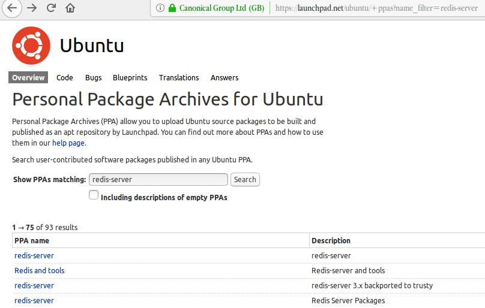
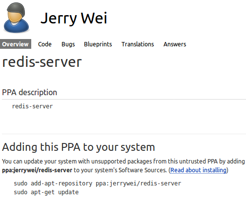
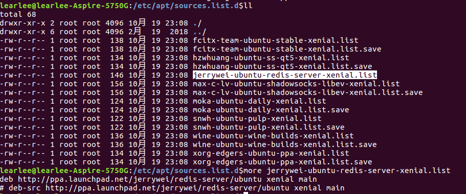
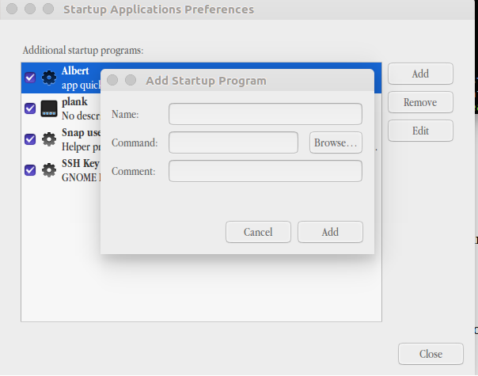

# “Linux”并不是Linux系统，完整的Linux系统由8部份组成

Linux发行版本并不是只有Linux内核。Linux发行版本都包含了其它重要的软件，比如Grub bootloader（Grub引）, Bash shell, GNU shell utilities, daemons, X.org graphical server, a desktop environment等

以上不同程序属于不同的开发者或组织，由Linux发行版组合在一起，形成一个完整的Linux系统。

## Bootloader

当你启动电脑时，计算机BIOS or UEFI固件从启动设备加载软件。与任何操作系统一起加载的第一个程序是引导加载程序。对于Linux来说，一般就是Grub引导程序

如果安装的是双系统，Grub会提供菜单选项，让用户做选择。比如：如果在双引导配置中安装了Linux，则可以在引导时选择Linux或Windows。

如果只是安装了单个Linux系统，Grub会直接启动该Linux系统。GRUB处理如何启动Linux，输出命令行选项，并允许您以其他方式启动Linux以进行故障排除。如果没有引导加载程序，Linux发行版就无法引导。

## The Linux Kernel

Grub引导的主要程序是Linux内核（The precise piece of software Grub boots is the Linux kernel.）而该Linux内核才是“Linux”这个单词表达的确切意义。内核是操作系统的核心，但不代表一个完整的操作系统。Linux内核管理CPU，内存，I/O设备（键盘，鼠标，显示设备）。因为内核直接与硬件交互，所以许多硬件驱动程序是Linux内核的一部分，并在和内核一起运行。

其它的软件运行在内核上。内核是其它软件基础，用来于硬件进行直接交互。并且内核提供了硬件的抽像，屏蔽了硬件的区别，这样系统上的其它部分可以很少的考虑硬件之间的差别。Windows现在用的是Windows NT内核，Linux用的是Linux内核


## Daemons

守护进程，本质上是后台进程。他们经常启动作为操作系统的引导过程的一部分，他是在内核进程启后和图形登录屏幕前被启动。Windows称其为“服务”，在类UNIX系统中叫“Daemons”。

例如，管理周期任务的Cron“守护”进程。另一个传统的syslogd是管理你的系统日志守护进程。各类服务如sshd,会以守护进程的方式运行在后台。这确保他们总是与听力再运行远程连接。

守护进程是一些必要程序，运行在后台，但它们是系统级进程一般用户无感知。

## The Shell

大部分Linux系统使用Bash Shell。 Shell提供命令行交互接口给用户，允许用户通过文本交互控制电脑。当然也能运行Shell脚本（脚本是命令集合，并且是脚本内定义顺序执行的文本）

即使我们使用的是图形桌面，Shell也会运行，可以在后台使用。

## Shell Utilities

Shell只提供了基本的命令，比如CP，ls,rm并没有提供，而这些是属于GNU Core Utilities包中的

Linux系统如果没有这些得要的工具是没有办法工作。事实上，Bash Shell本身是GNU项目的组成部分。

但是并不是所有的Shell工具和命令行程序是由GNU项目开发的。

## X.org Graphical Server

Linux的图形桌面也不属于Linux内核。被称为“X Server”，“X window system”是它的一个实现。

现在流行的“X Server”（图形服务）是X.org。我们所看到的图形登录界面或图形桌面就是X.org在后台做的功能支撑。X.org运行一套完整的图形系统，该系统与电脑的声卡，显示设备，鼠标和其它设备进行交互

## Desktop Environment

用户真正在桌面系统用到的叫桌面环境。比如Ubuntu的Unity桌面环境，Fedora的GNOME，Kubuntu的KDE，Mint的Cinnamon或MATE。这些环境提供你开机所能开到的一切，比如桌面背景，面板，窗口标题栏和边框。

作为一个桌面环境整体一起发布的还有一些自己的工具组件。例如GNOME和Unity包函了Nautilus文件管理系统。KDE提供了Dolphin文件管理系统

## Desktop Programs

但并不是所有的桌面程序都属于桌面环境。比如，FireFox和Chrome就不区分桌面环境，可以运行在任何的桌面环境上。OpenOffice.org也是一组程序，并不绑定到任何桌面环境，用户可以自行安装。

我们可运行任何Linux桌面程序到任何一个桌面环境。但如果是针对于某个桌面环境定制桌面程序则需要伴随安装额外的库和启动相关的辅助进程。比如，GNOME的Nautilus文件管理程序到KDE桌面环境上，我们就要安装GNOME库，可能还要启动GNOME桌面环境进程才能在KDE环境中正确的运行Nautilus文件管理程序

[原文](https://www.howtogeek.com/177213/linux-isnt-just-linux-8-pieces-of-software-that-make-up-linux-systems/)


```
不同的Linux distros其实就是用一不同的软件选择策略，有的不包含闭源程序，有的为了方便用户体验选择包括闭源程序。

用户实际中使用到的明显感受就是，包管理程序不同（yum or apt），配置方式不同(不同的桌面环境导致)，默认安装的应用软件会有区别。仅此而以！

下面是一段对Linux distros的描述
Linux works differently. The Linux operating system isn’t produced by a single organization. Different organizations and people work on different parts. There’s the Linux kernel (the core of the operating system), the GNU shell utilities (the terminal interface and many of the commands you use), the X server (which produces a graphical desktop), the desktop environment (which runs on the X server to provide a graphical desktop), and more. System services, graphical programs, terminal commands – many are developed independently from another. They’re all open-source software distributed in source code form.

If you wanted to, you could grab the source code for the Linux kernel, GNU shell utilities, Xorg X server, and every other program on a Linux system, assembling it all yourself. However, compiling the software would take a lot of time – not to mention the work involved with making all the different programs work properly together.

Linux distributions do the hard work for you, taking all the code from the open-source projects and compiling it for you, combining it into a single operating system you can boot up and install. They also make choices for you, such as choosing the default desktop environment, browser, and other software. Most distributions add their own finishing touches, such as themes and custom software – the Unity desktop environment Ubuntu provides, for example.
```

# PPA是什么

PPA软件源，全称是Personal Package Archives。虽然Ubuntu官方软件仓库尽可能囊括所有的开源软件，但仍有很多软件包由于各种原因不能进入官方软件仓库。为了方便Ubuntu用户使用，launchpad.net提供了个人软件包集，即PPA，允许用户建立自己的软件仓库，通过Launchpad进行编译并发布为2进制软件包，作为apt/新立得源供其他用户下载和更新。PPA也被用来对一些打算进入Ubuntu官方仓库的软件，或者某些软件的新版本进行测试。

Launchpad是Ubuntu母公司canonical有限公司所架设的网站，是一个提供维护、支援或联络Ubuntu开发者的平台。

可以在launchpad(https://launchpad.net/ubuntu/+ppas)平台上直接搜索相关的软件名称以便获得相关源地址，点击查看链接地址。例如搜索redis-server结果如下：



点击搜索结果redis-server，查看安装方法：



```bash
sudo add-apt-repository ppa:jerrywei/redis-server
sudo apt-get update
```

上面第一条命令会在/etc/apt/sources.list.d下创建.list文件。如下图所示:



jerrywei-ubuntu-redis-server-xenial.list内容如下：

```
learlee@learleePC:~$ sudo more /etc/apt/sources.list.d/jerrywei-ubuntu-redis-server-xenial.list 
deb http://ppa.launchpad.net/jerrywei/redis-server/ubuntu xenial main
# deb-src http://ppa.launchpad.net/jerrywei/redis-server/ubuntu xenial main
```

也可以在/etc/source.list中直接添加以下地址：

```
deb http://ppa.launchpad.net/jerrywei/redis-server/ubuntu xenial main
# deb-src http://ppa.launchpad.net/jerrywei/redis-server/ubuntu xenial main
```

**删除软件库**

```
Step 1: sudo add-apt-repository -r ppa:user/ppa-name
Step 2: 进入 /etc/apt/sources.list.d 文件夹，删除对应的源文件。
```

# Ubuntu简单添加开机启动

有的时候按装了一个应用程序，我们需要其开机的时候就启动。以前的方式是在/etc/profile里添加，现在Ubuntu可以使用Startup Applications应用把要添加的应用添加进去 即可。做到了所见即所得。如下图所示。在应用中搜索Startup Applications即可以。使用方式：点击Add按键会弹出添加程序对话框，在Name和comment里说明是什么即可。把启动命令写入Command里。

注：如果不知道命令存方位置可以通过”whereis commandName”来获取，如下所示，albert的启动命令在/usr/bin/albert

```bash
learlee@learleePC:~$ whereis albert
albert: /usr/bin/albert /usr/lib/albert /usr/share/albert
```

StartupAPP提示框如下：

