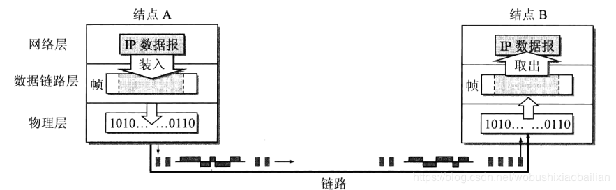
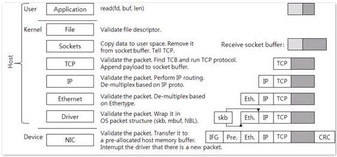
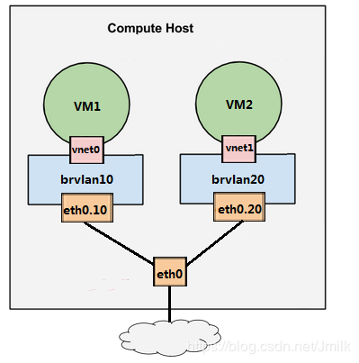
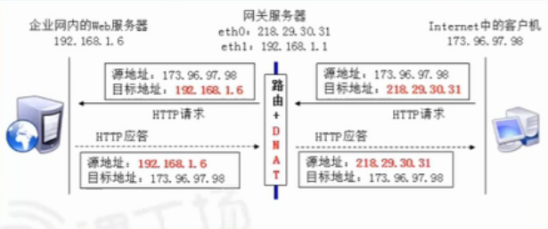

# “Linux”并不是Linux系统，完整的Linux系统由8部份组成

Linux发行版本并不是只有Linux内核。Linux发行版本都包含了其它重要的软件，比如Grub bootloader（Grub引）, Bash shell, GNU shell utilities, daemons, X.org graphical server, a desktop environment等

以上不同程序属于不同的开发者或组织，由Linux发行版组合在一起，形成一个完整的Linux系统。

## Bootloader

当你启动电脑时，计算机BIOS or UEFI固件从启动设备加载软件。与任何操作系统一起加载的第一个程序是引导加载程序。对于Linux来说，一般就是Grub引导程序

如果安装的是双系统，Grub会提供菜单选项，让用户做选择。比如：如果在双引导配置中安装了Linux，则可以在引导时选择Linux或Windows。

如果只是安装了单个Linux系统，Grub会直接启动该Linux系统。GRUB处理如何启动Linux，输出命令行选项，并允许您以其他方式启动Linux以进行故障排除。如果没有引导加载程序，Linux发行版就无法引导。

## The Linux Kernel

Grub引导的主要程序是Linux内核（The precise piece of software Grub boots is the Linux kernel.）而该Linux内核才是“Linux”这个单词表达的确切意义。内核是操作系统的核心，但不代表一个完整的操作系统。Linux内核管理CPU，内存，I/O设备（键盘，鼠标，显示设备）。因为内核直接与硬件交互，所以许多硬件驱动程序是Linux内核的一部分，并在和内核一起运行。

其它的软件运行在内核上。内核是其它软件基础，用来于硬件进行直接交互。并且内核提供了硬件的抽像，屏蔽了硬件的区别，这样系统上的其它部分可以很少的考虑硬件之间的差别。Windows现在用的是Windows NT内核，Linux用的是Linux内核


## Daemons

守护进程，本质上是后台进程。他们经常启动作为操作系统的引导过程的一部分，他是在内核进程启后和图形登录屏幕前被启动。Windows称其为“服务”，在类UNIX系统中叫“Daemons”。

例如，管理周期任务的Cron“守护”进程。另一个传统的syslogd是管理你的系统日志守护进程。各类服务如sshd,会以守护进程的方式运行在后台。这确保他们总是与听力再运行远程连接。

守护进程是一些必要程序，运行在后台，但它们是系统级进程一般用户无感知。

## The Shell

大部分Linux系统使用Bash Shell。 Shell提供命令行交互接口给用户，允许用户通过文本交互控制电脑。当然也能运行Shell脚本（脚本是命令集合，并且是脚本内定义顺序执行的文本）

即使我们使用的是图形桌面，Shell也会运行，可以在后台使用。

## Shell Utilities

Shell只提供了基本的命令，比如cp，ls,rm并没有提供，而这些是属于GNU Core Utilities包中的

Linux系统如果没有这些得要的工具是没有办法工作。事实上，Bash Shell本身是GNU项目的组成部分。

但是并不是所有的Shell工具和命令行程序是由GNU项目开发的。

## X.org Graphical Server

Linux的图形桌面也不属于Linux内核。被称为“X Server”，“X window system”是它的一个实现。

现在流行的“X Server”（图形服务）是X.org（即实现X协议的软件，X服务器的一种实现）。我们所看到的图形登录界面或图形桌面就是X.org在后台做的功能支撑。X.org运行一套完整的图形系统，该系统与电脑的声卡，显示设备，鼠标和其它设备进行交互。

X.org并不提供完整的桌面环境，只是一个图形系统，桌面环境和工具包可以建立在该图形系统上工作。

```
X是协议，就像HTTP协议，IP协议一样。这个概念很多初学者甚至学习LINUX有一定时间的人都混淆，一个基于X的应用程序需要运行并显示内容时他就联接到X服务器，开始用X协议和服务器交谈。比如一个X应用程序要在屏幕上输出一个圆，X应用程序只负责告诉X服务器在屏幕的什么地方用什么颜色画一个多大的圆，而具体的"画"的动作，比如这个圆如何生成，用什么显卡的驱动程 序去指挥显卡完成等等工作是由X服务器来完成的。X服务器还负责捕捉键盘和鼠标的动作，假设X服务器捕捉到鼠标的左键被按下了，他就告诉X应用程序：亲爱的应用程序先生，我发现鼠标被按下了，您有什么指示吗?下面的Desktop Environment就可以是那个程序。

苹果电脑的图形界面用的也是X协议，而且被认为是做的最好的X协议图形界面，并且他对X协议的实施是做在系统内核里的，所以性能明显好很多，这就是为什么很多大型三维图形设计软件都是在苹果平台上的原因。 

既然是协议，那么肯定和平台无关的，因此可以让X应用程序显示在任何装有X服务器的远程计算机上。甚至显示在装有Xnest服务器的windows系 统上。只不过在大多数情况下，X应用程序都用本机的X服务器，然后X服务器将显示结果输出到本机的显示器。

启动图形界面的时候同时也启动了一个WM（即窗口管理器），如果你用KDE就启动了KDE，如果你用GNOME就启动了GNOME。如果没有起动WM，最大化，最小化，移动，关闭窗口等操作是不能进行的。而这些不是X服务器来负责完成的。 
```

## Desktop Environment

用户真正在桌面系统用到的叫桌面环境。比如Ubuntu的Unity桌面环境，Fedora的GNOME，Kubuntu的KDE，Mint的Cinnamon或MATE。这些环境提供你开机所能看到的一切，比如桌面背景，面板，窗口标题栏和边框。

作为一个桌面环境整体一起发布的还有一些自己的工具组件。例如GNOME和Unity包函了Nautilus文件管理系统。KDE提供了Dolphin文件管理系统。所以他们不仅仅是一个窗口管理器那么简单。

linux图形界面层次关系： linux本身-->X服务器<-[通过X协议交谈]->窗口管理器（综合桌面环境）-->X应用程序。

## Desktop Programs

并不是所有的桌面程序都属于桌面环境。比如，FireFox和Chrome就不区分桌面环境，可以运行在任何的桌面环境上。OpenOffice.org也是一组程序，并不绑定到任何桌面环境，用户可以自行安装。

我们可运行任何Linux桌面程序到任何一个桌面环境。但如果是针对于某个桌面环境定制桌面程序则需要伴随安装额外的库和启动相关的辅助进程。比如，GNOME的Nautilus文件管理程序到KDE桌面环境上，我们就要安装GNOME库，可能还要启动GNOME桌面环境进程才能在KDE环境中正确的运行Nautilus文件管理程序。

[原文](https://www.howtogeek.com/177213/linux-isnt-just-linux-8-pieces-of-software-that-make-up-linux-systems/)

```
不同的Linux distros其实就是用一不同的软件选择策略，有的不包含闭源程序，有的为了方便用户体验选择包括闭源程序。

用户实际中使用到的明显感受就是，包管理程序不同（yum or apt），配置方式不同(不同的桌面环境导致)，默认安装的应用软件会有区别。仅此而以！

下面是一段对Linux distros的描述
Linux works differently. The Linux operating system isn’t produced by a single organization. Different organizations and people work on different parts. There’s the Linux kernel (the core of the operating system), the GNU shell utilities (the terminal interface and many of the commands you use), the X server (which produces a graphical desktop), the desktop environment (which runs on the X server to provide a graphical desktop), and more. System services, graphical programs, terminal commands – many are developed independently from another. They’re all open-source software distributed in source code form.

If you wanted to, you could grab the source code for the Linux kernel, GNU shell utilities, Xorg X server, and every other program on a Linux system, assembling it all yourself. However, compiling the software would take a lot of time – not to mention the work involved with making all the different programs work properly together.

Linux distributions do the hard work for you, taking all the code from the open-source projects and compiling it for you, combining it into a single operating system you can boot up and install. They also make choices for you, such as choosing the default desktop environment, browser, and other software. Most distributions add their own finishing touches, such as themes and custom software – the Unity desktop environment Ubuntu provides, for example.
```

# FHS标准

为个么不同发行版本的配置文件、执行文件、每个目录内放置的内容都差不多？实际都是由FHS标准进行约束的。

FHS(英文：Filesystem Hierarchy Standard 中文:文件系统层次结构标准)，多数Linux版本采用这种文件组织形式，FHS定义了系统中每个区域的用途、所需要的最小构成的文件和目录同时还给出了例外处理与矛盾处理。 FHS定义了两层规范，第一层是， / 下面的各个目录应该要放什么文件数据，例如/etc应该要放置设置文件，/bin与/sbin则应该要放置可执行文件等等。 第二层则是针对/usr及/var这两个目录的子目录来定义。例如/var/log放置系统登录文件、/usr/share放置共享数据等等。

**usr: Unix Software Resource**


**常态可变动文件目录（/var）说明**

   /var/cache/：应用程序本身运行过程中会产生的一些暂存文件

　　/var/lib/：程序本身执行的过程中，需要使用到的数据文件放置的目录

　　/var/lock/：目录下的文件资源一次只能被一个应用程序所使用

　　/var/log/：放置登录文件的目录

　　/var/mail/：放置个人电子邮件信箱的目录

　　/var/run/：某些程序或服务启动后的PID目录

　　/var/spool/：放置排队等待其他应用程程序使用的数据


上图中缺失下如下目录说明：

**丢失内容修复目录（/lost+found）**

这个目录是使用标准的 ext2/ext3 文件系统格式才会产生的一个目录，目的相当于文件系统发生错误时，将一些丢失的片段放置到这个目录下。这个目录通常会在分区的最顶层存在。

**虚拟文件系统目录（/proc)**

这个目录本身是一个虚拟文件系统（virtual filesystem）。它放置的数据都是在内存当中，例如系统内核、进程、外部设备以及网络状态等。因为这个目录下的数据都是在内存当中的，所以本身并不占任何硬盘空间。

**虚拟文件系统目录（/sys)**


FHS是根据以往无数linux用户和开发者的经验总结出来的，并且会维持更新，FHS依据文件系统使用的频繁与否以及是否允许用户随意改动（注意，不是不能，学习过程中，不要怕这些），将目录定义为四种交互作用的形态，如下表所示：


这个目录其实跟 /proc 非常类似，也是一个虚拟的文件系统，主要也是记录与内核相关的信息。包括目前已加载的内核模块与内核检测到的硬件设备信息等。这个目录同样不占硬盘容量。

[原文](https://www.cnblogs.com/happyframework/p/4480228.html)

```
Linux为什么使用设备的时候需要挂载
我们知道在linux系统中使用任何硬件设备都必须与根目录下某一目录执行挂载操作，否则无法使用。因为本身 Linux 具有一个以根目录为树根的文件目录结构，每个设备也同样如此，它们是相互独立的。如果我们想通过 Linux 上的根目录找到设备文件的目录结构，就必须将这两个文件系统目录合二为一，这就是挂载的真正含义。
```

# PPA是什么

PPA软件源，全称是Personal Package Archives。虽然Ubuntu官方软件仓库尽可能囊括所有的开源软件，但仍有很多软件包由于各种原因不能进入官方软件仓库。为了方便Ubuntu用户使用，launchpad.net提供了个人软件包集，即PPA，允许用户建立自己的软件仓库，通过Launchpad进行编译并发布为2进制软件包，作为apt/新立得源供其他用户下载和更新。PPA也被用来对一些打算进入Ubuntu官方仓库的软件，或者某些软件的新版本进行测试。

Launchpad是Ubuntu母公司canonical有限公司所架设的网站，是一个提供维护、支援或联络Ubuntu开发者的平台。

可以在[launchpad](https://launchpad.net/ubuntu/+ppas)平台上直接搜索相关的软件名称以便获得相关源地址，点击查看链接地址。例如搜索redis-server结果如下：


点击搜索结果redis-server，查看安装方法：


```bash
sudo add-apt-repository ppa:jerrywei/redis-server
sudo apt-get update
```

上面第一条命令会在/etc/apt/sources.list.d下创建.list文件。如下图所示:


jerrywei-ubuntu-redis-server-xenial.list内容如下：

```
$ sudo more /etc/apt/sources.list.d/jerrywei-ubuntu-redis-server-xenial.list 
deb http://ppa.launchpad.net/jerrywei/redis-server/ubuntu xenial main
# deb-src http://ppa.launchpad.net/jerrywei/redis-server/ubuntu xenial main
```

也可以在/etc/source.list中直接添加以下地址：

```
deb http://ppa.launchpad.net/jerrywei/redis-server/ubuntu xenial main
# deb-src http://ppa.launchpad.net/jerrywei/redis-server/ubuntu xenial main
```

**删除软件库**

```
Step 1: sudo add-apt-repository -r ppa:user/ppa-name
Step 2: 进入 /etc/apt/sources.list.d 文件夹，删除对应的源文件。
```

**何时会把库写到sources.list**

对于add-apt-repository命令直接使用软件库地址的会添加到sources.list文件中，如下命令。

```
sudo add-apt-repository 'deb https://dl.winehq.org/wine-builds/debian/ stretch main'

# sources.list文件内容 
$ more sources.list | grep -i stretch
deb https://dl.winehq.org/wine-builds/debian/ stretch main
# deb-src https://dl.winehq.org/wine-builds/debian/ stretch main
```

# Linux系统的各种环境变量

我们使用linux的时候会发现，当我们进入系统bash，就有一堆变量可以使用，这些东西都是从哪来的呢？这实际是系统配置文件起的作用。系统启动后，会去读取配置文件，让这些环境变量可以被正常使用。

了解这个之前我们先看看两个重要概念，这涉及系统会读取那些配置文件，导致可用的环境变量发生变化。一个叫login shell，一个叫non-login shell。

```
login shell：取得bash时需要完整的登录流程。就是说通过输入账号和密码登录系统，此时取得的shell称为login shell。

non-login shell：取得bash接口的方法不需要重复登录的举动。如以X Window登录登录linux后，再以X的图形界面启动终端机，此时那个终端机并没有需要输入账号和密码，那个bash环境就是non-login shell。在原本的bash环境下再次执行bash命令，同样也没有输入账号密码就进入新的bash环境（前一个bash的子进程），新的bash也是non-login shell。再比如启动终端。
```

login shell一般会读取以下配置文件

1. /etc/profile：这是系统整体的配置，一般尽量不要修改这个文件。
2. /etc/profile会去执行/etc/bash.bashrc
   ```
   # /etc/profile: system-wide .profile file for the Bourne shell (sh(1))
    # and Bourne compatible shells (bash(1), ksh(1), ash(1), ...).

    if [ "$PS1" ]; then
    if [ "$BASH" ] && [ "$BASH" != "/bin/sh" ]; then
        # The file bash.bashrc already sets the default PS1.
        # PS1='\h:\w\$ '
        if [ -f /etc/bash.bashrc ]; then
        . /etc/bash.bashrc
        fi
   ```
3. $HOME/.bash_profile or $HOME/.bash_login or $HOME/.profile。
4. .bashrc脚本。看profile的脚本说明就很直观了。如果是.profile被运行。（ubuntu没有前两个文件）
   
   ```
   # ~/.profile: executed by the command interpreter for login shells.
   # This file is not read by bash(1), if ~/.bash_profile or ~/.bash_login
   # exists.
   # if running bash
    if [ -n "$BASH_VERSION" ]; then
        # include .bashrc if it exists
        if [ -f "$HOME/.bashrc" ]; then
        . "$HOME/.bashrc"
        fi
    fi

   ```

```
当用户第一次登录时,该文件被执行。/etc/profile中使用一个for循环语句从/etc/profile.d调用该目录下的脚本。而这些脚本文件是用来设置一些变量和运行一些初始化过程的。只有Login shell启动时才会运行/etc/profile脚本。

所以，当你修改了/etc/profile的内容后，通过ctrl+alt+t启动一个新窗口并不生效，要么重启系统，要么用source /etc/profile重新加载。但如果是login方式登录你就会发生会立即生效。因为会在登录时重新加载/etc/profile里的内容。

登陆系统时shell读取的顺序应该是/etc/profile-->/etc/enviroment -->$HOME/.profile-->$HOME/.bashrc(如果存在)-->$HOME/.env(如果存在)
```

non-login shell一般会读取以下配置文件

1. $HOME/.bashrc 会被执行
   ```
   # $HOME/.bashrc: executed by bash(1) for non-login shells.
   ```
2. shell**不会**读取/etc/profile和~/.profile

```
/etc/profile中设定的变量(全局)的可以作用于任何用户,而~/.bashrc等中设定的变量(局部)只能继承 /etc/profile中的变量,他们是"父子"关系。

这也就是为什么我们通过远程去执行远端脚本的时候，会出现命令不在PATH下的情况。解决的方案有两种：
1. 在脚本里面添加export命令，每次执行脚本的时候都导出脚本需要的命令路径：`#export PATH=$PATH:your_command_path`
2. 在$HOME/.bashrc里面export脚本需要的命令路径。添加方式同1，只是写在了不同的位置而已。
```

## 其他环境相关脚本

**~/.bash_logout**:当每次退出系统(退出bash shell)时,执行该文件。 

**/etc/enviroment**: 是系统的环境变量。

```
系统应用程序的执行与用户环境可以是无关的，但与系统环境是相关的，所以当你登录时，你看到的提示信息，象日期、时间信息的显示格式与系统环境的LANG是相关的，缺省LANG=en_US，如果系统环境LANG=zh_CN，则提示信息是中文的，否则是英文的。所以如查把LANG=zh_CN设置到/etc/profile里时候并不生效!!!
```

## 系统语言相关环境变量

这个可以在/etc/default/locale文件中进行设定，也可以通过【系统设置】-->【语言支持】里进行设定。界面设定如下：


通过命令行设定的话，编辑/etc/default/locale文件就可以。我们可以先用`locale`命令看下都有那些参数可以设置：

```bash
$ locale
LANG=zh_CN.UTF-8
LANGUAGE=zh_CN:zh:en_US:en
LC_CTYPE="zh_CN.UTF-8"
LC_NUMERIC=zh_CN.UTF-8
LC_TIME=zh_CN.UTF-8
LC_COLLATE="zh_CN.UTF-8"
LC_MONETARY=zh_CN.UTF-8
LC_MESSAGES="zh_CN.UTF-8"
LC_PAPER=zh_CN.UTF-8
LC_NAME=zh_CN.UTF-8
LC_ADDRESS=zh_CN.UTF-8
LC_TELEPHONE=zh_CN.UTF-8
LC_MEASUREMENT=zh_CN.UTF-8
LC_IDENTIFICATION=zh_CN.UTF-8
LC_ALL=
```

那什么是locale?可以理解成，Locale是软件在运行时的语言环境, 它包括语言(Language), 地域 (Territory) 和字符集(Codeset)。一个locale的书写格式为: 语言[_地域[.字符集]]。完全的locale表达方式是 `[语言[_地域][.字符集] [@修正值]`。zh_CN.GB2312＝中文_中华人民共和国＋国标2312字符集。

locale把按照所涉及到的文化传统的各个方面分成12个大类，如上locale命令输出所示。他们分别代表：

1. 语言符号及其分类(LC_CTYPE)
2. 数字(LC_NUMERIC)
3. 比较和排序习惯(LC_COLLATE)
4. 时间显示格式(LC_TIME)
5. 货币单位(LC_MONETARY)
6. 信息主要是提示信息,错误信息,状态信息,标题,标签,按钮和菜单等(LC_MESSAGES)
7. 姓名书写方式(LC_NAME)
8. 地址书写方式(LC_ADDRESS)
9. 电话号码书写方式(LC_TELEPHONE)
10. 度量衡表达方式 (LC_MEASUREMENT)
11. 默认纸张尺寸大小(LC_PAPER)
12. 对locale自身包含信息的概述(LC_IDENTIFICATION)。

locale的设定的优先级别：LC_ALL > LC_* >LANG

示例：

1、如果需要一个纯中文的系统的话，设定LC_ALL= zh_CN.XXXX，或者LANG=zh_CN.XXXX都可以。 

2、如果只想要一个可以输入中文的环境，而保持菜单、标题，系统信息等等为英文界面，那么只需要设定 LC_CTYPE＝zh_CN.XXXX，LANG=en_US.XXXX就可以了。

3、假如什么也不做的话，也就是LC_ALL，LANG和LC_*均不指定特定值的话，系统将采用POSIX作为lcoale，也就是C locale。

**LANG和LANGUAGE的区别： **

- LANG - Specifies the default locale for all unset locale variables 
- LANGUAGE - Most programs use this for the language of its interface 

也就是说，LANGUAGE是设置应用程序的界面语言。而LANG是优先级很低的一个变量，它指定所有与locale有关的变量的默认值！

PC端桌面程序如果界面中文显示乱码，可以将设置`LANG =zh_CN.UTF-8`或者`LANGUAGE=zh_CN:en_US:en`一般就可以了。当然也可以在每个桌面程序的Setting里设置应用程序使用的字符集。比如Thunderbird可以通过设置收件箱的后备文字编码和`菜单-->查看(view)-->文本编码（Text Encoding）-->unicode`设置应用的文字编码来设置桌面程序的字符集。而不是通过全局方式设定。

注意：有的桌面程序并不支持中文，所以如果是全局设定界面字符，会导致乱码显示。另外，我一般会在【语言支持】中将语言和地区格式全部设定成中文而不是通过改locale文件设定。IDEA中，如果将LANG设定成zh_CN.UTF-8而LANGUAGE=en_US的话，sogou输入法在IDEA中是无法切换的，造成的结果就是没法输入中文。我认为这可能不是个案，所以我建议还是保持语言设定统一较好!

# Ubuntu简单添加开机启动

有的时候按装了一个应用程序，我们需要其开机的时候就启动。以前的方式是在/etc/profile里添加，现在Ubuntu可以使用Startup Applications应用把要添加的应用添加进去 即可。做到了所见即所得。如下图所示。在应用中搜索Startup Applications即可以。使用方式：点击Add按键会弹出添加程序对话框，在Name和comment里说明是什么即可。把启动命令写入Command里。

注：如果不知道命令存方位置可以通过”whereis commandName”来获取，如下所示，albert的启动命令在/usr/bin/albert

```bash
$ whereis albert
albert: /usr/bin/albert /usr/lib/albert /usr/share/albert
```

StartupAPP提示框如下：


# selinux

安全增强型 Linux（Security-Enhanced Linux）简称 SELinux，它是一个 Linux 内核模块，也是 Linux 的一个安全子系统。SELinux 主要由美国国家安全局开发。2.6 及以上版本的 Linux 内核都已经集成了 SELinux 模块。

**SELinux 的作用**

1. SELinux 主要作用就是最大限度地减小系统中服务进程可访问的资源（最小权限原则）。
2. 在没有使用 SELinux 的操作系统中，决定一个资源是否能被访问的因素是：某个资源是否拥有对应用户的权限（读、写、执行）。只要访问这个资源的进程符合以上的条件就可以被访问。而最致命问题是，root 用户不受任何管制，系统上任何资源都可以无限制地访问。这种权限管理机制的主体是用户，也称为自主访问控制（DAC）。
3. 强制访问控制（MAC）。决定一个资源是否能被访问的因素除了上述因素之外，还需要判断每一类进程是否拥有对某一类资源的访问权限。这样一来，即使进程是以 root 身份运行的，也需要判断这个进程的类型以及允许访问的资源类型才能决定是否允许访问某个资源。进程的活动空间也可以被压缩到最小。

DAC MAC区别如下图


**SELinux 的工作模式**

SELinux 有三种工作模式，分别是：
1. enforcing：强制模式。违反 SELinux 规则的行为将被阻止并记录到日志中。
2. permissive：宽容模式。违反 SELinux 规则的行为只会记录到日志中。一般为调试用。
3. disabled：关闭 SELinux。

**SELinux 工作流程**


**关闭方式**

1. 使用setup工具 进入图形化关闭
或者
2. 向/etc/sysconfig/selinux 文件加入SELINUX=disabled


```
etenforce是Linux的selinux防火墙配置命令 执行setenforce 0 表示关闭selinux防火墙。

setenforce命令是单词set（设置）和enforce(执行)连写，另一个命令getenforce可查看selinux的状态。 
```

# Networking基本术语

## 冲突域（Collision Domain）

冲突域是一种 “物理分段”，指连接在同一物理介质（e.g. 中继器、集线器）上的所有站点的集合。这些站点之间存在物理介质争用现象（e.g. 传统以太网中的 CSMA/CD 介质检测原理），也就是它们在数据通信时需要共享公用物理介质的某个部分。

在同一冲突域中的计算机等设备互联时会通过同一个物理通道，同一时刻只允许一个设备发送的数据在这条通道中通过，其他设备发送的数据则要等到这个通道处于 “空闲” 时才可以继续通过，否则会出现冲突，这时就可能出现大量的数据包因为延时而被丢弃或者丢失。冲突域指的是不会产生这类冲突的最小范围。

冲突域可以衡量一个设备的性能，冲突域越小性能就越高。集线器、中继器都是典型的共享介质连接设备，工作在物理层上。连接在这些设备上的站点都处于同一个冲突域中。

而工作在数据链路层上的设备，如网桥和交换机，它们是可以划分冲突域的，也可以连接不同的冲突域。虽然网桥与中继器类似，都只有两个端口，但网桥可用于连接不同的物理网段（ps：这里区别于网络层的 IP 逻辑网段）。可以把网桥看成是可以连接两个冲突域的设备，连接在同一网桥上的两个网段各自成为一个冲突域。交换机则是网桥的扩展，它有许多端口，而且每个端口就是一个冲突域，即一个或多个端口的高速传输不会影响其他端口的传输，因为不同端口发送的数据不需要在同一条通道中排队通过，而只是在同一端口中的数据才要在对应端口通道中排队。

**简单来说，冲突域可以看成是一条直通的管道，同时只能有一端发送数据。**

## 广播域（Broadcast Domain）

如果一个数据包的目标地址是这个网段的广播 IP 地址（广播 IP 地址对应网段的最后一个 IP 地址，e.g. 192.168.10.255/24）或者目标计算机的 MAC 地址是 FF-FF-FF-FF-FF-FF，那么这个数据包就会被这个网段的所有计算机接收并响应，这就叫做广播包（e.g. ARP 请求发出的广播包）。

广播域就是指可以接收相同广播消息的站点范围，在此范围中，任意一个站点发出广播包，都会被其他站点接收到。广播域是数据链路层的概念，所以像网桥和交换机等二层网络设备所连接的站点都被认为处于同一广播域，前提是各站点都处于同一 IP 网段，一个局域网就是一个广播域（往往是指一个 IP 逻辑网段），广播域中的机器可以收到域中其他任何一台机器的广播，而不能收到域外机器的广播，域外机器也不能收到域内机器发的广播；

而路由器、三层交换机、VLAN交换机这样的二、三层网络设备是可以划分广播域的，即它们可以连接不同的广播域，换句话说就是一个可路由端口所连接的网段为一个广播域。

通常广播包是用来进行 ARP 寻址等用途的，但是广播域无法控制也会对网络健康带来严重影响（e.g. 带宽、网络延迟）。二层交换机对广播的处理是转发，所以不能分割广播域；而路由器一般不会转发广播，所以可以分割或定义广播域。

VLAN 一般被用于将一个大的网络划分成多个小的虚拟网络，所以 VLAN 也具有划分多个广播域、缩小广播域大小的功能。因为不同 VLAN 间是不能直接通信的，VLAN 间的通信需要依靠三层路由，就像不同网段间的通信一样。

**冲突域与广播域的区别**


NOTE：

- 一层设备（中继器、集线器）不能划分冲突域和广播域。
- 二层设备（网桥、第二层交换机）能划分冲突域，不能划分广播域，但二层交换机的 VLAN 可以划分广播域。
- 三层设备（路由器）既能划分冲突域，又能划分广播域。

所以，常说的一个广播域实际就是路由器一个网关接口下的由若干个交换机（VLAN、Trunk 口）组成的二层网络。而一个冲突域就是交换机的一个端口。


## IP 网络数据传输方式

**单播（Unicast）**：在发送者和每一接收者之间实现点对点网络连接。如果一台发送者同时给多个的接收者传输相同的数据，也必须相应的复制多份相同的数据包。如果有大量主机希望获得数据包的同一份拷贝时，将导致发送者负担沉重、延迟长、网络拥塞；

**广播（Broadcasting）**：是指在IP子网内广播数据包，所有在子网内部的主机都将收到这些数据包。广播意味着网络向子网每一个主机都投递一份数据包，不论这些主机是否乐于接收该数据包。所以广播的使用范围非常小，只在本地子网内有效，通过路由器和网络设备控制广播传输。

**组播（Multicast）**：在发送者和每一接收者之间实现点对多点网络连接。如果一台发送者同时给多个接收者传输相同的数据，也只需复制一份相同的数据包。它提高了数据传送效率，减少了骨干网络出现拥塞的可能性。组播解决了单播和广播方式效率低的问题。当网络中的某些用户需求特定信息时，组播源（即组播信息发送者）仅发送一次信息，组播路由器借助组播路由协议为组播数据包建立树型路由，被传递的信息在尽可能远的分叉路口才开始复制和分发。

**多播（Multicast）**：1988 年 Steve Deering 首次在其博士论文中提出 IP 多播的概念。多播是 IPv6 数据包的 3 种基本目的地址类型之一，多播是一点对多点的通信，IPv6 没有采用 IPv4 中的组播术语，而是将广播看成是多播的一个特殊例子。

[原文](https://blog.csdn.net/Jmilk/article/details/85169871 )


# 物理网络设备

## 发展简述

以太网设计目标：电脑使用一个网络接口，可以同时与多台电脑通信，将电脑连接起来的 “黑盒子” 最先面世，称之为集线器（Hub）。这种集线器，通常有多个端口，可以接入多台电脑，使电脑连接在一起成为一种可能，其内部工作原理就是信号放大器。随着以太网的流行，越来越多的办公室使用它，网络变得越来越大，信号随着网线距离的变长，信号衰减的使得通信变得越发不可靠，同样需要可以将信号中继、放大的集线器。但这种集线器只需两个端口，一端连着一根网线，由于其本来的目的就是延伸网线，美其名曰：网桥，这个更像描述其功能性的一面，“牵线搭桥”之意。在集线器的基础上，添加了 MAC 地址学习功能。然后在网桥的基础上增了端口变成为了交换机（N×（N-1）网桥），这样可以避免集线器对所有帧都进行广播的弊病。但这些设备依然都是桥接设备，因为帧经过它们时，帧原封不动。

## 中继器（Repeater）

一个将输入信号增强放大的模拟设备，而不考虑输入信号种类（是类比的还是数字的）。中继器是用来加强缆在线的信号，把信号送得更远，以延展网络长度。当电子信号在电缆上传送时，信号强度会随着传递长度的增加而递减。因此需要中继器将信号重新加强以增加数据的发送距离。

简单来说，中继器就是一种用于频率转换及功率增强的模块或设备，主要用于信号增强和频率差转。

## 集线器（hub）

集线器（HUB）属于数据通信系统中的基础设备，它和双绞线等传输介质一样，是一种不需任何软件支持或只需很少管理软件管理的硬件设备。它被广泛应用到各种场合。集线器工作在局域网（LAN）环境，应用于 OSI 参考模型的物理层，因此又被称为物理层设备。集线器内部采用了电器互联，当维护 LAN 的环境是逻辑总线或环型结构时，完全可以用集线器建立一个物理上的星型或树型网络结构。在这方面，集线器所起的作用相当于多端口的中继器。其实，集线器实际上就是中继器的一种，其区别仅在于集线器能够提供更多的端口服务，所以集线器又叫多口中继器。

工作过程：集线器的工作过程是非常简单的，首先是节点发信号到线路，集线器接收该信号，因信号在电缆传输中有衰减，集线器接收信号后将衰减的信号整形放大，最后集线器将放大的信号广播转发给其他所有端口。

## 网桥（bridge）

网桥：网桥是一种在链路层实现中继，对帧进行转发的技术，根据MAC分区块，可隔离碰撞，将网络的多个网段在数据链路层连接起来的网络设备。

有人把网桥（bridge）比喻成一个聪明的 “中继器”，网桥和中继器一般只有两个接口，但中继器只是对所接收的信号进行放大，然后直接发送到另一个端口连接的电缆上，主要用于扩展网络的物理连接范围。而网桥除了可以扩展网络的物理连接范围外，还可以对 MAC 地址进行分区，隔离不同物理网段之间的碰撞（隔离冲突域）。集线器和中继器都是物理层设备，而网桥属于数据链路层设备。

简单来说，网桥工作在数据链路层，它会过滤 MAC，只有目的 MAC 地址匹配的帧（Frame）才会发送到出口。一个网桥就是一个输入到输出的桥接（bridging）。


NOTE 1：因为网桥只有两个端口，所以连接的两个物理网段的主机通常就是由当时的集线器进行集中连接的（网桥端口通常不是直接连接主机，而是连接集线器的）。

NOTE 2：基本网桥只有两个端口，还有一种网桥叫做多口网桥，多口网桥有多个端口。


上图中所示的物理网段 1 和物理网段 2 中的主机分别通过集线器集中连接起来，两个物理网段各自形成一个冲突域。而网桥的背板信道不是共享的（每个端口的数据收发都有一条单独的信道），所以网桥隔离了两个冲突域。


**网桥的工作原理**

网桥是工作在数据链路层的，它的作用是根据MAC帧的目的地址对收到的帧进行转发和过滤。
- 缓存：网桥首先会对收到的数据帧进行缓存并处理；
- 过滤：判断入帧的目标节点是否位于发送这个帧的物理网段中（同一端口中），如果是，网桥就不把帧转发到网桥的其他端口；
- 转发：如果帧的目标节点位于另一个网络，网桥就将帧发往正确的物理网段（向另一端口转发）；


网桥和集线器（转发器）的一个重要区别：网桥是按**存储转发方式**工作的，一定是先把整个帧收下来（集线器转发器是逐比特转发）在进行处理。网桥是通过内部的接口管理软件和网桥协议实体来完成上述操作的。

优点：
- 扩大了物理范围。使得整个以太网上工作站的数据增加了。
- 可互联不同速率的以太网，不同MAC子层，不同物理层

缺点：
- 增加时延。由于网桥在进行数据帧转发前会对数据帧进行缓冲，与中继器相比引入了更多的时延。
- 在MAC层并没有流量控制功能。当网络负荷过重，网桥中的缓存的存储空间会因为不够而溢出，从而丢失数据帧。
- 网桥只适合用户数不太多和通信量不太大的以太网。否则可能因为传播过多的广播信息造成网络拥塞，这就是所谓的广播风暴。

**网桥基于 MAC 的转发原理**

网桥除了可以隔离冲突域，还可以基于物理网段的 MAC 地址进行学习，并根据 MAC 地址表对帧进行转发。


MAC 地址表，也叫 MAC-Port 映射表也就是通常所说的 CAM（Content Addressable Memory，内容可寻址存储器）表，保存的是对应 MAC 地址主机与所连接的网桥（或交换机）端口的映射。

假设上图所示，网络中的一台 PC 要向另一台PC 发送数据。因为集线器不会识别帧中的 MAC 地址，所以无论是哪台主机要发送数据，在集线器上都是以广播方式进行的，连接该集线器上的同一个冲突域的所有节点都会收到这个广播帧，包括连接到该集线器某个端口上的网桥。

1. 当网桥收到集线器的广播帧后，网桥会把帧中的源 MAC 地址和目的 MAC 地址与网桥缓存中保存的 MAC 地址表进行比较。
2. 最初，网桥的缓存中是没有任何 MAC 地址的，所以一开始它也不知道目标主机和源主机都在哪个物理网段上，收到的所有帧都直接以泛洪方式转发到另一个端口上，同时会把数据帧中的源 MAC 地址所对应的物理网段记录下来（其实就是与对应的网桥端口对应起来）。
3. 在数据帧被某个 PC 接收后，也会把对应目的 MAC 地址所对应的物理网段记录在缓存中的 MAC 表中。这样，经过多次 “学习”，就可以在 MAC 地址表中把整个网络中各主机 MAC 地址与对应的物理网段全部记录下来。因为网桥的端口通常是连接集线器的，所以一个网桥端口会与多个主机 MAC 地址进行映射。
4. 当网桥收到的数据帧中源 MAC 地址和目的 MAC 地址都在网桥 MAC 地址表中可以找到时，网桥会比较这两个 MAC 地址是否属于同一个物理网段。如果是同一物理网段，则网桥不会把该帧转发到下一个端口，直接丢弃，起到冲突域隔离作用。相反，如果两个 MAC 地址不在同一物理网段，则网桥会把从一个物理网段发来的帧转发到连接另一个物理网段上，然后再通过所连接的集线器进行复制方式的广播。


MAC 地址表的表项可以由管理员手动绑定创建，也可以由网桥（或交换机）自动学习得到。

**网桥的核心作用**

通过上面的描述可以感受到，网桥最核心的作用就是：与集线器配合将规模较大的局域网划分成多个既互相对独立又能互相通信的两个局域网子网段（划分冲突域），从而改善各个子网段的性能、可靠性和安全性。


## 交换机（Switch）

早期的 Switch：可以看成是更先进的网桥，是由多个网桥集成的设备，也工作在数据链路层。一个交换机口的输入到另一个交换机口的输出可以认为是一个 bridging（桥接）。交换机中的 MAC 地址表实际上就是为了网桥能工作而存在的，提供基于 MAC 地址的转发功能。一个 N 口的交换机可以看出是 N*(N-1) 个网桥的集合。

L3 Switch：就是包含了 Routing 功能的交换机

交换机的每一个端口都是一个冲突域，同时可以通过配置交换机端口组的方式来划分广播域（VLAN）。同一个 VLAN 的主机的广播包会在 VLAN 对应的端口组中进行广播，这是基于交换机的 MAC-Port 映射表进行控制的。

**交换机的工作原理**


1. 交换机根据收到数据帧中的源 MAC 地址建立该地址与交换机端口的映射关系，并将其写入 MAC-Port 映射表中。
2. 交换机将数据帧中的目的 MAC 地址与已建立的 MAC-Port 映射表进行比较，以决定在哪个端口进行转发。
3. 如果数据帧中的目的 MAC 地址不在 MAC 地址表中，则向所有端口转发。这一过程称为泛洪（flood）。当收到回应后，交换机就 “学习” 到了一个新的 MAC 地址与端口的对应关系并写入到内存中的 MAC-Port 映射表。
4. 广播帧和组播帧向所有的端口转发

**从图中可以看到每一个端口实际上是一台主机，所以MACPORT表中不再是一个PORT对应多个MAC而是成为1对1**

如下图：主机 A 发送的报文被送到交换机 S1 的 eth0 口，由于 eth0 与 eth1、eth2 桥接（交换机任意两个端口之间为桥接关系）在一起，故而报文被复制到 eth1 和 eth2，并且发送出去，然后被主机 B 和交换机 S2 接收到，而 S2 又会将报文转发给主机 C、D。


比如主机 C 向主机 A 发送一个报文，报文来到了交换机 S1 的 eth2 网口上。假设 S1 刚刚启动，还没有学习到任何地址，则它会将报文转发给 eth0 和 eth1。同时，S1 会根据报文的源 MAC 地址，记录下 “主机 C 是通过本交换机的 eth2 端口接入的”。于是当主机 A 向 C 发送报文时，S1 只需要将报文转发到 eth2 网口即可。而当主机 D 向 C 发送报文时，假设交换机 S2 将报文转发到了 S1 的 eth2 网口（实际上 S2 也多半会因为地址学习而不这么做），则 S1 会直接将报文丢弃而不做转发（因为主机 C 就是从 eth2 接入的，意味着 D 和 C 在同一个交换机上）。

然而，网络拓扑不可能永不改变。假设我们将主机 B 和主机 C 换个位置，当主机 C 发出报文时（不管发给谁），交换机 S1 的 eth1 口收到报文，于是交换机 S1 会更新其学习到的地址，将原来的 “主机 C 是通过 eth2 网口接入的” 改为 “主机 C 是通过 eth1 网口接入的”。但是如果主机 C 一直不发送报文呢？S1 将一直认为 “主机 C 是通过 eth2 网口接入的”，于是将其他主机发送给 C 的报文都从 eth2 转发出去，结果报文就丢失了。所以交换机的地址学习需要有超时策略。对于交换机 S1 来说，如果距离最后一次收到主机 C 的报文已经过去一定时间了（默认为 5 分钟），则 S1 需要忘记 “主机 C 是通过 eth2 网口接入的” 这件事情。这样一来，发往主机 C 的报文又会被转发到所有网口上去，而其中从 eth1 转发出去的报文将被主机 C 收到。

交换机在报文转发的过程中并不会篡改报文数据，只是做原样复制。然而桥接是在数据链路层实现的，所以交换机能够理解数据链路层的帧信息，所以实际桥接却非只是单纯的报文转发。交换机会关心报文的数据链路层头部中的 MAC 地址信息（包括源 MAC 地址和目的 MAC 地址），以便了解每个数据帧的 MAC 地址所代表的主机都在什么位置（连接在交换机的哪个端口）。如此这般的，交换机在报文转发时只需要向特定的端口转发即可，从而避免不必要的网络交互（广播数据帧）。这就是交换机的 “地址学习” 的好处。但如果交换机遇到了一个自己未学习到的地址，就不会知道这个报文应该从哪个端口转发了，这时只好将报文转发到所有的端口（接收报文的那个端口除外），这就是所谓的二层网络泛洪（Flood）。

```
PS：当一台交换机收到一个数据帧时，分析数据帧头部的目的地址，并地址表中进行查找，如果有匹配项，则将数据帧从该匹配项所关联的交换机端口交换出去，如果没有匹配项，则将数据帧进行泛洪（Flood），将该数据帧在除了接收帧之外的所有端口上发出去。在数据网络中，如果交换机之间存在环路，泛洪数据帧将在环路中循环交换转发产生广播风暴，占用所有网络资源，以致整个网络没有资源传送其他有效数据帧而瘫痪。
```

### 网桥与交换机的区别

交换机同样也有一张 MAC-PORT 映射表（CAM），与网桥不一样的是：网桥的 MAC 地址表是一对多的（一个 Port 对多个 MAC 地址）；而交换机的 CAM 表却是一对一的（一个 Port 对应一个 MAC 地址），如果一个端口有了新的 MAC 地址，它不会新增 MAC-Port 记录，而是修改原有的记录。对比如下列两张图：

 VS 

NOTE：在现代的机房中，已经很难看见网桥和集线器设备了，基本都是物理服务器与交换机直连的架构，一台物理服务器就是一个冲突域，极大的提高了网络带宽的性能。

## 路由器（Router）

路由器工作在网络层，提供基于 IP 地址的转发功能。用于连接不同的 IP 逻辑网段，负责在复杂的网络世界中找到数据包传输（跳转）的最优路径。路由器与交换机一样具有划分广播域的能力，连接到同一路由器上的不同网段会被分割成不同的广播域，广播域之间的数据包转发需要路由器来完成。

物理路由器一般有专业的路由器设备和Linux操作系统物理服务器两种，后者只适合规模较小的应用环境。当使用Linux来充当路由器时，需要打开**路由转发**功能。

```bash
#临时开启
echo "1" > /proc/sys/net/ipv4/ip_forward

#永久开启
# /etc/sysctl.conf
net.ipv4.ip_forward= 1
```

### 路由器的工作原理

路由器的基本功能包括两大部分：

- 路由：决定分组（数据包）下一跳的位置，通过路由算法对路由表进行填充和更新。
- 转发：一个分组（数据包）达后所采取的动作，根据路由表查找下一跳的位置，然后通过修改数据报文的源 MAC 地址和目的 MAC 地址来完成分发。

路由算法分为：

- 静态路由算法（非自适应）：静态路由算法不会根据当前测量或者估计的流量和拓扑结构来调整它们的路由决策。静态路由表在离线情况下已经计算好，在网络启动的时候被下载到路由器中。

- 动态路由算法（自适应）：动态路由算法会改变它们的决策 ，以反映出拓扑结构的变化，通常也会反映出流量的变化情况。动态路由算法又分为：a)距离矢量路由算法; b)链路状态路由算法

在收到数据包时，路由器会进行如下操作：

1. 从包头部分提取出目的 IP 地址。
2. 在自己的全局路由表中查找是否有此 IP 的路由信息。若没有，此将此包发往默认路由。若有，则将此包发送到路由表中记录的相应的下一跳处。

通过路由实现的全网通信示例


1. 要实现全网通信，也就是网络中任意两个节点都可以通信，就要求每个路由器的路由表中必须有到所有网段的路由。如上图所示，R1在连接时就知道A网和B网，但要让R1知道B网怎么到的C网和C网怎么到的D网。所以要做两个配置。
2. 对于路由器来说，它只知道与自己直接相连的网段，对于没有直连的网络，则需要人工添加到这些网段的路由。如 R1 路由器直接与 A、B 两个网段相连，R1 会自动生成 A、B 网段的路由表，所以 R1 天然就知道数据包如何在在 A、B 网段之间进行转发。但 R1 没有与直接 C、D 网段相连，A、B 网段发出的数据包无法被 R1 转发至 C、D 网段，此时就需要手动添加 C、D 网段的路由到 R1（如上图所示）。此时 A 网段（192.168.0.2/24）访问 C 网段（172.16.1.2/24），R1就要知道该数据包应该被转发至 R2 的网关 172.16.0.2/24，R2再根据目标地址（172.16.1.2/24）转发至 R3。
3. “下一跳” 指的是数据包下一步转发给哪个路由器，应该为目标路由器的入口地址。对于点到点链路而言，“下一跳” 地址可以被写成目标网络的出口（如 serial 2/0），因为 PPP 协议，数据帧从一端发出，接收端只有一个；但对于路由器而言，因为路由器之间是一个以太网连接，这种情况下添加路由器，只能写下一跳地址，而不能写路由器的出口，因为路由器的出口连的是以太网，它无法知道该将数据包发给该以太网中的哪个路由器。
4. 路由器只关心到某个 网段 如何转发数据包，所以添加路由时一定要是某个网段的地址，而不能是某个特定地址的路由，即一定要确保 IP 地址的主机位全是 0。如果要让路由器转发到一个 IP 地址的路由，子网掩码要写成 4 个 255。如：R1(config)#ip route 192.168.1.3 255.255.255.255 172.16.0.2。


### 路由和桥的区别

路由（Routing）是指路由器从一个接口上收到数据包，根据数据包的目的地址进行定向并转发到另一个接口的过程。路由与桥接（Bridging）来对比，它们的主要区别在于桥接发生在 OSI 参考模型的第二层（数据链路层），而路由发生在第三层（网络层）。这一区别使二者在传递信息的过程中使用不同的信息（IP vs MAC），从而以不同的方式来完成其任务。

路由器连接着多个不同的网段，连接到同一路由器上的不同网段会被分割成不同的广播域，广播域之间的数据包转发需要路由器来完成。虽然具有 VLAN 功能的交换机也可以分割广播域，但是各广播域之间的通信交流仍然需要借助于路由器。

下图是一个由Router和Switch组成的网络图（四个平行箭头的是交换机，R*标识的为路由）


# Linux 网络接口设备

**网络接口的命名：**

-  ethX：Ethernet 的简写，一般用于以太网接口。
-  wifiX：WIFI 无线局域网。
-  athX：Atheros 的简写，一般指 Atheros 芯片所包含的无线网络接口。
-  lo：Local 的简写，一般指本地环回接口。

```
本地回环接口 lo： 最着名的虚拟网络接口当属 lo 本地回环设置了，假如包是由一个本地进程为另一个本地进程产生的，它们将通过外出链的 lo 接口，然后返回进入链的 lo 接口。
```

**网络接口是如何工作的：**

- 网络接口是用来发送和接受数据包的基本设备。
- 系统中的所有网络接口组成一个链状结构，应用层程序使用时按名称调用。
- 每个网络接口在 Linux 系统中对应于一个 struct net_device 结构体，包含name,mac,mask,mtu,… 等信息。
- 每个硬件网卡（MAC 地址唯一）对应一个网络接口，其工作完全由相应的驱动程序控制。

**虚拟网络接口：** 虚拟网络接口和真实存在的网络接口在使用上是一致的。只是虚拟网络接口并不真实地从外界接收和发送数据包，而是在系统内部接收和发送数据包，因此虚拟网络接口不需要驱动程序。

**网络接口的创建：**

- 硬件网卡的网络接口由驱动程序创建网络接口。
- 虚拟网络接口由系统创建或通过应用层程序创建。

## OSI七层模型


**TCP/IP 的具体含义**

从字面意义上讲，有人可能会认为 TCP/IP 是指 TCP 和 IP 两种协议。实际生活当中有时也确实就是指这两种协议。然而在很多情况下，它只是利用 IP 进行通信时所必须用到的协议群的统称。具体来说，IP 或 ICMP、TCP 或 UDP、TELNET 或 FTP、以及 HTTP 等都属于 TCP/IP 协议。他们与 TCP 或 IP 的关系紧密，是互联网必不可少的组成部分。TCP/IP 一词泛指这些协议，因此，有时也称 TCP/IP 为网际协议群。

** 数据处理流程**


1. 应用程序处理：首先应用程序会进行编码处理，这些编码相当于 OSI 的表示层功能；编码转化后，邮件不一定马上被发送出去，这种何时建立通信连接何时发送数据的管理功能，相当于 OSI 的会话层功能.
2. TCP 模块的处理:    TCP 根据应用的指示，负责建立连接、发送数据以及断开连接。TCP 提供将应用层发来的数据顺利发送至对端的可靠传输。为了实现这一功能，需要在应用层数据的前端附加一个 TCP 首部。
3. IP 模块的处理: IP 将 TCP 传过来的 TCP 首部和 TCP 数据合起来当做自己的数据，并在 TCP 首部的前端加上自己的 IP 首部。IP 包生成后，参考路由控制表决定接受此 IP 包的路由或主机。
4. 网络接口（以太网驱动）发送的处理: 从 IP 传过来的 IP 包对于以太网来说就是数据。给这些数据附加上以太网首部并进行发送处理，生成的以太网数据包将通过物理层传输给接收端。
5. 网络接口（以太网驱动）接收的处理: 主机收到以太网包后，首先从以太网包首部找到 MAC 地址判断是否为发送给自己的包，若不是则丢弃数据。如果是发送给自己的包，则从以太网包首部中的类型确定数据类型，再传给相应的模块，如 IP、ARP 等。这里的例子则是 IP 。
6. IP 模块的处理: IP 模块接收到 数据后也做类似的处理。从包首部中判断此 IP 地址是否与自己的 IP 地址匹配，如果匹配则根据首部的协议类型将数据发送给对应的模块，如 TCP、UDP。这里的例子则是 TCP。 另外，对于有路由器的情况，接收端地址往往不是自己的地址，此时，需要借助路由控制表，调查应该送往的主机或路由器之后再进行转发数据。
7. TCP 模块的处理:  在 TCP 模块中，首先会计算一下校验和，判断数据是否被破坏。然后检查是否在按照序号接收数据。最后检查端口号，确定具体的应用程序。数据被完整地接收以后，会传给由端口号识别的应用程序。
8. 应用程序的处理:接收端应用程序会直接接收发送端发送的数据。通过解析数据，展示相应的内容。

```
数据链路和 IP 中的地址，分别指的是 MAC 地址和 IP 地址。前者用来识别同一链路中不同的计算机，后者用来识别 TCP/IP 网络中互连的主机和路由器。在传输层也有这种类似于地址的概念，那就是端口号。端口号用来识别同一台计算机中进行通信的不同应用程序。因此，它也被称为程序地址。

标准既定的端口号：这种方法也叫静态方法。它是指每个应用程序都有其指定的端口号。但并不是说可以随意使用任何一个端口号。例如 HTTP、FTP、TELNET 等广为使用的应用协议中所使用的端口号就是固定的。这些端口号被称为知名端口号，分布在 0~1023 之间；除知名端口号之外，还有一些端口号被正式注册，它们分布在 1024~49151 之间，不过这些端口号可用于任何通信用途。

时序分配法：服务器有必要确定监听端口号，但是接受服务的客户端没必要确定端口号。在这种方法下，客户端应用程序完全可以不用自己设置端口号，而全权交给操作系统进行分配。动态分配的端口号范围在 49152~65535 之间。
```

## Linux网络路径


Socket: 应用层的各种网络应用程序基本上都是通过 Linux Socket 编程接口来和内核空间的网络协议栈通信的。Linux Socket 是从 BSD Socket 发展而来的，它是网络应用程序的基础。从层次上来说，它位于应用层，是操作系统为应用程序员提供的 API，通过它，应用程序可以访问传输层协议。

- socket 位于传输层协议之上，屏蔽了不同网络协议之间的差异
- socket 是网络编程的入口，它提供了大量的系统调用，构成了网络程序的主体
- 在Linux系统中，socket 属于文件系统的一部分，网络通信可以被看作是对文件的读取，使得我们对网络的控制和对文件的控制一样方便。
  


**UDP socket处理过程**


**TCP socket处理过程：**


与UDP的核心区别是多了connect和close两个过程

```
通过序列号与确认应答提高可靠性

在 TCP 中，当发送端的数据到达接收主机时，接收端主机会返回一个已收到消息的通知。这个消息叫做确认应答（ACK）。当发送端将数据发出之后会等待对端的确认应答。如果有确认应答，说明数据已经成功到达对端。反之，则数据丢失的可能性很大。

在一定时间内没有等待到确认应答，发送端就可以认为数据已经丢失，并进行重发。由此，即使产生了丢包，仍然能够保证数据能够到达对端，实现可靠传输。未收到确认应答并不意味着数据一定丢失。也有可能是数据对方已经收到，只是返回的确认应答在途中丢失。这种情况也会导致发送端误以为数据没有到达目的地而重发数据。此外，也有可能因为一些其他原因导致确认应答延迟到达，在源主机重发数据以后才到达的情况也屡见不鲜。此时，源主机只要按照机制重发数据即可。

对于目标主机来说，反复收到相同的数据是不可取的。为了对上层应用提供可靠的传输，目标主机必须放弃重复的数据包。**为此我们引入了序列号**。

序列号是按照顺序给发送数据的每一个字节（8位字节）都标上号码的编号。接收端查询接收数据 TCP 首部中的序列号和数据的长度，将自己下一步应该接收的序列号作为确认应答返送回去。通过序列号和确认应答号，TCP 能够识别是否已经接收数据，又能够判断是否需要接收，从而实现可靠传输。
```

**应用层处理流程：**

1. 网络应用调用Socket API socket (int family, int type, int protocol) 创建一个 socket,返回被创建好了的那个 socket 的 file descriptor。对于每一个 userspace 网络应用创建的 socket，在内核中都有一个对应的 struct socket和 struct sock。其中，struct sock 有三个队列（queue），分别是 rx , tx 和 err，在 sock 结构被初始化的时候，这些缓冲队列也被初始化完成；在收据收发过程中，每个 queue 中保存要发送或者接收的每个 packet 对应的 Linux 网络栈 sk_buffer 数据结构的实例 skb。
   
2. 对于 TCP socket 来说，应用调用 connect（）API ，使得客户端和服务器端通过该 socket 建立一个虚拟连接。在此过程中，TCP 协议栈通过三次握手会建立 TCP 连接。默认地，该 API 会等到 TCP 握手完成连接建立后才返回。在建立连接的过程中的一个重要步骤是，确定双方使用的 Maxium Segemet Size （MSS）。因为 UDP 是面向无连接的协议，因此它是不需要该步骤的。

3. 应用调用 Linux Socket 的 send 或者 write API 来发出一个 message 给接收端

4. sock_sendmsg 被调用，它使用 socket descriptor 获取 sock struct，创建 message header 和 socket control message

5. _sock_sendmsg 被调用，根据 socket 的协议类型，调用相应协议的发送函数。
    - 对于 UDP 来说，userspace 应用可以调用 send()/sendto()/sendmsg() 三个 system call 中的任意一个来发送 UDP message，它们最终都会调用内核中的 udp_sendmsg() 函数。

**传输层处理流程**

传输层的最终目的是向它的用户提供高效的、可靠的和成本有效的数据传输服务，主要功能包括 （1）构造 TCP segment （2）计算 checksum （3）发送回复（ACK）包 （4）滑动窗口（sliding windown）等保证可靠性的操作。

TCP 栈简要过程：

1. tcp_sendmsg 函数会首先检查已经建立的 TCP connection 的状态，然后获取该连接的 MSS，开始 segement 发送流程。
2. 构造 TCP 段的 playload：它在内核空间中创建该 packet 的 sk_buffer 数据结构的实例 skb，从 userspace buffer 中拷贝 packet 的数据到 skb 的 buffer。
3. 构造 TCP header。
4. 计算 TCP 校验和（checksum）和 顺序号 （sequence number）。
    - TCP 校验和是一个端到端的校验和，由发送端计算，然后由接收端验证。其目的是为了发现TCP首部和数据在发送端到接收端之间发生的任何改动。如果接收方检测到校验和有差错，则TCP段会被直接丢弃。TCP校验和覆盖 TCP 首部和 TCP 数据。
    - TCP的校验和是必需的
5. 发到 IP 层处理：调用 IP handler 句柄 ip_queue_xmit，将 skb 传入 IP 处理流程。

```
TCP特点：
1. 面向连接，可以用五元组来表示一条连接(远程ip，远程端口，本地ip，本地端口，传输层协议)。2. 数据是全双工的
3. 数据是有序的，也就是接受的数据一定是按照发送时的顺序的。
4. 流量控制，发送方可以通过接收方滑动窗口大小来动态调整发送数据的大小。
5. 拥塞控制，发送方通过ACK的状态结合拥塞算法综合计算给出窗口大小。
```

UDP 栈简要过程：

1. UDP 将 message 封装成 UDP 数据报
2. 调用 ip_append_data() 方法将 packet 送到 IP 层进行处理。

** IP 网络层 **

网络层：选择合适的网间路由和交换结点， 确保数据及时传送。网络层将传输层提供的帧组成数据包，包中封装有网络层包头，其中含有逻辑地址信息- -源站点和目的站点地址的网络地址。其主要任务包括 （1）路由处理，即选择下一跳 （2）添加 IP header（3）计算 IP header checksum，用于检测 IP 报文头部在传播过程中是否出错 （4）可能的话，进行 IP 分片（5）处理完毕，获取下一跳的 MAC 地址，设置链路层报文头，然后转入链路层处理。

1. 首先，ip_queue_xmit(skb)会检查skb->dst路由信息。如果没有，比如套接字的第一个包，就使用ip_route_output()选择一个路由。
2. 接着，填充IP包的各个字段，比如版本、包头长度、TOS等。
3. 中间的一些分片等，可参阅相关文档。基本思想是，当报文的长度大于mtu，gso的长度不为0就会调用 ip_fragment 进行分片，否则就会调用ip_finish_output2把数据发送出去。ip_fragment 函数中，会检查 IP_DF 标志位，如果待分片IP数据包禁止分片，则调用 icmp_send()向发送方发送一个原因为需要分片而设置了不分片标志的目的不可达ICMP报文，并丢弃报文，即设置IP状态为分片失败，释放skb，返回消息过长错误码。 
4. 接下来就用 ip_finish_ouput2 设置链路层报文头了。如果，链路层报头缓存有（即hh不为空），那就拷贝到skb里。如果没，那么就调用neigh_resolve_output，使用 ARP 获取。

**数据链路层**

物理层的线路有传输介质与通信设备组成，比特流在传输介质上传输时肯定会存在误差的。这样就引入了数据链路层在物理层之上，采用差错检测、差错控制和流量控制等方法，向网络层提供高质量的数据传输服务。

物理层提供比特流服务的基础上，建立相邻结点之间的数据链路，通过差错控制提供数据帧（Frame）在信道上无差错的传输，并进行各电路上的动作系列。数据链路层在不可靠的物理介质上提供可靠的传输。该层的作用包括：物理地址寻址、数据的成帧、流量控制、数据的检错、重发等。在这一层，数据的单位称为帧（frame）。数据链路层协议的代表包括：SDLC、HDLC、PPP、STP、帧中继等。

数据链路层的工作过程分为三个阶段：建立数据链路，帧传输，释放数据链路


数据链路：链路是一个结点到另一个结点之间的物理线路，而中间没有其他交换结点。当传输数据时，还需要一些必要的通信协议来控制数据传输。因此，链路加上通信协议就是数据链路。

帧：数据链路层的协议数据单元为帧。数据链路层将网络层下发的IP数据报封装成帧。

三层简化模型：任何一条数据链路上（不管是主机和路由器之间，还是连个路由器之间），都可以用该模型表示。



数据链路层的点对点信道通信的步骤如下：

1. 节点A的数据链路层将网络层下发的IP数据报封装成帧。
2. 结点A通过物理层将帧传输给结点B。
3. 若结点B的数据链路层收到的帧无差错（比特差错、传输差错），则将提取到的IP数据报交给网络层。

```
NOTE:数据链路层可以不用考虑物理层如何进行比特传输。
```

**封装成帧**

封装成帧，就是将网络层下发的IP数据报封装成帧(为什么要封装成帧？是为了让数据链路层从物理层的比特流中识别帧的开始和结束)。帧的结构如图所示：


一个帧的前面部分是帧首部，用一个控制字符SOH，后面部分是帧尾部，用EOH表示。如图:


透明传输，就是在进行数据传输时，就好像数据链路层不存在一样，数据链路层并不妨碍数据传输的东西。这里需要考虑一个问题，当我们的数据部分出现帧开始符和帧结束符时就会发生异常。解决方法是添加转义字符"ESC"。


**数据链路层差错校验**

可能出现差错。分为：

- 比特差错：即0变成1,1变成0
- 帧丢失
- 帧重复
- 帧失序

**以太网的MAC层**

数据链路层被分为两个子层：逻辑链路控制LLC(Logical Link Control)与媒体接入控制层MAC(Medium Access Control)。MAC又叫做物理地址或硬件地址，它是固化在ROM中的地址。

适配器从网络上每收到一个MAC帧就先用硬件检查MAC帧中的目的地址。如果是发往本站的帧则收下，否则将此帧丢弃。发往本站的帧有一下三种：

1. 单播帧（一对一）。即收到的帧的MAC地址与本站的硬件地址相同。
2. 广播帧（一对全体）。即发送给本局域网上所有站点的帧。
3. 多播帧（一对多）。即发送给本局域网上一部分站点的帧。


其中，目的地址、源地址都是MAC地址，第三个字段表明MAC帧的类型，数据部分用来封装网络层下发的IP数据报，FCS部分存放帧校验序列（用来进行CRC校验）。


```
MAC地址和IP地址的对比：

    一个数据报中的源IP地址和目的IP地址是为了标识这个数据的起点和终点
    源MAC地址和目的MAC地址是为了标识上一站的地址和下一站的地址
    在一个数据报的传输过程中，IP一直不变，而MAC地址是一直在变的
```

ARP协议： ARP是介于链路层到网络层之间的协议，它的作用是为了解析IP地址到MAC地址的映射，在网络层一个数据报拿到了下一条的IP地址，但是数据报是要经过底层的链路层传输的，所以要通过ARP协议得到下一条的MAC地址才能传输数据报。数据包首先是被网卡接收到再去处理上层协议的,如果接收到的数据包的硬件地址与本机不符,则直接丢弃。

```
ARP协议工作原理：

源主机发出ARP请求，询问“IP地址是192.168.0.1的主机的硬件地址是多少”，并将这个请求广播到本地网段(以太网帧首部的硬件地址填FF:FF:FF:FF:FF:FF表示广播)

目的主机接收到广播的ARP请求，发现其中的IP地址与本机相符，则发送一个ARP应答数据包给源主机，将自己的硬件地址填写在应答包中。
  
每台主机都维护一个ARP缓存表可以用arp -a命令查看。缓存表中的表项有过期时间(一般为20分钟)如果20分钟内没有再次使用某个表项则该表项失效，下次还要发ARP请求来获得目的主机的硬件地址。
```


**物理层**

1. 物理层在收到发送请求之后，通过 DMA 将该主存中的数据拷贝至内部RAM（buffer）之中。在数据拷贝中，同时加入符合以太网协议的相关header，IFG、前导符和CRC。对于以太网网络，物理层发送采用CSMA/CD,即在发送过程中侦听链路冲突。
2. 一旦网卡完成报文发送，将产生中断通知CPU，然后驱动层中的中断处理程序就可以删除保存的 skb 了。

网络数据发送流程总结


网络数据接受流程总结

接收的过程实际就是各种数据校验过程



## 虚拟网络设备

### 网络命名空间（network namespace）

Linux 可以在一个 Host 内创建多个 namespace，将那些原本是 Linux 全局的资源，就变成了 namespace 范围内的 “全局” 资源，而且不同 namespace 的资源互相不可见 、 彼此透明。


从网络的视角来看，一个 namespace 提供了一份独立的网络协议栈（网络设备接口、IPv4、IPv6、IP 路由、防火墙规则、sockets 等）。注意一个网络设备只能位于一个 namespace 中，不同 namespace 中的网络设备可以利用 veth pair 进行桥接（根据数据链路层的 MAC 地址对网络数据包进行转发的过程）。

### 虚拟“网卡”（tap）

Linux 在谈到 tap 时，经常会与 tun 并列谈论，两者都是操作系统内核中的虚拟网络设备，都是一种让用户态程序向内核协议栈注入数据的设备。tap 工作在二层（数据链路层）而 tun 工作在三层（网络层）。

数据链路层的主要协议有 :

- 点对点协议（Point-to-Point Protocol）
- 以太网（Ethernet）;
- 高级数据链路协议（High-Level Data Link Protocol）;
- 帧中继（FrameRelay）;
- 异步传输模式（AsynchronousTransfer Mode）

tap 只与其中的以太网（Ethernet）协议对应，所以，tap 有时也称为 “虚拟以太设备” 。

### 虚拟“网线”（veth pair）

veth pair veth设备全称为Virtual Enternet device，veth主要的目的是为了跨Network Namespace之间提供一种类似于Linux进程间通信的技术,所以不是一个设备，而是一对设备，用于连接两个虚拟以太端口。veth pair 的本质是反转通讯数据的方向，需要发送的数据会被转换成需要收到的数据重新送入内核网络层进行处理，从而间接的完成数据的注入。操作 veth pair，需要跟 namespace 一起配合，不然就没有意义。


基本工作流程如下图简化所示：


如果我们使用`ping -I veth0 10.1.1.3 -c 2`命令Ping其中一个端口，来看下整个通信流程就明白了。

1. 首先 ping 程序构造 ICMP echo request，通过 socket 发给协议栈。
2. 由于 ping 指定了走 veth0 口，如果是第一次，则需要发 ARP 请求，否则协议栈直接将数据包交给 veth0。
3. 由于 veth0 连着 veth1，所以 ICMP request 直接发给 veth1。
4. veth1 收到请求后，交给另一端的协议栈。
5. 协议栈看本地有 10.1.1.3 这个 IP，于是构造 ICMP reply 包，查看路由表，发现回给 10.1.1.0 网段的数据包应该走 localback 口，于是将 reply 包交给 lo 口（会优先查看路由表的 0 号表，ip route show table 0 查看）。
6. lo 收到协议栈的 reply 包后，啥都没干，转手又回给协议栈。
7. 协议栈收到 reply 包之后，发现有 socket 在等待包，于是将包给 socket。
8. 等待在用户态的 ping 程序发现 socket 返回，于是就收到 ICMP 的 reply 包。


### Namespace

Namespace类似传统网络里的VRF，与VRF不同的是：VRF做的是网络层三层隔离。而namespace隔离的更彻底，它做的是整个协议栈的隔离，隔离的资源包括：UTS(UnixTimesharing System的简称，包含内存名称、版本、 底层体系结构等信息)、IPS(所有与进程间通信（IPC）有关的信息)、mnt(当前装载的文件系统)、PID(有关进程ID的信息)、user(资源配额的信息)、net(网络信息)。
从网络角度看一个namespace提供了一份独立的网络协议栈（网络设备接口、IPv4/v6、IP路由、防火墙规则、sockets等），而一个设备（Linux Device）只能位于一个namespace中，不同namespace中的设备可以利用vethpair进行桥接。


使用一段简单的代码，试一试UTS隔离的效果：

```c
#define _GNU_SOURCE
#include <sys/types.h>
#include <sys/wait.h>
#include <stdio.h>
#include <sched.h>
#include <signal.h>
#include <unistd.h>

#define STACK_SIZE (1024*1024)

static char child_stack[STACK_SIZE];
char* const child_args[] = {
	"/bin/bash",
	NULL
};

int child_main(void* args){
	printf("Now in child process!\n");
	sethostname("ChildHostname",12);
	execv(child_args[0],child_args);
	return 1;
}

int main(){
	printf("Program start: \n");
	int child_pid = clone(child_main,child_stack + STACK_SIZE,CLONE_NEWUTS | SIGCHLD,NULL);
	waitpid(child_pid,NULL,0);
	printf("Already exit!\n");
	return 0;
}
```

`gcc testNamespace.c -o testNamespace.o` 编译完成后如果不在root用户下，需要使用sudo来执行

```bash
learlee@learleePC:~/WorkSpace/C$ sudo ./testNamespace.o
Program start: 
Now in child process!
root@ChildHostnam:~/WorkSpace/C$ hostname
ChildHostnam
root@ChildHostnam:~/WorkSpace/C$ exit
exit
Already exit!
learlee@learleePC:~/WorkSpace/C$ 
```
上面代码中，重要的地方是在调用clone()方法时，加入了 CLONE_NEWUTS 参数，Linux内核提供的UTS namespace隔离系统调用。如果不加，执行这段代码，将会更改当前的主机名称。不会产生主机名和域名的隔离效果。
在使用的时候你会发现你进入新的空间，主机名变了，但主机的所有配置是可以使用的，比如java


### 虚拟“隧道网卡”（tun）

tun 是一个网络层的点对点（Peer To Peer）设备，启用了 IP 层隧道（tunnel）功能。Linux 原生支持 5 种三层（IP）隧道：

- ipip
- gre：通用路由封装（Generic Routing Encapsulation），定义了在任意一种网络层协议上封装任意一个其他网络层协议的协议，属于 IPv4/IPv6 over IPv4。
- sit
- isatap
- vti


物理与虚拟设备对比关系：


物理网卡工作流程


由上图可以看出来所有物理网卡收到的包会交给内核的 Network Stack 处理，然后通过 Socket API 通知给用户程序。

TUN工作流程


普通的网卡通过网线收发数据包，但是 TUN 设备通过一个文件收发数据包。所有对这个文件的写操作会通过 TUN 设备转换成一个数据包送给内核，然后后面的操作和物理设备相同，另一端的程序通过socket API获取数据；当内核发送一个包给 TUN 设备时，通过读这个文件可以拿到包的内容。使用tunX的APP可以看成另一台机器。Tun和Tap可以看成网卡，也就是eth0.

如果我们使用 TUN 设备搭建一个基于 UDP VPN，那么整个处理过程就是这样：


物理网卡(eth0)读取到数据交给NetWorkStack,然后通过Socket API由APP读取到，APP处理完后再交给tun，tun会再次交给Network stack处理并最终交给Socket API被最后需要的程序获取。

### TAP/TUN 与 VETH 设备的工作原理


如上图所示，创建一个 tap 设备时，Linux 的 dev（设备文件）目录下就会生成一个对应 char 设备。用户程序可以像打开普通文件一样打开这个 tap “文件” 进行读写（Linux 的一切皆文件设计理念）。

- 当执行 write()操作时：数据进入 tap 设备，此时对于 Linux 网络层来说就相当于 tap 设备收到了一个数据包，并请求内核接受它，如同普通的物理网卡从外界收到数据包一样，不同的是此时的数据其实来自 Linux 上的一个用户程序。Linux 收到此数据后将根据网络配置进行后续处理，从而完成了用户程序向 Linux 内核网络层注入数据的功能。
    
- 当用户程序执行 read() 请求时：相当于向内核查询 tap 设备上是否有需要被发送过来的数据，有的话取出到用户程序里。

针对 tap 设备的一个形象的比喻是：使用 tap 设备的应用程序相当于另外一台计算机，tap 设备是本机的一个网卡，他们之间相互连接。应用程序通过 read()/write() 操作来和本机网络核心进行通讯。

tap/tun 通过实现相应的网卡驱动程序来和网络协议栈通信。一般的流程和物理网卡和协议栈的交互流程是一样的，不同的是物理网卡一端是连接物理网络，而 tap/tun 虚拟网卡一般连接到用户空间。


```
NOTE：tun 设备的工作原理与 tap 设备大同小异。

tap/tun 设备文件就像一个管道，一端连接着用户空间，一端连接着内核空间。当用户程序向文件 /dev/net/tun 或 /dev/tap0 写数据时，内核就可以从对应的 tunX 或 tapX 接口读到数据，反之，内核可以通过相反的方式向用户程序发送数据

网络协议栈指linux内核的网络封装流程如:传输层，网络层，链路层的处理

veth pair 设备总是成对出现的，送到一端的数据总是从另一端以请求接受的形式出现。该设备不能被用户程序直接（读/写）操作，但使用起来比较简单。创建并配置正确后，向其一端输入数据，veth pair 会改变数据的方向并将其送入内核网络核心，完成数据的注入，然后在另一端能读到此数据。
```

#### TAP/TUN来做VPN


### Linux Bridge

Linux Bridge（下文简称 Bridge）是 Linux 上用来做 TCP/IP 二层协议交换的设备，一种从 Linux Kernel 虚拟出来的网桥设备。在 Linux 的语境中，Bridge（网桥）和 Switch（交换机）是同一个概念，Linux 实现 Bridge 功能的是 brctl 模块。Bridge 设备实例可以和 Linux 上其他的网络设备实例（e.g. TAP 设备，veth 虚拟网卡）连接，又称为Attach一个从设备，类似于物理交换机和一台主机之间连接一根网线。当从设备接收到帧时，Bridge 会根据帧中的 MAC 地址进行广播、转发或过滤处理。

**再次强调：与物理网桥不同，在 Linux 的语境中，Linux Bridge（网桥）和 Switch（交换机）是同一个概念。**


如图所示，Bridge 主要在 Linux kernal 里实现如下功能：

1. 当一个从设备被 Attach 到 Bridge 上，这时在内核程序里的 netdev_rx_handler_register() 被调用，注册一个用于接受数据的回调函数。以后每当这个从设备收到数据时都会调用这个函数把数据转发到 Bridge 上。

2. 当 Bridge 接收到转发过来的数据时，br_handle_frame() 被调用，进行一个与物理交换机类似的处理过程：判断帧的类别（广播 or 单点），查找内部 MAC-Port 映射表，定位到数据帧预期的目标端口号，将帧转发到目标端口（或丢弃），可能还会同时进行 MAC-Port 映射表自学习。

可以感受到，Linux Bridge 本质就是一个软件实现的虚拟交换机（Virtual Switch）。

**Linux Bridge 的工作原理**


**Bridge 与 Linux 虚拟机/容器的典型应用场景：**

当两个网络命令空间存在的时候（KVM或LXC(Linux Container)）需要通过交换设备进行互联。Linux一个熟知的方式是使用Linux bridge。我们需要创建一个交换机和两个链接器。而Linux bridge和Veth pair就是对应选项。


如上图所示，实际功能如下：
- 连接同宿主机内所有虚拟机/容器的虚拟网络。
- 打通虚拟机/容器内网与外网，通过 bridge 将数据转发到真实的物理网卡 eth0 中。

**Linux Bridge 的特性**

由于 Bridge 自带缺省 MAC 的特性，带来了一个有意思的结果：可以为 Bridge 设备设置 IP 地址。通常来说 IP 地址是三层协议的内容，而 Bridge 是一个二层的网络设备，IP 是不应该出现在 Bridge 上的。但实际上，由于 Bridge 是一种 Linux 系统的通用网络设备的抽象，只要是网络设备就能够设定 IP 地址。Bridge 的 IP 地址就类似于物理交换机的管理 IP 地址（为了方便应用 SSH、SNMP 等协议应用）。当 br0 拥有 IP 后，Linux 就可以通过路由表在网络层定位到 br0。此时就相当于 Linux 拥有了一张 “隐藏的网卡” 和 Bridge 的 “隐藏端口” 相连，两种组成了一张 “Linux 网卡” 就是名为 br0 的通用网络设备。当 IP 数据包到达 br0 时，内核协议栈就认为收到了一个数据包，此时应用程序可以通过 Socket 接收到它。

Bridge 的实现当前存在一个限制：当一个从设备被 Attach 到 Bridge 上时，那个从设备的 IP 会变的无效，Linux 不再使用从设备的 IP 在三层接受数据。比如：eth0 的 IP 地址为 192.168.1.2，此时如果网卡设备 eth0 收到到了一个目标 IP 地址是 192.168.1.2 的数据包，Linux 的应用程序能通过 Socket 接受到它；而当 eth0 被 Attach 到 br0 后，实际上 eth0 的 IP 就变得无效了，此时应该把 IP 地址 192.168.1.2 赋予 br0，让 br0 作为 “网卡设备” 来代替 eth0 继续接收三层数据包。


NOTE 1：对于一个被 Attach 到 Bridge 上的从设备来说，只有在收到数据报文时，此数据报文才会被转发到 Bridge 进而完成查表广播等后续操作。但是当从设备的请求是发送类型时，数据报文是不会被经过 Bridge 上的，它会寻找下一个发送出口。用户在配置网络时经常会忽略这一点从而造成网络故障。

**简单来说，Linux Bridge 就是一个虚拟交换机，多个网络设备（e.g. eth0、tap0、vent0，不管是物理的还是虚拟的都统称为网络设备）可以挂载到 Bridge 的多个端口上，当 Bridge 收到数据帧时，就会根据帧的源 MAC 地址和目的 MAC 地址进行帧的广播、转发和过滤操作**


**应用示例**

通过 veth pair 连接两个 namespace。 但是，3 个 namespace 之间的互通呢？或者多个 namespace 之间的互通呢？veth pair 只有一对 tap，无法胜任，这就需要用到 Bridge/Switch 了。


下列步骤实现上图模型：

```bash
# 创建 veth pair
ip link add tap1 type veth peer name tap1_peer 
ip link add tap2 type veth peer name tap2_peer 
ip link add tap3 type veth peer name tap3_peer 
ip link add tap4 type veth peer name tap4_peer

# 创建 namesapce
ip netns add ns1
ip netns add ns2
ip netns add ns3
ip netns add ns4

# 把 tap 设备迁移到相应 namespace 中
ip link set tap1 netns ns1
ip link set tap2 netns ns2
ip link set tap3 netns ns3
ip link set tap4 netns ns4

# 创建 Bridge
brctl addbr br1

# 把相应 tap 添加到 Bridge 中
brctl addif br1 tap1_peer
brctl addif br1 tap2_peer
brctl addif br1 tap3_peer
brctl addif br1 tap4_peer

# 配置 tap 设备的 IP 地址
ip netns exec ns1 ip addr add local 192.168.50.1/24 dev tap1 
ip netns exec ns2 ip addr add local 192.168.50.2/24 dev tap2 
ip netns exec ns3 ip addr add local 192.168.50.3/24 dev tap3 
ip netns exec ns4 ip addr add local 192.168.50.4/24 dev tap4

# 将 Bridge 及所有 tap 状态设置为 up
ip link set br1 up 
ip link set tap1_peer up 
ip link set tap2_peer up 
ip link set tap3_peer up 
ip link set tap4_peer up 
ip netns exec ns1 ip link set tap1 up 
ip netns exec ns2 ip link set tap2 up 
ip netns exec ns3 ip link set tap3 up 
ip netns exec ns4 ip link set tap4 up

#在任意 namespace 中互相 ping 通
```

## Linux VLAN device

VLAN（Virtual Local Area Network）的种类很多，按照协议原理一般分为：MACVLAN、802.1.q VLAN、802.1.qbg VLAN、802.1.qbh VLAN。其中出现较早，应用广泛并且比较成熟的是 802.1.q VLAN。

802.1.q VLAN 的基本原理是在二层协议里插入额外的 VLAN 协议数据（称为 802.1.q VLAN Tag)，同时保持和传统二层设备的兼容性。Linux 里的 VLAN 设备是对 802.1.q 协议的一种内部软件实现，模拟现实世界中的 802.1.q 交换机。

Linux 里的 802.1.q VLAN 设备是以 “母子关系” 成对出现的，母设备相当于现实世界中的交换机 TRUNK 口，用于连接上级网络，子设备相当于普通 ACCESS 口用于连接下级网络。当数据在母子设备间传递时，内核将会根据 802.1.q VLAN Tag 进行对应的操作。母子设备之间是一对多的关系，一个母设备可以有多个子设备，一个子设备只有一个母设备。

当一个子设备有数据包需要发送时，数据报文将被打上 VLAN Tag 然后从母设备发送出去。当母设备收到数据包时，它会分析其中的 VLAN Tag，如果有对应的子设备存在，则把数据报文转发到那个子设备上并根据设置移除 VLAN Tag，否则丢弃该数据。在某些设置下，VLAN Tag 可以不被移除以满足某些监听程序的需要，如 DHCP 服务程序。

举例说明如下：eth0 作为母设备创建一个 ID 为 100 的子设备（子网卡） eth0.100。此时如果有程序要求从 eth0.100 发送数据包，数据报文将被打上 VLAN 100 的 Tag 从 eth0 发送出去。如果 eth0 收到一个数据包，VLAN Tag 是 100，数据将被转发到 eth0.100 上，并根据设置决定是否移除 VLAN Tag。如果 eth0 收到一个包含 VLAN Tag 101 的数据，则将其丢弃。

# 网络类型

## 局域网（LAN）

LAN（Local Area Network，本地局域网），使用 Hub（集线器）或 Switch（交换机）等设备连接起来的计算机处于一个 LAN。一个 LAN 表示一个广播域，LAN 中所有成员都会收到任意一个成员发出的广播包。

## 虚拟局域网（VLAN）

VLAN（Virtual Local Area Network，虚拟局域网）。当交换机接入较多的终端时，任意一台终端发送广播包都会传遍整个 LAN。对于规模较大的组网场景，广播包泛滥（广播风暴）会网络的通信健康造成很大的影响（e.g. 网络延迟）。VLAN 为这一问题提供了解决方案，它将一个网络划分为多个逻辑上的虚拟网络，并规定广播包仅在 VLAN 中进行传递。VLAN 在数据链路层中实现了广播域隔离（二层隔离）。

NOTE：VLAN 的隔离是二层上的隔离，VLAN 之间无法相互访问指的是二层广播包无法跨越 VLAN 的边界。

现在的交换机几乎都是支持 VLAN 的，甚至可以支持路由功能（三层交换机）。一般的，交换机的端口具有两种配置模式（交换机具有两种类型的端口）：

    Access 口：这类端口都具有一个唯一的 VLAN ID 和 Tag 来作为标识，VLAN ID 的取值范围是 [1, 4096]。Access 口都是直接与网络适配器相连的，从该网络适配器出来的数据包在通过 Access 口后会被打上特定的 VLAN Tag，以此来区分该数据包只能在具有相同 VLAN Tag 的 VLAN 传递。Access 口只属于一个 VLAN。

    Trunk 口：假设有 SwitchA 和 SwitchB 两个交换机。SwitchA 上有 VLAN1（红）、VLAN2（黄）、VLAN3（蓝）；SwitchB 上也有 VLAN1、2、3。那如何让 AB 上相同 VLAN 之间能够通信呢？办法就是将 AB 连接起来，并且连接 AB 的端口要允许 VLAN1、2、3，三个不同 VLAN 的数据通过。这样的端口就是 Trunk 口了（同时允许多个不同 VLAN 的数据包通过的交换机端口）。VLAN1、2、3 的数据包通过 Trunk 口后，自己的 VLAN Tag 始终不变。

一言以蔽之，Access 口用来标识每个端口的 VLAN ID，而 Trunk 口用来保证不同 VLAN 的数据包可以在交换机之间传递。显然，如果想跨交换机建立 VLAN，就需要同时应用两种类型的端口了。


**Linux 上的VLAN：**


Linux Host 可以通过软件实现 vSwitch。如上图，eth0 是 Host 的物理网卡，创建了一个 eth0.10 子设备与之相连。eth0.10 就是一个 VLAN 设备，ID 为 10。eth0.10 和 vent0 均挂在 Linux-Bridge brvlan10 上。就相当于 eth0.10、brvlan10 和 vnet0 都接入到了 VLAN10 的 Access 口上，VM1 通过 vnet0 发出来的数据包被打上了 VLAN10 的 Tag。而 eth0 就相当于一个 Trunk 口，用于连接不同的 VLAN。其中：

    eth0.10 的作用是：定义了 VLAN10。
    brvlan10 的作用是：Bridge 上的其他网络设备会自动加入到 VLAN10 中。

下面再以一个例子说明 VLAN 的隔离性：



上图，Host 上的虚拟交换机有两个 VLAN，VM1 和 VM2 分别属于 VLAN10 和 VLAN20。对于新创建的 VM，只需要将其虚拟网卡放入相应的 Bridge，就加入到相应的 VLAN 了。

假如说 VM2 向 VM1 发 Ping 包，需要获取 VM1 的 MAC 地址。所以 VM2 会在 VLAN20 上广播 ARP 请求包。ARP 是二层网络协议，由于 VLAN 的隔离，使得 ARP 请求包只能在 VLAN20 范围内广播。也就是说只有 brvlan20 和 eth0.20 能收到，VLAN10 里的设备是收不到的。VM2 拿不到 VM1 vnet0 的 MAC 地址，也就 Ping 不通 VM1。

但如果说，Host1 和 Host2 均可以通过物理网卡 eth0 进行通信，那么 eth0 就发挥着 Trunk 口的作用，两主机之间具有相同 VLAN ID 的虚拟机可以通过 eth0 实现互相通信。

NOTE：Linux 的 VLAN 设备总是以母子关系出现，母子设备之间是一对多的关系。一个母设备（e.g. eth0）可以有多个子设备（e.g. eth0.10，eth0.20），而一个子设备只有一个母设备。

## 覆盖网络（Overlay)

所谓 Overlay 覆盖，意思是「覆盖于传统三层网络（物理层、数据链路层、网络层）之上的自定义网络」。是指建立在其他网络之上的网络。P2P 和隧道（tunnel）就是典型的 Overlay，VxLAN 和 GRE 都是基于隧道技术实现的，所以它们也都是 Overlay。

### 隧道技术（Tunneling）

使用隧道传递的数据可以是不同协议的数据帧或数据报文，隧道协议将其它协议的数据帧或数据报文重新封装后再发送。新的封装头部提供了路由信息，以便通过互联网传递被封装的真实负载数据。

隧道这种方式能够使来自多种信息源的网络业务在同一个基础设施中通过不同的隧道进行点到点传输。隧道技术使用点对点通信协议（传输层）代替了交换连接，通过路由网络（网络层）来连接数据地址。

隧道的建立，可实现：

    将数据流强制送到特定的地址
    隐藏私有的网络地址
    在 IP 网上传递非 IP 数据包
    提供数据安全支持

例如：隧道技术允许授权移动用户或已授权的用户在任何时间、任何地点访问企业网络。

常见的隧道技术有：

    VxLAN:Virtual eXtensible LAN，虚拟可扩展局域网
    GRE:Generic Routing Encapsulation，通用路由封装
    IPSec:安全隧道

## 虚拟私有云/网络（VPC）

VPC（Virtual Private Cloud，虚拟私有云）是一个容易让人误解的称谓，是云？是网？让人迷惑。其实从服务和技术的角度分别来看 VPC 即是一种云，也是一种网络模式。

## 大二层网络

首先我们思考为什么会出现 “大二层网络” 这个概念，它解决了什么问题？答案就是 —— 解决虚拟化（云）时代的虚拟机大范围迁移域需求。

传统数据中心的三层（核心层、汇聚层、接入层）架构设计是为了应付 C/S 应用程序的纵贯式大流量访问，采用了 STP（SpanningTreeProtocol，生成树协议）来优化客户端到服务器的访问路径并支持连接冗余高可用。在这样的三层网络架构中，通常会将二层网络的范围限制在网络接入层以下，避免出现大范围的二层广播域。这就导致了服务器不能随便在不同二层域之间移动，一旦服务器迁移到其他二层域，就需要变更 IP 地址，伴随着生产业务中断。在具有网络关联性的服务器集群中甚至会牵一发而动全身，相关的服务器也要跟着变更相应的配置，影响巨大。

[原文]https://blog.csdn.net/Jmilk/article/details/85169871 


# NAT

NAT的产生完全是由于IPv4（即网际网协议第4版——Internet Protocol Version 4的缩写）的量完全不够用的产物。NAT 功能通常被集成到路由器、防火墙、ISDN路由器或者单独的NAT设备中。

一般P2P用户位于NAT网关以内。因为P2P主要运行在终端用户的个人电脑之上，这个数字意味着大多数PC通过NAT网关连接到Internet。所以我们需要区分公网IP和私网IP的概念

- Public IP : 公共 IP ，经由 INTERNIC 所统一规划的 IP，有这种 IP 才可以连上 Internet ；

- Private IP : 私有 IP 或保留 IP，不能直接连上 Internet 的 IP ，主要用于局域网络内的主机联机规划。

私有ip有几个限制：

- 私有 IP 的路由信息不能对外散播 (只能存在内部网络)；
- 使用私有 IP 作为来源或目的地址的封包，不能透过 Internet 来转送 (不然网络会混乱)；
- 关于私有 IP 的参考纪录(如 DNS)，只能限于内部网络使用

私有 IP 有什么好处：

- 由于他的私有路由不能对外直接提供信息，所以，你的内部网络将不会直接被 Internet 上面的黑客攻击。
- 节省合法的公有ip地址
- 地址重叠时，提供 解决办法
- 网络发生变化时，避免重新编址（比如单位搬迁，导致网络环境发生了一些变化，但是由于nat技术的特点，我们局域网的地址并没有发生改变，我们依然使用着最初的编址方案）
- 负载平衡:目的地址转换NAT可以重定向一些服务器的连接到其他随机选定的服务器。例如1.2.3所讲的目的NAT的例子。
- 失效终结:目的地址转换NAT可以用来提供高可靠性的服务。如果一个系统有一台通过路由器访问的关键服务器，一旦路由器检测到该服务器当机，它可以使用目的地址转换NAT透明的把连接转移到一个备份服务器上，提高系统的可靠性。

缺点大概如下：

- 无法进行端到端的ip跟踪（破坏了端对端通信的平等性），可以参考NAT特点的必须私网侧发起。端对端要求双向平等。这个特点打破了该规则。
- 很多应用层协议无法识别（比如ftp协议 ），就因为多对一导致无法识别主机导致。
  - NAT在实现上将多个内部主机发出的连接复用到一个IP上的特点，使依赖IP进行主机跟踪的机制都失效了。如网络管理中需要的基于网络流量分析的应用无法跟踪到终端用户与流量的具体行为的关系。基于用户行为的日志分析也变得困难，因为一个IP被很多用户共享，如果存在恶意的用户行为，很难定位到发起连接的那个主机。
  - 基于IP的用户授权不再可靠，因为拥有一个IP的不等于一个用户或主机。一个服务器也不能简单把同一IP的访问视作同一主机发起的，不能进行关联。
- 如果设置有连接限制，同一时刻只接纳来自一个IP的有限访问(有时是仅一个访问)，这会造成不同用户之间的服务抢占和排队。
- NAT设备不能翻译那些嵌入到应用数据部分的IP地址或端口信息，它只能翻译那种正常位于IP首部中的地址信息和位于TCP/UDP首部中的端口信息，有的应用协议的有效载荷中包含有IP地址和端口，然后又试图使用这些内嵌的IP地址和端口号建立连接，这样就可能产生连接故障，如果通信双方都是使用的公网IP，这不会造成什么问题，但如果那个嵌入式地址和端口是内网的。如下图：
  
  

所以网络交互就变成了：私网ip然后把我们的需求和要发送的数据发给路由器，然后路由器对接网络，再把数据发送给Internet.然后internet发送数据到我们学校的路由，然后路由在通过我的私网ip发送给我，这就是我们真实上网的流程。中间的就是通过NAT技术做的公网IP和私网IP转换。就是通过替换IP报文头部的地址信息来完成功能。NAT通常部署在一个组织的网络出口位置，通过将内部网络IP地址替换为出口的IP地址提供公网可达性和上层协议的连接能力。

对于有Internet访问需求而内部又使用私有地址的网络，就要在组织的出口位置部署NAT网关，在报文离开私网进入Internet时，将源IP替换为公网地址，通常是出口设备的接口地址。一个对外的访问请求在到达目标以后，表现为由本组织出口设备发起，因此被请求的服务端可将响应由Internet发回出口网关。出口网关再将目的地址替换为私网的源主机地址，发回内部。这样一次由私网主机向公网服务端的请求和响应就在通信两端均无感知的情况下完成了。依据这种模型，数量庞大的内网主机就不再需要公有IP地址了。如下所示：


NAT有以下几个特点：

- 网络被分为私网和公网两个部分，NAT网关设置在私网到公网的路由出口位置，双向流量必须都要经过NAT网关

- 网络访问只能先由私网侧发起，公网无法主动访问私网主机；因为NAT使IP会话的保持时效变短。因为一个会话建立后会在NAT设备上建立一个关联表，在会话静默的这段时间，NAT网关会进行老化操作。这是任何一个NAT网关必须做的事情，因为IP和端口资源有限，通信的需求无限，所以必须在会话结束后回收资源。通常TCP会话通过协商的方式主动关闭连接，NAT网关可以跟踪这些报文，但总是存在例外的情况，要依赖自己的定时器去回收资源。而基于UDP的通信协议很难确定何时通信结束，所以NAT网关主要依赖超时机制回收外部端口。这样就导致内网服务器并不是一直和外网地址映射在一起的。所以外网不一定能找到该私网地址。因为网关回收相关转换表资源以后，新的数据到达时就找不到相关的转换信息，必须建立新的连接。当这个新数据是由公网侧向私网侧发送时，就会发生无法触发新连接建立。即使新数据是从私网侧发向公网侧，因为重建的会话表往往使用不同于之前的公网IP和端口地址，公网侧主机也无法对应到之前的通信上，导致用户可感知的连接中断。

- NAT网关在出入两个访问方向上完成两次地址的转换或翻译，出方向做源信息替换，入方向做目的信息替换；

- NAT网关的存在对通信双方是保持透明的；

- NAT网关为了实现双向翻译的功能，需要维护一张关联表，把会话的信息保存下来。如下图所示：

  

## 静态NAT

如果一个内部主机唯一占用一个公网IP，这种方式被称为一对一模型。此种方式下，转换上层协议就是不必要的，因为一个公网IP就能唯一对应一个内部主机。显然，这种方式对节约公网IP没有太大意义，主要是为了实现一些特殊的组网需求。比如用户希望隐藏内部主机的真实IP，或者实现两个IP地址重叠网络的通信。 


## 动态NAT

它能够将内部私网的IP地址映射到注册IP地址池中的一个地址。不像使用静态NAT那样，你无需静态地配置路由器，使其将每个内部地址映射到一个外部地址，但必须有足够的公有因特网IP地址，让连接到因特网的主机都能够同时发送和接收信息


## NAT重载

这是最常用的NAT类型。NAT重载也是动态NAT，它**利用源端口**将多个私网ip地址映射到一个公网ip地址(**多对一**)。它也被称为端口地址特换(PAT)。通过使用PAT(NAT重载)，只需使用一个公网ip地址，就可将数千名用户连接到因特网。其核心之处就在于利用端口号实现公网和私网的转换。 

面对私网内部数量庞大的主机，如果NAT只进行IP地址的简单替换，就会产生一个问题：当有多个内部主机去访问同一个服务器时，从返回的信息不足以区分响应应该转发到哪个内部主机。如下图所示：


所以NAT网关使用传输层信息，将不同的内部连接访问映射到同一公网IP的不同**传输层端口**，通过这种方式实现公网IP的复用和解复用。这种方式也被称为端口转换PAT、NAPT或IP伪装，但更多时候直接被称为NAT，因为它是最典型的一种应用模式。


举个例子，客户端172.18.250.6和百度服务器202.108.22.5通信，172.18.250.6发送数据时，先转换为219.155.6.240:1723（任意>1024的随机端口），然后再利用这个身份发送数据给百度服务器，然后百度服务器回应数据并发送给219.155.6.240:1723，NAT网关检查自己的关联表，意识到这是自己地私网中172.18.250.6的数据包，然后把这个数据发送给客户端

也就是说，我们利用端口号的唯一性实现了公网ip转换为私网ip的这一步。PAT（NAT重载）能够使用传输层端口号来标识主机，因此，从理论上说，最多可让大约65000台主机共用一个公有IP地址


## 应用层网关（ALG）

应用层网关（Application Layer Gateway）。前面解释了一些些特殊的应用协议的有效载荷中包含有IP地址和端口，然后又试图使用这些内嵌的IP地址和端口号建立连接，而NAT ALG功能则可对它们执行有效载荷的检测和变换，保证它们在NAT环境下的正常运行，无需用户做任何特殊配置。

NAT实现了对UDP或TCP报文头中的的IP地址及端口转换功能，但对应用层数据载荷中的字段无能为力（也就是净载中的数据无法修改），在许多应用层协议中，比如多媒体协议（H.323、SIP等）、FTP、SQLNET等，TCP/UDP载荷中带有地址或者端口信息，这些内容不能被NAT进行有效的转换。也就是说，NAT只是将数据包的包头的ip地址和端口号进行了转换（也就是链路层和传输层做了处理），但是没有对包内数据（即应用层）中的ip地址和端口号进行转换于是我们开始设想能不能使用一种行之有效的方法保证包头的ip和端口号与包中数据里的Ip地址和端口号都转化为公网的ip地址和端口号。

下面我们举个FTP传输的例子来简单介绍一下ALG的实际应用 ：


图中私网侧的主机要访问公网的FTP服务器。
NAT设备上配置了私网地址192.168.1.2到公网地址8.8.8.11的映射，实现地址的NAT转换，以支持私网主机对公网的访问。组网中，若没有ALG对报文载荷的处理，私网主机发送的PORT报文到达服务器端后，服务器无法根据私网地址进行寻址，也就无法建立正确的数据连接。整个通信过程包括如下四个阶段：

(1) 私网主机和公网FTP服务器之间通过TCP三次握手成功建立控制连接。

(2) 控制连接建立后，私网主机向FTP服务器发送PORT报文，报文中携带私网主机指定的数据连接的目的地址和端口，用于通知服务器使用该地址和端口和自己进行数据连接。

(3) PORT报文在经过支持ALG特性的NAT设备时，报文载荷中的私网地址和端口会被转换成对应的公网地址和端口。即设备将收到的PORT报文载荷中的私网地址192.168.1.2转换成公网地址8.8.8.11，端口1084转换成12487。

(4) 公网的FTP服务器收到PORT报文后，解析其内容，并向私网主机发起数据连接，该数据连接的目的地址为8.8.8.11，目的端口为12487（注意：一般情况下，该报文源端口为20，但由于FTP协议没有严格规定，有的服务器发出的数据连接源端口为大于1024的随机端口，如本例采用的是wftpd服务器，采用的源端口为3004）。由于该目的地址是一个公网地址，因此后续的数据连接就能够成功建立，从而实现私网主机对公网服务器的访问。


[原文地址](https://blog.csdn.net/gui951753/article/details/79593307)

# ifconfig中lo、eth0、br0、wlan0


## lo 回环接口

```
lo Link encap:Local Loopback
inet addr:127.0.0.1 Mask:255.0.0.0
```

这是一个虚拟网络接口并非真实存在，并不真实地从外界接收和发送数据包，而是在系统内部接收和发送数据包，因此虚拟网络接口不需要驱动程序。

为什么会有该接口？
如果包是由一个本地进程为另一个本地进程产生的, 它们将通过外出链的lo接口,然后返回进入链的lo接口

## eth0 以太网接口

```
eth0 Link encap:Ethernet HWaddr 04:7d:7b:7e:6d:19
inet addr:192.168.1.106 Bcast:192.168.1.255 Mask:255.255.255.0

HW代表hardware
```

以太网接口与网卡对应，每个硬件网卡(一个MAC)对应一个以太网接口，其工作完全由网卡相应的驱动程序控制。如果物理网卡只有一个，而却有eth1，eth2等，则可能存在无线网卡或多个虚拟网卡，虚拟网卡由系统创建或通过应用层程序创建，作用与物理网卡类似。

## br0 网桥接口

```
br0 Link encap:Ethernet HWaddr a2:d3:29:ba:51:4b 
```

网桥是一种在链路层实现中继，对帧进行转发的技术，根据MAC分区块，可隔离碰撞，将网络的多个网段在数据链路层连接起来的网络设备。br0可以将两个接口进行连接，如将两个以太网接口eth0进行连接，对帧进行转发。

## wlan0 无线接口

```
wlan0 Link encap:Ethernet HWaddr 9c:b7:0d:c0:0b:36
inet addr:192.168.1.115 Bcast:192.168.1.255 Mask:255.255.255.0
```

无线网卡对应的接口，无线网卡也需要对应的驱动程序才能工作。

## 控制命令

ifconfig

功能说明：显示或设置网络设备

语　法：ifconfig [网络设备][down up -allmulti -arp -promisc][add<地址>][del<地址>][<硬件地址>] [media<网络媒介类型>][mem_start<内存地址>][metric<数目>][mtu<字节>][netmask<子网掩码>][tunnel<地址>][-broadcast<地址>] [-pointopoint<地址>]

**补充说明：ifconfig可设置网络设备的状态，或是显示目前的设置。**

参数：
```
[网络设备] 网络设备的名称。

down 关闭指定的网络设备。

up 启动指定的网络设备。

-arp 打开或关闭指定接口上使用的ARP协议。前面加上一个负号用于关闭该选项。

-allmuti 关闭或启动指定接口的无区别模式。前面加上一个负号用于关闭该选项。

-promisc 关闭或启动指定网络设备的promiscuous模式。前面加上一个负号用于关闭该选项。

add<地址> 设置网络设备IPv6的IP地址。

del<地址> 删除网络设备IPv6的IP地址。

media<网络媒介类型> 设置网络设备的媒介类型。

mem_start<内存地址> 设置网络设备在主内存所占用的起始地址。

metric<数目> 指定在计算数据包的转送次数时，所要加上的数目。

mtu<字节> 设置网络设备的MTU。

netmask<子网掩码> 设置网络设备的子网掩码。

tunnel<地址> 建立IPv4与IPv6之间的隧道通信地址。

-broadcast<地址> 将要送往指定地址的数据包当成广播数据包来处理。

-pointopoint<地址> 与指定地址的网络设备建立直接连线，此模式具有保密功能。
```

## ip址及子网掩码换算，子网划分

一般都会用到子网划分，来解决网络风暴的产生。也有通过子网划分来解决组播和广播的优化网络的。

IP地址划分，我们一般需要计算如下数据：
- 具体的子网掩码
- 子网数
- 可用的主机数
- 最大可容纳主机数
- 网络地址
- 广播地址是连接网络线路的一种装置

看一下示例 192.168.1.53/27。如何计算上面的数据呢？

Step1 计算子网掩码

平时如果我们给出的子网掩码是255.255.255.0,那么二进制下是11111111.11111111.11111111.00000000。这样前面24位表示网络号，后面的8位表示主机数，现在返过来看192.168.1.53/27，其中27表示的是网络号数的个数，指从左向右数。那么转换后就是11111111.11111111.11111111.11100000。即主机数只有5位

Step2 可用的主机数和最大可容纳主机数

192.168.1.53/27的子网掩码11111111.11111111.11111111.11100000所有可用的主机数为主机号所剩下的5位掩码所能表示的组合个数，即最多可容纳主机数为32（2的5次幂：２^5）;可用主机数为30（规定每个子网的第一个IP地址为网段地址，最后一个IP地址为广播地址，都不可用：２^5-2）

Step3 具体的子网掩码

192.168.1.53/27的子网掩码11111111.11111111.11111111.11100000所以转换成十进制是255.255.255.224

Step 4 子网数
准确说把C类网可以划分成几个子网。从二进制子网掩码的最后8位可以看到网络号只占三位，所以可以分割出来的C类子网是8个（2的3次方：２^3）

Step 4 网络地址和广播地址

192.168.1.53/27从子网来看是属于第二个子网的主机地址：
- 第一个子网是从192.168.1.0--192.168.1.31(共32个:192.168.1.00000000--192.168.1.00011111)
- 第二个子网是从192.168.1.32--192.168.1.63(共32个192.168.1.00100000--192.168.1.00111111)
- 依次类推

定每个子网的第一个IP地址为网段地址，最后一个IP地址为广播地址，所以网络地址是192.168.1.32广播地址是192.168.1.62

如果知道要建设可容纳888个主机数的网络，在192.168.0.0网段,如何设计子网掩码呢，计算网络地址和广播地址？

1. 从可用主机数:２^n – 2 =X 可以推出２^n – 2 ≥ 888所以n必须是10才能满足
2. 从主机数来反推掩码，主机地址位为0,所以需要10个0,即掩码为11111111.11111111.11111100.00000000
3. 这个实际上１０２２个，满足我们的实际需要。把上面的二进制换算成10进制是255.255.252.0
4. 网络地址，如果我们以192.168开始，那第从0开始的即查网络地址，即192.168.0.0
5. 广播地址是最后一位即192.168.00000011.11111111-->192.168.3.255
6. 最终我们可以使用192.168.0.0/22来描述该网段
   
```
子网掩码：由连续的1和0组成，连续的1表示网络地址，连续的0表示主机地址，通过0的个数可以计算出子网的容量（子网中主机的IP地址范围）。用子网掩码与IP地址与得出的网络地址一样即认为是同一个子网

网络地址：网络地址是识别网络ID用的,是用于隔离主机地址的，通俗的说电话的区号就是来隔离不同城市的电话号码的，有了网络地址就可以很好的对不同环境、不同领域、不同地理环境等主机地址的规划和管理。如192.168.1.0说明该网段属于192.168.1的段。属于不可用IP

广播地址：顾名思义是对网路上所有的ip地址进行广播自己的地址信息，广播又分为网内广播和网段广播，例如192.168.1.255，这就是你一个广播地址，对192.168.1这个网络的所有主机地址进行广播，192.168.255.255，这个就是对整个c类网段的广播，255.255.255.255，这个就不得了了，是对整个互联网的广播。在使用TCP/IP 协议的网络中，主机标识段host ID 为全1 的IP 地址为广播地址。
```

[引用](https://jingyan.baidu.com/article/ae97a646d936ddbbfd461d02.html)


# $() ${}区别

\$( )中放的是命令，相当于` `，例如todaydate=\$(date +%Y%m%d)意思是执行date命令，返回执行结果给变量todaydate，也可以写为todaydate=`date +%Y%m%d`；

\${ }中放的是变量，例如echo \${PATH}取PATH变量的值并打印，也可以不加括号比如\$PATH。

并且以上两个方式都可以在CLI中直接使用比如

```bash
chown $(id -u):$(id -g) $HOME/.kube/config

#$HOME不能写成$(HOME)
$ $(HOME)
HOME: command not found
```

# openssl 非对称加密算法RSA命令详解

非对称加密算法也称公开密钥算法，其解决了对称加密算法密钥分配的问题，非对称加密算法基本特点如下：

1. 加密密钥和解密密钥不同
2. 密钥对中的一个密钥可以公开
3. 根据公开密钥很难推算出私人密钥

用途：可用户数字签名、密钥交换、数据加密。但是由于非对称加密算法较对称加密算法加密速度慢很多，故最常用的用途是数字签名和密钥交换。

目前常用的非对称加密算法有```RSA, DH```和```DSA```三种，但并非都可以用于密钥交换和数字签名。而是RSA可用于数字签名和密钥交换，DH算法可用于密钥交换，而DSA算法专门用户数字签名。openssl支持以上三种算法，并为三种算法提供了丰富的指令集。

**抛开数字签名和密钥交换的概念，实质上就是使用公钥加密还是使用私钥加密的区别。所以我们只要记住一句话：“公钥加密，私钥签名”。**

- 公钥加密：用途是密钥交换，用户A使用用户B的公钥将少量数据加密发送给B，B用自己的私钥解密数据

- 私钥签名：用途是数字签名，用户A使用自己的私钥将数据的摘要信息加密一并发送给B，B用A的公钥解密摘要信息并验证

## RSA算法相关指令及用法

opessl中RSA算法指令主要有三个

指令 | 功能
:---|:--- 
genrsa | 生成并输入一个RSA私钥
rsa | 处理RSA密钥的格式转换等问题
rsautl | 使用RSA密钥进行加密、解密、签名和验证等运算

### genrsa指令说明

```bash
$ openssl genrsa -
usage: genrsa [args] [numbits]                                                     //密钥位数，建议1024及以上
 -des            encrypt the generated key with DES in cbc mode                    //生成的密钥使用des方式进行加密
 -des3           encrypt the generated key with DES in ede cbc mode (168 bit key)  //生成的密钥使用des3方式进行加密
 -seed
                 encrypt PEM output with cbc seed                                  //生成的密钥还是要seed方式进行
 -aes128, -aes192, -aes256
                 encrypt PEM output with cbc aes                                   //生成的密钥使用aes方式进行加密
 -camellia128, -camellia192, –camellia256 
                 encrypt PEM output with cbc camellia                              //生成的密钥使用camellia方式进行加密
 -out file       output the key to file                                           //生成的密钥文件，可从中提取公钥
 -passout arg    output file pass phrase source                                    //指定密钥文件的加密口令，可从文件、环境变量、终端等输入
 -f4             use F4 (0x10001) for the E value                                  //选择指数e的值，默认指定该项，e值为65537 -3              use 3 for the E value                                             //选择指数e的值，默认值为65537，使用该选项则指数指定为3
 -engine e       use engine e, possibly a hardware device.                         //指定三方加密库或者硬件
 -rand file:file:...
                 load the file (or the files in the directory) into                //产生随机数的种子文件
                 the random number generator
```

可以看到genrsa指令使用较为简单，常用的也就有指定加密算法、输出密钥文件、加密口令。我们仅举一个例子来说明

```bash
/*
 * 指定密钥文件rsa.pem
 * 指定加密算法aes128
 * 指定加密密钥123456
 * 指定密钥长度1024
 **/
$ openssl genrsa -out rsa.pem -aes128 -passout pass:123456 1024
```

### rsa指令说明

rsa指令用户管理生成的密钥，其用法如下:

```bash
 openssl rsa -
unknown option -
rsa [options] <infile >outfile     
where options are
 -inform arg     input format - one of DER NET PEM                      //输入文件格式，默认pem格式
 -outform arg    output format - one of DER NET PEM                     //输入文件格式，默认pem格式
 -in arg         input file                                             //输入文件
 -sgckey         Use IIS SGC key format                                 //指定SGC编码格式，兼容老版本，不应再使用
 -passin arg     input file pass phrase source                          //指定输入文件的加密口令，可来自文件、终端、环境变量等
 -out arg        output file                                            //输出文件
 -passout arg    output file pass phrase source                         //指定输出文件的加密口令，可来自文件、终端、环境变量等
 -des            encrypt PEM output with cbc des                        //使用des加密输出的文件
 -des3           encrypt PEM output with ede cbc des using 168 bit key  //使用des3加密输出的文件
 -seed           encrypt PEM output with cbc seed                       //使用seed加密输出的文件
 -aes128, -aes192, -aes256
                 encrypt PEM output with cbc aes                        //使用aes加密输出的文件
 -camellia128, -camellia192, -camellia256
                 encrypt PEM output with cbc camellia                   //使用camellia加密输出的文件呢
 -text           print the key in text                                  //以明文形式输出各个参数值
 -noout          don not print key out                                    //不输出密钥到任何文件
 -modulus        print the RSA key modulus                              //输出模数指
 -check          verify key consistency                                 //检查输入密钥的正确性和一致性
 -pubin          expect a public key in input file                      //指定输入文件是公钥
 -pubout         output a public key                                    //指定输出文件是公钥
 -engine e       use engine e, possibly a hardware device.              //指定三方加密库或者硬
```

示例 

```bash
/*生成不加密的RSA密钥*/
$ openssl genrsa -out RSA.pem

/*为RSA密钥增加口令保护*/
$ openssl rsa -in RSA.pem -des3 -passout pass:123456 -out E_RSA.pem
writing RSA key

/*为RSA密钥去除口令保护*/
$ openssl rsa -in E_RSA.pem -passin pass:123456 -out P_RSA.pem
writing RSA key

/*比较原始后的RSA密钥和去除口令后的RSA密钥，是一样*/
$ diff RSA.pem P_RSA.pem

/*提取公钥，用pubout参数指定输出为公钥*/
openssl rsa -in E_RSA.pem -passin pass:123456 -pubout -out pub.pem
```

### rsautl指令说明

rsautl则是真正用于密钥交换和数字签名。实质上就是使用RSA公钥或者私钥加密。

```bash
$ openssl rsautl - 
Usage: rsautl [options]                  
-in file        input file                                           //输入文件
-out file       output file                                          //输出文件
-inkey file     input key                                            //输入的密钥
-keyform arg    private key format - default PEM                     //指定密钥格式
-pubin          input is an RSA public                               //指定输入的是RSA公钥
-certin         input is a certificate carrying an RSA public key    //指定输入的是证书文件
-ssl            use SSL v2 padding                                   //使用SSLv23的填充方式
-raw            use no padding                                       //不进行填充
-pkcs           use PKCS#1 v1.5 padding (default)                    //使用V1.5的填充方式
-oaep           use PKCS#1 OAEP                                      //使用OAEP的填充方式
-sign           sign with private key                                //使用私钥做签名
-verify         verify with public key                               //使用公钥认证签名
-encrypt        encrypt with public key                              //使用公钥加密
-decrypt        decrypt with private key                             //使用私钥解密
-hexdump        hex dump output                                      //以16进制dump输出
-engine e       use engine e, possibly a hardware device.            //指定三方库或者硬件设备
-passin arg    pass phrase source                                    //指定输入的密码
```

示例：

```bash
#使用rsautl进行加密和解密操作
$ openssl genrsa -des3 -passout pass:123456 -out RSA.pem 
Generating RSA private key, 512 bit long modulus
............++++++++++++
...++++++++++++
e is 65537 (0x10001)
/*提取公钥*/
$ openssl rsa -in RSA.pem -passin pass:123456 -pubout -out pub.pem 
writing RSA key
/*使用RSA作为密钥进行加密，实际上使用其中的公钥进行加密*/
$ openssl rsautl -encrypt -in plain.txt -inkey RSA.pem -passin pass:123456 -out enc.txt
/*使用RSA作为密钥进行解密，实际上使用其中的私钥进行解密*/
$ openssl rsautl -decrypt -in enc.txt -inkey RSA.pem -passin pass:123456 -out replain.txt
/*比较原始文件和解密后文件*/
$ diff plain.txt replain.txt 

/*使用公钥进行加密*/
$ openssl rsautl -encrypt -in plain.txt -inkey pub.pem -pubin -out enc1.txt
/*使用RSA作为密钥进行解密，实际上使用其中的私钥进行解密*/
$ openssl rsautl -decrypt -in enc1.txt -inkey RSA.pem -passin pass:123456 -out replain1.txt
/*比较原始文件和解密后文件*/
xlzh@cmos:~/test$ diff plain.txt replain1.txt


# 使用rsautl进行签名和验证操作
/*提取PCKS8格式的私钥*/
$ openssl pkcs8 -topk8 -in RSA.pem -passin pass:123456 -out pri.pem -nocrypt
/*使用RSA密钥进行签名，实际上使用私钥进行加密*/
$ openssl rsautl -sign -in plain.txt -inkey RSA.pem -passin pass:123456 -out sign.txt
/*使用RSA密钥进行验证，实际上使用公钥进行解密*/
$ openssl rsautl -verify -in sign.txt -inkey RSA.pem -passin pass:123456 -out replain.txt
/*对比原始文件和签名解密后的文件*/
$ diff plain.txt replain.txt 
/*使用私钥进行签名*/
$ openssl rsautl -sign -in plain.txt -inkey pri.pem  -out sign1.txt
/*使用公钥进行验证*/
$ openssl rsautl -verify -in sign1.txt -inkey pub.pem -pubin -out replain1.txt
/*对比原始文件和签名解密后的文件*/
$ cat plain replain1.txt
```

# SSL和SSH和OpenSSH，OpenSSL有什么区别

SSL（Secure Sockets Layer）是通讯链路的附加层。可以包含很多协议。https, ftps, .....;是一种国际标准的加密及身份认证通信协议，您用的浏览器就支持此协议。SSL协议使用通讯双方的客户证书以及CA根证书，允许客户/服务器应用以一种不能被偷听的方式通讯，在通讯双方间建立起了一条安全的、可信任的通讯通道。它具备以下基本特征：信息保密性、信息完整性、相互鉴定。 主要用于提高应用程序之间数据的安全系数。SSL协议的整个概念可以被总结为：一个保证任何安装了安全套接字的客户和服务器间事务安全的协议，它涉及所有TC/IP应用程序。另外还有一个额外的好处就是传输的数据是经过压缩的，所以可以加快传输的速度。

SSH（Secure SHell）只是加密的shell，最初是用来替代telnet的。通过port forward，也可以让其他协议通过ssh的隧道而起到加密的效果。SSH是由客户端和服务端的软件组成的，有两个不兼容的版本分别是：1.x和2.x。用SSH 2.x的客户程序是不能连接到SSH 1.x的服务程序上去的。OpenSSH 2.x同时支持SSH 1.x和2.x。

SSH提供两种级别的安全验证：

-  第一种级别（基于口令的安全验证）只要你知道自己帐号和口令，就可以登录到远程主机。所有传输的数据都会被加密，但是不能保证你正在连接的服务器就是你想连接的服务器。可能会有别的服务器在冒充真正的服务器，也就是受到“中间人”这种方式的攻击。

-  第二种级别（基于密匙的安全验证）需要依靠密匙，也就是你必须为自己创建一对密匙，并把公用密匙放在需要访问的服务器上。如果你要连接到SSH服务器上，客户端请求连接服务器，服务器将一个随机字符串发送给客户端，客户端根据自己的私钥加密这个随机字符串之后再发送给服务器，服务器接受到加密后的字符串之后用公钥解密，如果正确就让客户端登录，否则拒绝。但是，与第一种级别相比，第二种级别不需要在网络上传送口令。第二种级别不仅加密所有传送的数据，而且“中间人”这种攻击方式也是不可能的（因为他没有你的私人密匙）。但是整个登录的过程可能需要10秒。

OpenSSL：一个C语言函数库，是对SSL协议的实现。

OpenSSH：是对SSH协议的实现。

从编译依赖上看：

1. openssh依赖于openssl，没有openssl的话openssh就编译不过去，也运行不了。
2. HTTPS可以使用TLS或者SSL协议，而openssl是TLS、SSL协议的开源实现，提供开发库和命令行程序。openssl很优秀，所以很多涉及到数据加密、传输加密的地方都会使用openssl的库来做。
3. 可以理解成所有的HTTPS都使用了openssl。

## .ssh目录

SSH相关目录，一般都在用户目录下（即~目录），其中的config文件配置可直接被ssh、scp、ansible等使用。

SSH工作机制：ssh服务端由2部分组成openssh(提供ssh服务）和openssl(提供加密的程序)。SSH2支持RSA和DSA密钥（digital signature Algorithm）;

数字签名RSA既可以数字签名又可以加密  

目录基本内容：authorized_keys、config、id_rsa、 id_rsa.pub、id_dsa、 id_dsa.pub、 known_hosts（）

**.ssh目录及其下面的文件以及其宿主目录都有严格的文件权限限制,用户目录（～目录）权限为 755 或者 700，就是不能是77x，.ssh目录是700(drwx --- ---)或755，里面的密钥文件是600（-rw- --- ---），。如果权限不对，则ssh的免密码登陆不生效。**

### 目录文件解释

authorized_keys：允许免密访问本机的公钥保存文件，可以保存多个台机器的公钥。例：A机想免密访问到B机。那么将A机的公钥Copy到B机的~/.ssh/authorized_key的文件中（echo '公钥文件' >> authorized_keys）。完成后ssh scp sftp命令就可以免密访问A机作操作。用户名必须是～的用户。

Config：用来配置ssh、scp、sftp等命令登录远端的各种参数，这样可以简化命令行输入复杂度。通过别名引用配置在config文件里的配置参数。

id_rsa、 id_rsa.pub、id_dsa、 id_dsa.pub：rsa dsa的公钥和私钥

Known_hosts:该档案是纪录连到对方时，对方给的host key。每次连线时都会检查目前对方给的 host key与记录的host key是否相同，可以简单验证连结是否又被诈骗等相关事宜。如果不同，OpenSSH会发出警告，避免你受到DNS Hijack之类的攻击。

如果遇到报警可用如下方式处理：

修改配置文件“~/.ssh/config”，加上如下两行，重启服务器，并在本机上执行a OR b操作。

```
StrictHostKeyChecking no
noUserKnownHostsFile /dev/null
```
a. 在本机清除旧的公钥信息
ssh-keygen -R 服务器IP

b. 在本机直接删除
rm -rf ~/.ssh/known_hosts

缺点：把其他正确的公钥信息也删除，下次链接要全部重新经过认证

**命令行下去掉输入yes请求：**

通过SSH命令的“StrictHostKeyChecking”选项，关闭验证。
具体是采用如下形式使用SSH：`ssh -o StrictHostKeyChecking=no RemoteHost`

如果在rsync命令中使用SSH，那么应该采用类似如下形式：`rsync "ssh -o StrictHostKeyChecking=no"`


```
SSH服务端密钥（HostKey）保存在/etc/ssh目录下以ssh_host_*开头的文件中,当客户端通过ssh命令发起连接请求时，服务端会传过来。

可以通过sudo ssh-keygen -A命令重新生成SSH服务端密钥，然后重启SSH服务即可生效。
```

### 免密登录操作

`ssh-keygen`  产生公钥与私钥对.
`ssh-copy-id` 将本机的公钥复制到远程机器的authorized_keys文件中，ssh-copy-id也能让你有到远程机器的home, ~./ssh , 和 ~/.ssh/authorized_keys的权利

第一步:在本地机器上使用ssh-keygen产生公钥私钥对
    $ ssh-keygen

第二步:用ssh-copy-id将公钥复制到远程机器中
$ ssh-copy-id -i .ssh/id_rsa.pub  用户名字@192.168.x.xxx
注意: ssh-copy-id 将key写到远程机器的 ~/ .ssh/authorized_key文件中
也可以将A机的公钥Copy到B机中然后在B机器中使用命令 `echo '公钥文件' >> authorized_keys`

第三步: 登录到远程机器不用输入密码
    $  ssh 用户名字@192.168.x.xxx
    Last login: Sun Nov 16 17:22:33 2008 from 192.168.1.2

#### SSH管理公钥私钥匹配

如果生成密钥对的时候，指定密钥名称，而不使用默认密钥名称id_rsa而使用id_rsa_test1。如下图所示


然后使用生成的公钥在10.1.0.3服务器上建立到本机的免密链接，如果通过ssh请求，没有通过-i指定私钥文件，会提示输入密码操作，免密并不生效。如下图


原因：ssh基于密钥进行认证时，默认会使用~/.ssh/id_rsa进行认证，当你使用非默认名称的私钥进行让证的时候，需要手机指定对应的私钥。如下图操作就可以在命令行指定了免密就可以生效了


但如果我们手中有多个密钥每一个都要指定就会变的很麻烦，所以通过ssh-add 命令将公私密钥对应关系建立起来，这样就可以在登录的时候不用再指定如下图所示:


如果我们在生成密钥的时候设置了密码，ssh基于密钥进行认证的时候，会提示输入私钥设置的密码，才能够进行认证。如下图所示：


同样如果每次都要这样做，密钥多了，也是麻烦，所以同理也可以使用ssh-add来管理私钥对应的密码

## ssh config文件

本地系统的每个用户都可以维护一个客户端的 SSH 配置文件，这个配置文件可以包含你在命令行中使用 ssh 时参数，也可以存储公共连接选项并在连接时自动处理。你可以在命令上中使用 ssh 来指定 flag ，以覆盖配置文件中的选项。通常，该文件不是默认创建的，因此你可能要自己创建它。

它可以简化ssh scp sftp命令行的参数输入，使用别名直接引用配置好的参数。配置前“ssh username@hostname -p port然后输入密码。配置后配置以后，我们只需要输入连接账户的别名即可：ssh 别名

SSH 的配置文件有两个：
```
$ ~/.ssh/config            # 用户配置文件
$ /etc/ssh/ssh_config      # 系统配置文件
```

### SSH 文件的结构和解释流程

配置文件通过 Host 来组织，每一个Host 定义项为匹配的主机定义连接选项。通配符可以用，为了让选项有更大的范围。

配置文件看起来是这样的：

```
Host firsthost
    SSH_OPTIONS_1 custom_value
    SSH_OPTIONS_2 custom_value
    SSH_OPTIONS_3 custom_value

Host secondhost
    ANOTHER_OPTION custom_value

Host *host
    ANOTHER_OPTION custom_value

Host *
    CHANGE_DEFAULT custom_value
```

SSH 使命令行中给出的主机名与配置文件中定义的 Host 来匹配。它从文件顶部向下执行此操作，所以顺序非常重要！

需要指出的是， Host 定义中的模式不必与您要连接的实际主机名称一样。 实际上，您可以使用这些定义为主机设置别名，以替代实际的主机名。比如下面用`dev1`代替`dev1.example.com`。

```
Host dev1
    HostName dev1.example.com
    User tom
```

现在要连接到 tom@dev1.example.com，就可以通过在命令行中输入如下命令：`ssh dev1`

记住这一点，我们现在继续讨论在由上而下的过程中，SSH 怎么应用每一个配置选中。它从顶部开始，检查每一个 Host 定义是否与命令行中给出的主机匹配。在上一个例子中，就是检查dev1。

当找到第一个匹配的主机定义时，每个关联的SSH选项都将应用于即将到来的连接（为了方便下边的讨论，这里我们称该连接接为“连接a”）。尽管如此，解释并没有结束。

SSH 继续在文件中向下查找，检查是否有其他匹配的 Host 定义。如果有另一个 Host 定义匹配，SSH 将考虑该 Host 定义下的配置选项。如果新的配置选项中有“连接a”暂时没有使用的选项，就把这些选项也加入“连接a”中。

总结一下，SSH 将按顺序解释与命令行上给出主机名匹配的每个Host定义。在这个过程中，SSH始终使用为每个选项给出的第一个值。后面的配置没有办法覆盖之前已经匹配的Host定义给出的值。

这样看来，写配置文件的一个简单的原则是。越细化的 Host 定义，要写在上边。通用的 Host 定义，要写在下边。

看个例子：

```
Host firsthost
    SSH_OPTIONS_1 custom_value1
    SSH_OPTIONS_2 custom_value2
    SSH_OPTIONS_3 custom_value3

Host secondhost
    ANOTHER_OPTION custom_value4

Host *host
    ANOTHER_OPTION custom_value5

Host *
    CHANGE_DEFAULT custom_value6
```

如果 ssh firsthost ，那么 SSH 使用的选项有 SSH_OPTIONS_1、SSH_OPTIONS_2、SSH_OPTIONS_3、ANOTHER_OPTION、CHANGE_DEFAULT ，使用的值分别为 custom_value1、custom_value2、custom_value3、custom_value5、custom_value6 。

如果 ssh secondhost，那么 SSH 使用的选项有 ANOTHER_OPTION、CHANGE_DEFAULT ，使用的值分别为 custom_value4、custom_value6 。

### 命令行选项对应到config配置文件

这部分直接用实例来解释：要将名为 apollo 的用户连接到名为 example.com，该主机在 4567 端口上运行 SSH 守护程序。

一般情况下，我们会在命令行在这么写：`ssh -p 4567 apollo@example.com`

如果使用选项的全名，是这样的：`ssh -o "User=apollo" -o "Port=4567" -o "HostName=example.com"`

*我们可以把第二种方式中大写字母开头的选项放到配置文件中。可以通过 man ssh_config 来获取完整的可用的选项列表。*

现在，用配置文件写一下上边的例子：

```
Host home
    HostName example.com
    User apollo
    Port 4567

#对每个选项而言，这样写也可以（以Port为例）：
#Port = 4567
#Port=4567
```

### 配置共享的选项

继续上一部分的例子，我又两个主机，分别 home 和 work ，在两台主机上，我的用户名都是 apollo。简单，直接修改配置文件：

```
Host home
    HostName example.com
    User apollo
    Port 4567

Host work
    HostName company.com
    User apollo
```

这样写没有问题，但是我们可以把 User 提出来：

```
Host home
    HostName example.com
    Port 4567

Host work
    HostName company.com

Host *
    User apollo
```

非常不错，不过新问题来了，你有一个好朋友 Mars ，有一个主机共享给你用，但他喜欢把你的名字倒着念，那么该怎么办？利用不可覆盖特性。

```
Host home
    HostName example.com
    Port 4567

Host work
    HostName company.com

Host friend-Mars
    HostName abc.com
    User ollopa

Host *
    User apollo
```

随着时间流逝，朋友越来越多，他们都有主机给你用，而且都喜欢把你的名字倒着念，那该怎么办？同样利用不可覆盖特性添加通配。

```
Host home
    HostName example.com
    Port 4567

Host work
    HostName company.com

Host friend-Mars
    HostName mars.com

Host friend-Mercury
    HostName mercury.com

Host friend-Jupiter
    HostName jupiter.com

Host friend-*
    User ollopa

Host *
    User apollo
```

## 一些常见配置

密钥登录配置

```bash
#不适用配置的写法
$ ssh centos@5AServer.IP -i ~/.ssh/AServer私钥

Host AServer
 user centos
 Hostname AServer.IP
 Port 22
 IdentityFile ~/.ssh/AServer私钥

#配置后用法
$ ssh AServer
```

通过跳板机登录私有服务器

```bash
#配置前需要两步
Step1：$ ssh -A jump@jumpserver-ip 
Step2：$ ssh devops@private-server-ip   #在jump server上运行

#配置后只需要一步
Host jumpserver
 user jump
 Hostname jumpserver-ip 
 IdentityFile ~/.ssh/私钥
Host private-subnet-hostA
 user devops
 Hostname private-server-ip
 Port 22
 ProxyCommand ssh -W %h:%p jumpserver
# 然后登陆 private-subnet-hostA:
$ ssh private-subnet-hostA
```

## SSH常用功能

1. 登录 ssh -p22 omd@192.168.25.137
2. 直接执行命令(最好全路径):ssh root@192.168.25.137 ls -ltr /backup/data
3. ssh远程执行sudo命令:ssh -t omd@192.168.25.137 sudo rsync hosts /etc/
4. scp
  - 功能:远程文件的安全(加密)拷贝
    scp -P22 -r -p /home/omd/h.txt omd@192.168.25.137:/home/omd/
  - scp知识小结 
    - scp是加密远程拷贝，cp为本地拷贝 
    - 可以推送过去，也可以拉过来 
    - 每次都是全量拷贝(效率不高，适合第一次)，增量拷贝用rsync
5. ssh自带的sftp功能    
                
```bash
$ sftp -oPort=22 root@192.168.25.137       
Connected to 192.168.25.137.
sftp>put /etc/hosts /tmp  把本地/etc/hosts下内容上传到服务器/tmp下           sftp>get /etc/hosts /home/omd   把服务器/etc/hosts下内容下载到服务器/home/omd下
```  

*indow和Linux的传输工具 wincp filezip, sftp基于ssh的安全加密传输,samba等都是传输工具*   

## SSH的端口转发功能

为什么需要这样的功能？试想一下，如果服务器只开放了22端口，但在该服务器上部署了MySQL，你如何间接把请求转发到服务器的3306上？这个时候就可以通过SSH建立隧道，让ssh转发给3306端口。可以在本地机器使用命令建立与服务器的隧道：`ssh -L local_port:localhost:3306 ssh_hostname`。命令详细说明见下详诉。

命令格式：`ssh -L/R <local port>:<remote host>:<remote port> <SSH hostname>`


```
-L是本地开端口，然后在本地和服务器之间成立隧道，本机是中间人。ssh创建命令在本地端执行。这个时候SSH hostname是服务器的ssh登录地址

-R是在服务器和本地之间建立隧道，但是把端口开在服务器端，服务器中间人。ssh创建命令在服务器端执行。这个时候SSH hostname是“工作机器”ssh登录的地址

local port：你的本地工作电脑端口

remote host:数据通过ssh隧道转发到服务器后，需要服务器转发的主机地址。如果是localhost就代表是服务器本机，所以数据通过隧道到达后实际是转发给的服务器本身的指定端口上，这样就完成了最开始说的通过22端口访问3306端口的问题；如果是其他IP那么隧道收到数据后会把数据转发给remote host:remote port

remote port：数据通过ssh隧道转发到服务器后，需要服务期转发的主机端口

比如：A-->B-->C。其中A是本机，B是中间人，C是目标主机（hostc：portc），B可以访问到C。那么在A机器上建立隧道命令：ssh -L Aport:hostc:portc c_ssh_hostname。当然也可以在B机器上建立AB之间隧道然后转发，那么B机器执行：ssh -R Aport:hostc:portc A_ssh_hostname


SSH hostname: 可以是[user@]hostname 或者是在.ssh/config文件里配置的hostname.

一般和-L/R一起使用的参数如下：
-f 告诉SSH客户端在后台运行 
-N Do not execute a shell or command.不执行脚本或命令，通常与-f连用。
-n Redirects stdin from /dev/null (actually, prevents reading from stdin).  This must be used when ssh is run in the background. 
-T      Disable pseudo-terminal allocation.

E.G.: ssh -f -n -N -T -L Aport:hostc:portc c_ssh_hostname
```

通过下图红线标记，实际很清楚的表示了—L/R建立隧道的区别，实际就是谁是ssh server的问题。


#### 反向代理与正向代理

理解一：不论那种代理实际上数据传输的方向没有发生变化，都需要通过代理服务器转发请求。哪为什么叫法不一样？我个人的理解是区分为谁做代理；如果是为客户端做代理，那就叫正向代理；如果为服务器做代理就是反向代理。好吧这样说可能还是不清楚。实际上正向代理的时候客户端是知道有代理服务器，需要客户设置代理服务器；而反向代理客户实际是不知道代理的存在，比如你访问baidu的时候，实际访问的是代理服务器，代理服务器再转发你的请求给实际的后端服务器（因为需要做负载均衡），然后在把真实服务器返回数据转发给客户。

下面的图可以很清楚的表达二者的区别，仔细看红框部分！


理解二：A B C 三个服务器，正向代理服务器C不知道真实谁访问他的是谁，反向代理情况下客户端A不知道实际访问的是谁。

- 正向： * B C
- 反向： A B *

# SNAT DNAT

## SNAT

应用环境：局域网主机共享单个公网IP地址接入Internet，简单的说就是企业内部局域网想访问外部服务器时，网关型防火墙需要开启的SNAT应用策略。

SNAT策略原理：网关型防火墙把源地址转换，修改数据包的源地址。

未作SNAT转换时内网数据包通信的分析：图中局域网以192.168.1.234的IP访问Web服务，发送数据包时，网络层会封装源地址和目标地址，当Web服务器进行HTTP应答时，找不到192.168.1.234的IP地址（私网地址不允许出现在公网），所以通讯中断。


进行SNAT转换后的数据包通信分析：下图中网关服务器应用了SNAT策略，当局域网访问外网的数据到达网关，会先进行路由选择，若发现数据包需要从外网接口eht0向外转发，则将其源IP地址修改为网关的外网接口地址218.29.30.31，然后再发送给目标Web服务器，相当于从网关服务器的公网IP地址提交数据访问请求，因为是公网IP，当Web服务器进行HTTP应答时，也可以正确返回响应数据包。在地址转换的过程中，网关服务器会根据之前建立的SNAT映射，将响应数据包正确返回局域网中的源主机，因此，只要连接的第一个包被SNAT处理了，那么这个连接及对应数据流的其他包也会自动地进行SNAT处理，另一方面，Internet中的服务器并不知道局域网PC的实际IP地址，中间的转换完全由网关主机完成，一定程度上也起到了保护内部网络的作用。


### 设置SNAT规则

前提条件：

-  局域网各主机正确设置IP地址和子网掩码
-  局域网各主机正确设置默认网关地址
-  Linux网关支持IP路由转发，即/etc/sysctl.conf文件中的net.ipv4.ip_forword = 1

```bash
#SNAT转换规则1：固定的外网IP地址
iptables -t nat -A POSTROUTING -s 192.168.1.0/24 -o eth0 -j SNAT --to-source 218.29.30.31

#SNAT转换规则2：非固定外网IP地址或ADSL
iptables -t nat -A POSTROUTING -s 192.168.1.0/24 -o eth0 -j MASQUERADE

#MASQUERADE，地址伪装，算是snat中的一种特例，可以实现自动化的snat。
```

## DNAT

应用环境：在Internet中发布位于企业局域网内的服务器

DNAT策略原理：目标地址转换，修改数据包的目标地址

注意：企业所注册的网站域名必须对应公网IP地址

进行DNAT转换后的数据包通信分析：外网请求内网服务器时，目的地址是我们的公网IP 218.29.30.31，网关服务器发现你请求的是80端口，就把你的目的地址（我们的公网IP 218.29.30.31）修改为端口号为80端口的Web服务器192.168.1.6；当我们发送应答包的时候就用到了SNAT策略，这样一去一回，就构成了我们完整的通信过程。



### 设置DNAT规则

前提条件：
-  局域网的Web服务器能够访问Internet
-  网关的外网IP地址有正确的DNS解析记录
-  Linux网关支持IP路由转发

```bash
#DNAT转换规则1：发内网Web服务
iptables -t nat -A PREROUTING -i eth0 -d 218.29.30.31 -p tcp --dport 80 -j DNAT --to-destination 192.168.1.6

#DNAT转换规则2：发布时修改目标端口
#如果我想在外网访问我们内网服务器的22号端口，连接ssh的话不能直接把 --dport 80改为22，因为网关防火墙本身也有22号端口，我们可以对端口进行转化,把服务器的22号端口，通过网关防火墙转化为了250号端口，因此我们访问250号端口就是访问了服务器的22号端口。如下语句转换了IP的同时也转换了端口。

iptables -t nat -A PREROUTING -i eth0 -d 218.29.30.31 -p tcp --dport 250 -j DNAT --to-destination 192.168.1.6:22 #配置方法
ssh 218.29.30.31:250  #访问方法
```

[原文](https://www.cnblogs.com/mangood/p/6024053.html)


# Linux Soft Bridge

Bridge（桥）是 Linux 上用来做 TCP/IP 二层协议交换的设备，与现实世界中的交换机功能相似。Bridge 设备实例可以和 Linux 上其他网络设备实例连接，既 attach 一个从设备，类似于在现实世界中的交换机和一个用户终端之间连接一根网线。当有数据到达时，Bridge 会根据报文中的 MAC 信息进行广播、转发、丢弃处理。

[参考1](https://blog.51cto.com/hostman/2106155)


# PS1、PS2、PS3、PS4详解

## PS1

PS1是主提示符变量,也是默认提示符变量。默认值`[\u@\h \W]\$`，显示用户主机名称工作目录。

基本上通过设置PS1来定义命令行提示字符即可，最常用的需求就是显示登录的用户名、主目录、主机名等等。

默认值：

```bash
# echo $PS1
[\u@\h \W]\$
```

参数

```
/d 	代表日期，格式为weekday month date，例如：”Mon Aug 1”
/H 	完整的主机名称。例如：我的机器名称为：fc4.linux，则这个名称就是fc4.linux
/h 	仅取主机的第一个名字，如上例，则为fc4，.linux则被省略
/t 	显示时间为24小时格式，如：HH：MM：SS
/T 	显示时间为12小时格式
/A 	显示时间为24小时格式：HH：MM
/u 	当前用户的账号名称
/v 	BASH的版本信息
/w 	完整的工作目录名称。家目录会以 ~代替
/W 	利用basename取得工作目录名称，所以只会列出最后一个目录
/# 	下达的第几个命令
/$ 	提示字符，如果是root时，提示符为：# ，普通用户则为：$
/[ 	字符”[“
/] 	字符”]”
/! 	命令行动态统计历史命令次数
```

值得指出的是，在PS1的变量中是可以调用shell方法的，比如`export PS1="\[\e]0;\u@\h: \w\$(git_branch)\a\] `，其中git_branch就是一个shell方法，这样就可以动态改变命令行提示了。

## PS2

一个非常长的命令可以通过在末尾加` \` 使其分行显示; PS2多行命令的默认提示符，默认值是 `>`

PS2一般使用于命令行里较长命令的换行提示信息，比如：

```bash
[root@centos7 ~]#echo \
>   #默认的

[root@centos7 ~]# export PS2=">+ "  # 修改

[root@centos7 ~]#echo \            
>+   #修改后
```

## PS3

Shell脚本中使用select时的提示符

你可以像下面示范的那样，用环境变量PS3定制shell脚本的select提示：

```bash
#不使用PS3的脚本输出:
[root@centos6 ~]#cat ps3.sh 
select i in mon tue wed exit 
do
  case $i in
    mon) echo "Monday";;
    tue) echo "Tuesday";;
    wed) echo "Wednesday";;
    exit) exit;;
  esac 
done [root@centos6 ~]#bash ps3.sh 
1) mon 
2) tue 
3) 
wed 
4) exit 
#? 1      [注: 提示符是 #?] 
Monday 
#? 2 
Tuesday

# 修改PS3后效果
[root@centos6 ~]#cat ps3.sh 
PS3="Select a day (1-4): "
select i in mon tue wed exit 
do
  case $i in
    mon) echo "Monday";;
    tue) echo "Tuesday";;
    wed) echo "Wednesday";;
    exit) exit;;
  esac 
done [root@centos6 ~]#bash ps3.sh 
1) mon
2) tue
3) wed
4) exit
Select a day (1-4): 1
Monday
Select a day (1-4): 2
Tuesday
```

## PS4

set -x用来修改跟踪输出的前缀

```
PS4 The value of this parameter is expanded as with PS1 and the value is printed before each command bash displays during an execution trace. The first character of PS4 is replicated multiple times, as neces-sary, to indicate multiple levels of indirection. The default is ”+ ”.
```

如果你像下面那样在调试模式下的脚本中，PS4环境变量可以定制提示信息：

```bash
#没有设置PS4时的shell脚本输出:当使用sex -x跟踪输出时的提示符为 ++
ramesh@dev-db ~> cat ps4.sh
set –x
echo "PS4 demo script"
ls -l /etc/ | wc –l du -sh ~

ramesh@dev-db ~> ./ps4.sh
++ echo 'PS4 demo script'
PS4 demo script
++ ls -l /etc/
++ wc –l
243
++ du -sh /home/ramesh
48K /home/ramesh

#设置PS4后的脚本输出:$0 显示当前的脚本名;$LINENO 显示的当前的行号


ramesh@dev-db ~> cat ps4.sh
export PS4='$0.$LINENO+ '
set -x
echo "PS4 demo script"
ls -l /etc/ | wc -l
du -sh ~
 
ramesh@dev-db ~> ./ps4.sh
../ps4.sh.3+ echo 'PS4 demo script'
PS4 demo script
../ps4.sh.4+ ls -l /etc/
../ps4.sh.4+ wc -l
243
../ps4.sh.5+ du -sh /home/ramesh
48K /home/ramesh

```

# Bash运行环境设置

```bash
$ bash script.sh
```

上面代码中，script.sh是在一个新的 Shell 里面执行。这个 Shell 就是脚本的执行环境，Bash 默认给定了这个环境的各种参数。

但这样导致脚本的安全性和可维护性出问题。本文介绍它的基本用法，让你可以更安心地使用 Bash 脚本。

## set -u 不存在的变量识别

```bash
#!/usr/bin/env bash

echo $a
echo bar
```

上面代码中，$a是一个不存在的变量。执行结果如下。

```bash
$ bash script.sh

ba
```

```echo $a```输出了一个空行，Bash 忽略了不存在的$a，然后继续执行echo bar。大多数情况下，这不是开发者想要的行为，遇到变量不存在，脚本应该报错，而不是一声不响地往下执行。

set -u就用来改变这种行为。脚本在头部加上它，遇到不存在的变量就会报错，并停止执行。

```bash
#!/usr/bin/env bash
set -u

echo $a
echo bar
```

运行结果如下:

```bash
$ bash script.sh
bash: script.sh:行4: a: 未绑定的变量
```

## set -x输出运行命令

默认情况下，脚本执行后，屏幕只显示运行结果，没有其他内容。如果多个命令连续执行，它们的运行结果就会连续输出。有时会分不清，某一段内容是什么命令产生的。set -x用来在运行结果之前，先输出执行的那一行命令。

```bash
#!/usr/bin/env bash
set -x

echo bar
```

运行结果如下:

```bash
$ bash script.sh
+ echo bar
bar
```

可以看到，执行echo bar之前，该命令会先打印出来，行首以+表示。这对于调试复杂的脚本是很有用的。

## Bash的错误处理

后面的两个set设置和错误处理相关，所以先看一下错误处理处理。

如果脚本里面有运行失败的命令（返回值非0），Bash 默认会继续执行后面的命令。

```bash
#!/usr/bin/env bash

foo
echo bar
```

foo是一个不存在的命令，执行时会报错。但是，Bash 会忽略这个错误，继续往下执行。

```bash
$ bash script.sh
script.sh:行3: foo: 未找到命令
bar
```

实际开发中，如果某个命令失败，往往需要脚本停止执行，防止错误累积。这时，一般采用下面的写法。

```bash
# 写法一
command || exit 1


# 写法二
command || { echo "command failed"; exit 1; }

# 写法三
if ! command; then echo "command failed"; exit 1; fi

# 写法四
command
if [ "$?" -ne 0 ]; then echo "command failed"; exit 1; fi

```

## set -e发生错误终止执行

```bash
#!/usr/bin/env bash
set -e

foo
echo bar
```

执行结果如下

```bash
$ bash script.sh
script.sh:行4: foo: 未找到命令
```

set -e根据返回值来判断，一个命令是否运行失败。但是，某些命令的非零返回值可能不表示失败，或者开发者希望在命令失败的情况下，脚本继续执行下去。这时可以暂时关闭set -e，该命令执行结束后，再重新打开set -e。

```bash
set +e
command1
command2
set -e
```

## set -o pipefail

set -e有一个例外情况，就是不适用于管道命令。

所谓管道命令，就是多个子命令通过管道运算符（|）组合成为一个大的命令。Bash 会把最后一个子命令的返回值，作为整个命令的返回值。也就是说，只要最后一个子命令不失败，管道命令总是会执行成功，因此它后面命令依然会执行，set -e就失效了。

```bash
#!/usr/bin/env bash
set -e

foo | echo a
echo bar
```

执行结果如下:

```bash
$ bash script.sh
a
script.sh:行4: foo: 未找到命令
bar
```

上面代码中，foo是一个不存在的命令，但是foo | echo a这个管道命令会执行成功，导致后面的echo bar会继续执行。

set -o pipefail用来解决这种情况，只要一个子命令失败，整个管道命令就失败，脚本就会终止执行。但该命令一定要配合-e一起使用才可以生效

```bash
#!/usr/bin/env bash
set -eo pipefail

foo | echo a
echo bar
```

结果如下：

```bash
$ bash script.sh
a
script.sh:行4: foo: 未找到命令
```

## 总结
set命令的上面这四个参数，一般都放在一起放在脚本头部。

```
# 写法一
set -euxo pipefail

# 写法二
set -eux
set -o pipefail
```

另一种办法是在执行 Bash 脚本的时候，从命令行传入这些参数。

```bash
$ bash -euxo pipefail script.sh
```

[原文](http://www.ruanyifeng.com/blog/2017/11/bash-set.html?utm_source=tool.lu)

# 权限相关文件

在Ubuntu系统中，/etc目录下，有四个文件：passwd shadow group gshadow，可能我们已经在用了，但是没有注意到其详细。

都是文本文件，可用vi等文本编辑器打开。/etc/passwd用于存放用户帐号信息;/etc/shadow 用于存放每个用户加密的密码;/etc/group用于存放用户的组信息;/etc/gshadow用来存组用户的密码信息。

## passwd

/etc/passwd中一行记录对应着一个用户，每行记录又被冒号(:)分隔为7个字段，其格式和具体含义如下:```用户名:口令:用户标识号:组标识号:注释性描述:主目录:登录Shell```

Unix系统最初是用明文保存密码的，后来由于安全的考虑，采用crypt()算法加密密码并存放在/etc/passwd文件。现在，由 于计算机处理能力的提高，使密码破解变得越来越容易。/etc/passwd文件是所有合法用户都可访问的，大家都可互相看到密码的加密字符串，这给系统 带来很大的安全威胁。现代的Unix系统使用影子密码系统，它把密码从/etc/passwd文件中分离出来，真正的密码保存在/etc/shadow文件中，shadow文件只能由超级用户访问。这样入侵者就不能获得加密密码串，用于破 解。使用shadow密码文件后，/etc/passwd文件中所有帐户的password域的内容为"x"，如果password域的内容为"*"，则 该帐号被停用。使用passwd这个程序可修改用户的密。

## shadow

shadow文件的格式如下:```username:password:last_change:min_change:max_change:warm:failed_expire:expiration:reserved```

- 字段 1：定义与这个 shadow 条目相关联的特殊用户帐户。
- 字段 2：包含一个加密的密码。其余的字段在下表中描述： 
- 字段 3：自 1/1/1970 起，密码被修改的天数 
- 字段 4：密码将被允许修改之前的天数（0 表示“可在任何时间修改”） 
- 字段 5：系统将强制用户修改为新密码之前的天数（1 表示“永远都不能修改”） 
- 字段 6：密码过期之前，用户将被警告过期的天数（-1 表示“没有警告”） 
- 字段 7：密码过期之后，系统自动禁用帐户的天数（-1 表示“永远不会禁用”） 
- 字段 8：该帐户被禁用的天数（-1 表示“该帐户被启用”） 
- 字段 9：保留供将来使用

文件内容如下：

```
sys:*:17379:0:99999:7:::
sync:*:17379:0:99999:7:::
```

通过chage命令查看帐户信息：

```
$ chage -l learlee
Last password change                                    : 1月 08, 2019
Password expires                                        : never
Password inactive                                       : never
Account expires                                         : never
Minimum number of days between password change          : 0
Maximum number of days between password change          : 99999
Number of days of warning before password expires       : 7
```

## group

内容包括用户和用户组，并且能显示出用户是归属哪个用户组或哪几个用户组，因为一个用户可以归属一个或多个不同的用户组；同一用 户组的用户之间具有相似的特征。比如我们把某一用户加入到root用户组，那么这个用户就可以浏览root用户家目录的文件，如果root用户把某个文件 的读写执行权限开放，root用户组的所有用户都可以修改此文件，如果是可执行的文件（比如脚本），root用户组的用户也是可以执行的； 用户组的特性在系统管理中为系统管理员提供了极大的方便，但安全性也是值得关注的，如某个用户下有对系统管理有最重要的内容，最好让用户拥有独立的用户 组，或者是把用户下的文件的权限设置为完全私有。

每个字段的含义：```group_name:passwd:GID:user_list```

- 第一字段：用户组名称；
- 第二字段：用户组密码；
- 第三字段：GID
- 第四字段：用户列表，每个用户之间用,号分割；本字段可以为空；如果字段为空表示用户组为GID的用户名； 我们举个例子：

root:x:0:root,linuxsir 注：用户组root，x是密码段，表示没有设置密码，GID是0,root用户组下包括root、linuxsir以。


## gshadow

文件中，每行代表一个组用户的密码信息，各行信息用 ":" 作为分隔符分为 4 个字段，每个字段的含义：```组名：加密密码：组管理员：组附加用户列表```

组名:同 /etc/group 文件中的组名相对应。

组密码:对于大多数用户来说，通常不设置组密码，因此该字段常为空，但有时为 "!"，指的是该群组没有组密码，也不设有群组管理员。

组管理员:从系统管理员的角度来说，该文件最大的功能就是创建群组管理员。那么，什么是群组管理员呢？

```
考虑到 Linux 系统中账号太多，而超级管理员 root 可能比较忙碌，因此当有用户想要加入某群组时，root 或许不能及时作出回应。这种情况下，如果有群组管理员，那么他就能将用户加入自己管理的群组中，也就免去麻烦 root 了。

不过，由于目前有 sudo 之类的工具，因此群组管理员的这个功能已经很少使用了。
```

组中的附加用户:该字段显示这个用户组中有哪些附加用户，和 /etc/group 文件中附加组显示内容相同。

# /etc/hosts

Hosts - The static table lookup for host name（主机名查询静态表)。hosts文件是Linux系统中一个负责IP地址与域名快速解析的文件，以ASCII格式保存在“/etc”目录下，文件名为“hosts”（不同的linux版本，这个配置文件也可能不同。比如Debian的对应文件是/etc/hostname）。

hosts文件包含了IP地址和主机名之间的映射，还包括主机名的别名。在没有域名服务器的情况下，系统上的所有网络程序都通过查询该文件来解析对应于某个主机名的IP地址，否则就需要使用DNS服务程序来解决。

通常可以将常用的域名和IP地址映射加入到hosts文件中，实现快速方便的访问。

## 配置文件格式说明

一般/etc/hosts 的内容一般有如下类似内容：

```
127.0.0.1	localhost
127.0.1.1	tra

# The following lines are desirable for IPv6 capable hosts
::1     ip6-localhost ip6-loopback
fe00::0 ip6-localnet
ff00::0 ip6-mcastprefix
ff02::1 ip6-allnodes
ff02::2 ip6-allrouters
```

以上通过`http://tra`可以直接访问`127.0.1.1`一般情况下hosts文件的每行为一个主机，每行由三部份组成，每个部份由空格隔开。其中#号开头的行做说明，不被系统解释。

hosts文件的格式如下：
```
IP地址 主机名/域名 别名
```

当然每行也可以是两部份，即主机IP地址和主机名；比如 192.168.1.100 linmu100。

*这里可以稍微解释一下主机名(hostname)和域名(Domain）的区别：主机名通常在局域网内使用，通过hosts文件，主机名就被解析到对应ip；域名通常在internet上使用，但如果本机不想使用internet上的域名解析，这时就可以更改hosts文件，加入自己的域名解析。*

### hosts文件可以帮助解决哪些问题

- 远程登录linux主机过慢问题:有时客户端想远程登录一台linux主机，但每次登录输入密码后都会等很长一段时间才会进入，这是因为linux主机在返回信息时需要解析ip，如果在linux主机的hosts文件事先加入客户端的ip地址，这时再从客户端远程登录linux就会变很快。(*注：这里所说的远程登录不仅仅是ssh，还可能是mysql远程登录，或是文件共享的查询等。*)
  
- 双机互连:当两台主机只是双机互连时，这时两台主机都需要设置自己的ip，同时在对方的hosts文件里加入自己的ip和主机名。

```
主机名修改工具hostname;hostname - show or set the system’s host name
显示主机名： # hostname
显示主机IP： # hostname -i

通过hostname 工具来设置主机名只是临时的，下次重启系统时，此主机名将不会存在.
```

# 目录与文件的权限意义

## 权限对于文件的意义

文件是实际含有数据的地方，所以r、w、x权限对文件来说是与其内容有关的;包括一般文件、数据库内容文件、二进制可执行文等。因些权限对于文件来说，意义如下：

1. r(read): 表示可以读取此文件的实际内容.
2. w(write):可以编辑、添加或者是修改该文件的内容。但是不包含删除该文件。因为删除文件会改变目录结构，是要看目录的执行权限
3. 具有可以被系统执行的权限。文件是否能被执行就是由该权限来决定的，跟文件名没有绝对的关系。

## 权限对于目录的意义

目录主要的内容是记录文件名列表，文件名与目录有强烈的关联。因些权限对于目录来说，意义如下：

1. r: 拥有此权限表示可以读取目录结构列表，也就是说可以查看目录下的文件名和子目录名，注意：仅仅指的是名字。
2. w: 拥有此权限表示具有更改该目录结构列表的权限，总之，目录的w权限与该目录下的文件名或子目录名的变动有关，注意：指的是名字。具体如下：
    - 新建新的文件与目录
    - 删除已经存在的文件与目录（**不论文件的权限如何**）
    - 将已存在的文件或目录进行重命名
    - 转移该目录内的文件、目录位置
3. x: 代表用户能否进入该目录成为工作目录的用途。能不能进入一个目录，只与该目录的x权限有关，如果用户对于某个目录不具有x权限，则无法切换到该目录下，也就无法执行该目录下的任何命令，即使具有该目录的r权限。且如果用户对于某目录不具有x权限，则该用户不能查询该目录下的文件的内容，注意：指的是内容，如果有r 权限是可以查看该目录下的文件名列表或子目录列表的。所以要开放目录给任何人浏览时，应该至少要给与r及x权限。    


# 文件时间

每个文件在Linux下面都会记录三个主要的变动时间，分别如下

- modification time(mtime) 当文件的内容更改时，这个时间会发生变更。但文件的属性或权限变更这个时间是不会更新
- status time(ctime) 文件状态改变时，这个时间会更新。比如属性或权限更改
- access time(atime) 当文件的内容被取用时，这个时间会更新。比如我们使用cat去读一个文件后

# 磁盘挂载

挂载点是目录即可。但在挂载之前确定如下事项：

1. 一个文件系统不要被重复挂载到不同的挂载点（目录）中
2. 一个目录不应该重复挂载多个文件系统
3. 作为挂在点的目录理论上应该是空目录

```
NOTE：如果目录不为空，挂载了文件系统后，原目录下的东西会暂时消失。比如/home/userdir这个目录是存在的，我们现在把一个移动硬盘挂载到/home下后，home会显示硬盘内的目录，原来的userdir则看不见，实际是被隐藏了，等挂载的移动硬盘被卸载后原本的内容会显示
```

# 内存交换空间（swap）

swap的功能是在应付物理内存不足的情况，为了让后续程序可以顺利运行，因此在内存中暂不使用的程序与数据就会被挪到swap中。些时内存就会空出来给需要执行的程序加载。由于swap是用硬盘来暂存内存数据，所以用到swap的时候，主机硬盘灯会开如会闪。

如果主机支持电源管理模式，即可以进入“休眠”模式的话，那么运行当中的程序状态会被记录到swap去，以做为“唤醒”主机的状态依据。

服务器会有大是不量来自网络的请求，因些对于服务器是很有必要预留swap来缓冲一下系统的内存用量。

# Shell脚本的符号(#!)

符号的名称，叫做”Shebang”或者”Sha-bang”。长期以来，Shebang都没有正式的中文名称。Linux中国翻译组的GOLinux将其翻译为“释伴”，即“解释伴随行”的简称，同时又是Shebang的音译。在2010年版的 Advanced bash scripting guide（revision 6.2）中，Shebang 被称为 “sha-bang”，同时提到”也写作 she-bang 或 sh-bang”，但该文件中没有提到 “shebang” 这一形式。

## 用法

Shebang通常出现在类Unix系统的脚本中第一行，作为前两个字符。在Shebang之后，可以有一个或数个空白字符，后接解释器的绝对路径，用于指明执行这个脚本文件的解释器。在直接调用脚本时，系统的程序载入器会分析 Shebang 后的内容，将这些内容作为运行该脚本的解释器。并调用该解释器，将载有 Shebang 的文件和调用文件时传入的参数一并做为参数传递给指定的解释器执行，从而使得脚本文件的调用方式与普通的可执行文件类似。例如，以指令#!/bin/sh开头的文件，在执行时会实际调用 /bin/sh 程序（通常是 Bourne shell 或兼容的 shell，例如 bash、dash 等）来执行。 

由于 # 符号在许多脚本语言中都是注释标识符，Shebang 的内容会被这些脚本解释器自动忽略。 在 # 字符不是注释标识符的语言中，例如 Scheme，解释器也可能忽略以 #! 开头的首行内容，以提供与 Shebang 的兼容性。

Shebang的一些具体用法罗列如下：

1、如果脚本文件中没有#!这一行，那么执行时会默认采用当前Shell去解释这个脚本(即：$SHELL环境变量）。
2、如果#!之后的解释程序是一个可执行文件，那么执行这个脚本时，它就会把文件名及其参数一起作为参数传给那个解释程序去执行。
3、如果#!指定的解释程序没有可执行权限，则会报错“bad interpreter: Permission
denied”。如果#!指定的解释程序不是一个可执行文件，那么指定的解释程序会被忽略，转而交给当前的SHELL去执行这个脚本。
4、如果#!指定的解释程序不存在，那么会报错“bad interpreter: No such file or directory”。注意：#!之后的解释程序，需要写其绝对路径（如：#!/bin/bash），它是不会自动到$PATH中寻找解释器的。
5、当然，如果你使用类似于”bash test.sh”这样的命令来执行脚本，那么#!这一行将会被忽略掉，解释器当然是用命令行中显式指定的bash。
6、脚本文件必须拥有可执行权限。

Shebang的好处在于，允许脚本和数据文件充当系统命令，无需在调用时由用户指定解释器（bash test.sh的方式），从而对用户和其它程序隐藏其实现细节。Shebang 行也可以包含需要传递到解释器的特定选项。下面我们一起来看几个典型的例子：

```
#!/bin/sh：使用 sh，即 Bourne shell 或其它兼容 shell 执行脚本
#!/bin/csh：使用 csh，即 C shell 执行
#!/usr/bin/perl -w：使用带警告的 Perl 执行
#!/usr/bin/python -O：使用具有代码优化的 Python 执行
#!/usr/bin/php：使用 PHP 的命令行解释器执行
```

这里有两点需要注意的地方:

(1).之前我们提到过，解释器指令本身会被解释器认为是单纯的注释而跳过。 然而，并不是每一种解释器都会自动忽略Shebang行，例如对于下面的脚本，

```
#!/bin/cat
Hello world!
```

cat 会把文件中的两行都输出到标准输出中。

(2).使用 #!/usr/bin/env 脚本解释器名称 是一种常见的在不同平台上都能正确找到解释器的办法。因为env一般固定在/usr/bin目录下，而其余解释器的安装位置就相对不那么固定。但是，用env时你应该注意这么一个事实：传递给解释器的argv和你想象得并不一样。下面这个就是不对的：

```
#!/usr/bin/env perl -w
```

shell会提示：/usr/bin/env: perl -w: No such file or directory。错误的根源就在于 perl -w 被当成了整体传递给env。

最后，我们来总结一下Shebang的几点要求：

```
#! 必须连接在一起
#! 一句必须在文件的最开始，第一行
# 开头的语句一般情况下会被当成注释而忽略，所以Shebang 对文件的内容是没有影响的
#! 开头的一行会设置解释器运行环境
```