# 通过软件中心安装到哪个目录

软件中心安装支持 deb和snap两种格式，所以运行命今目录会有不同，安装的软件一般都在/home 目录下面，目录名字是“.软件名”　，里面有配置文件;命令是在/usr目录里（具体命令路径可用```which or whereis```命令名查询）,如果安装的是snap应用启动命令则会在 /snap下

比如查看firefox在哪：
```
ps -ef | grep -i softname  会例出启动命令
tra 1885  1  4 10:02 tty2  00:03:01 /usr/lib/firefox/firefox -new-window
```
可以看到是在/usr/lib下的，所以可以确认是通过系统安装的。如果是自己通过下载源码编译并命令行安装的会到/usr/local/lib/中存放启动命令（我在自己安装python3.7的时候验证是该结果）

**NOTE:** 
- 如果是deb格式，那么即可以使用```dpkg -L softname```查看所有相关文件都安装在何处; 也可以使用```dpkg -l softname```查看版本信息 和 ```dpkg -S softname```查看包所拥有的文件;
- 还有一种程序是直接安装在/opt目录下的,该目录会存放程序所有相关文件。比如teamviewer


# snap与dpkg/apt的区别

Ubuntu 16.04引入了一种全新的软件包安装管理方式snap包管理。

Snap的安装包扩展名是.snap，类似于一个容器，它包含一个应用程序需要用到的所有文件和库（snap包包含一个私有的root文件系统，里面包含了依赖的软件包）。它们会被安装到单独的目录；各个应用程序之间**相互隔离**。使用snap有很多好处，首先它解决了软件包的依赖问题；其次，也使应用程序更容易管理。下图就很形象的描述了二者的本质区别。

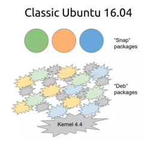

为了能够使得在16.04 LTS的系统上运行snap应用，必须做一些安装。在的terminal中输入如命令：

```bash
$ sudo apt update
$ sudo apt install snapd
$ sudo apt install snapcraft
```

**snap特性**

1. 自动更新，使你的应用永远是最新的
2. 回退版本容易
3. 免费
4. 简单快速的从GNOME Software或通过命令行安装应用
5. Snaps是安全的，完全与系统，其它应用还有硬件功能进行隔离

**snap包三种模式**

- Strict限制模式：所有包都需要遵守。snap包只有访问它所安装的文件夹，如果用户目录对snap包是可用的，用户也可以访问用户目录。严格限制模式，只能使应用读写如下目录：
  - /snap/\<snap>/\<revision> （只读，安装目录）
  - /var/snap/\<snap>/\<revision>（读/写，per-revision data）
  - /var/snap/\<snap>/common (读/写, common data)
  - /home/$USER/snap/\<snap>/\<revision> (读/写, per-revision user data)
  - /home/$USER/snap/\<snap>/common (读/写, common user data).

- Classic限制模式:该模式下的snap包和.deb包的工作方式一样，没有任何访问限制。处在该模式下的snap包可以访问home目录以外的目录，甚至可以读书root目录。然应用可以使用classic限制模式，但并不意味着每一个应用都可以在该模式下发布。如果想以该限制模式发行，必需要经过snapcraft.io组的审核，该组所有成员同意要以该模式发布的原由才可以该模式发布。

- Devmode限制模式:用于开发和测试，在该模式下的snaps安装包是不可以发布到稳定通到下。当确认稳定可以被发布的时候，开发者必需改为strict模式或classic模式。


宗上所述Snaps除了在安全和更新上优于deb,在其它方面优于deb包。使用snaps，你可以一直使用最新版本的应用，因为他会和他的依赖包一起打包，运行不需要依赖系统包。所以在安装软件的时候优先通过snap安装！！！

## Snap常用命令

命令|解释
---|---
snap find  |列出适用于当前系统的 Snap 软件包。
snap install <包名> | 安装软件包。
snap list | 查看当前系统中已安装的 Snap 软件包。
snap changes | 查看系统的更改历史记录。
snap refresh <包名>  | 升级 Snap 软件包版本。
snap remove <包名> | 移除 Snap 软件包。
snap info <包名> | 查看包信息 
snap switch –channel=xxxx xxxx | 更换软件安装通道
snap revert xxxx | 还原到之前版本

```
注：默认情况下，是通过stable的通道进行安装的。 如果想换通道可以用如下两种方式：
a)snap install <包名> –<通道名>  
b)snap switch–channel=<通道名> <包名> 然后执行snap refresh。（该方案只能用来从另一个通道更新软件包）

如果遇到cannot find signatures with metadata for snap报错，是因为没有经过snap store签名，需要加--dangerous选项，即snap install xxx --dangerous。

install安装选项参数：
--beta       --classic    --devmode    --no-wait    --unaliased  
--candidate  --color      --edge       --revision   --unicode    
--channel    --dangerous  --jailmode   --stable
```

可以通过[snapcraft store](https://snapcraft.io/store)查看可以安装的snap APP。

## Ubuntu中snap安装软件太慢解决办法

可以通过如下两种方案解决：一是下载好包手动安装,二设置snap的代理.

**下载安装包方式**

1. 到 https://uappexplorer.com/snaps 搜索需要的 snap 包,然后下载
2. 下载的时候选择对应的平台. 如 amd arm64 
3. 到下载snap的目录里面执行 sudo snap install xxx.snap --dangerous

**设置snap的代理**

1. 修改配置`sudo systemctl edit snapd`
2. 添加如下内容
   ```
   [Service]
   Environment="http_proxy=http://代理ip:代理的端口"
   Environment="https_proxy=http://代理ip:代理的端口"
   ```
3. 让systemd重载配置`sudo systemctl daemon-reload`
4. 重新启动snap服务`sudo systemctl restart snapd`
   
# nixnote2

**安装：**

- sudo add-apt-repository ppa:nixnote/nixnote2-stable
- sudo apt update
- apt install nixnote2 (在ubuntu 18版本下只需要这一个命令即可)

    Nixnote 是一个 Evernote 开源客户端，原名 Nevernote。Evernote 是一个著名的笔记等个人资料整理和同步软件， 因为 Evernote 没有 Linux 下的官方版本，因此出现了这个使用 Evernote 开放 API 实现的客户端，现在已经可以运行在 Mac、Linux 和 Windows 上。支持通过 Evernote 账户同步你的笔记等各种数据。

但用命令行安装的没有图标，要自己补图标，所以有人建议直接下载用dkpg安装并安装其依赖包即可，下载地址：https://sourceforge.net/projects/nevernote/

当然也可以通过Wine来安装Evernote，但可能会出现中文字体乱码。可以通Evernot的Tool-->Options-->Note下去选择支持中文的字体。我本机使用的是Noto Sans Mono CJK TC Regular字体

**添加账户与更新：**

File-->Add user完成帐户添加。然后点Sync完成授权与更新，授权的时候会弹出对话界面，输入完帐户如果没有弹出密码输入框，用鼠标点击一下右下角的create account就好

注：因为印象笔记分为国服和国际版，所以在创建账户的时候需要做选择如下图所示左为国际版本，右为国内版本。

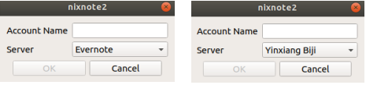

这个也可以使用RamBox做代理处理，但有的时候我们没有网络的时候也是需要使用的，所以还是用该客户端来使用以解决离线使用问题

# RamBox

免费的开源消息和电子邮件应用程序，可以将常见的Web应该程序组合在一起，即只要是有网页端的都可以使用RamBox做代理客户端来访问。比如，可以将WeChat的页面端交给RamBox来代理。这样我们不用在浏览器多个页面中来回切换找WeChat了。

官方描述，直白的讲就是一个工作浏览器，可以组织Web应用：

```
Rambox is a workspace browser that allows you to manage as many applications as you want, all in one place. It is perfect for people who care about productivity and work with many applications, both business and personal.
```

安装
- Step1.到https://github.com/ramboxapp/community-edition/releases/下载
- Step2.如果是deb的用sudo dpkg -i xxx.deb
- Step3.在命令行输入rambox启动看一下是否正常

使用中可能出现的问题：输入法不能切换或者你点Rambox桌面图标没有办法启动。可以在命令行输入rambox看是否有错，我用的时候发现Rambox是以Root权限安装，导致我用用户权限时~	/.config/rambox这个目录没有权限，我用chmod 777强制更改了，以上两个问题就都解决了。或者用chown [-R]  用户名：用户组名 文件或目录 

最近发现Snap craft上发布了安装，所以安装可以简化为`sudo snap install rambox`

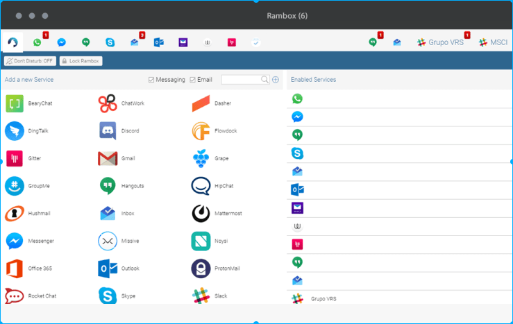

# JDK安装

第一种方式下载JDK
- Step 1：
在https://www.oracle.com/technetwork/java/javase/downloads/index.html下选择下载版本，我本地是jdk-8u181-linux-x64.tar.gz。
- Step2: 用tar解压，或者直接在图形界面解压出来即可
- Step3: 编辑/etc/profile文件加入JAVA_HOME;PATH;CLASSPATH(可加可不加);其中JAVA_HOME是你的解压目录
```
# the following configuration is for jdk
export JAVA_HOME=/install_path/jkdx.x.x
export PATH=$PATH:$JAVA_HOME/bin
export CLASSPATH=.:$JAVA_HOME/lib:$JAVA_HOME/jre/lib
```

- Step4：执行 chmod +x profile ，把profile变成可执行文件
- Step5：执行 source profile, 把profile里的内容执行生效
- Step6： 执行 java、 javac、java -version 查看是否安装成功.

第二种方式通过APT：
- Step1:sudo add-apt-repository ppa:webupd8team/java
- Step2: sudo apt-get update
- Step3: sudo apt-get install oracle-java8-installer

# wine

在16.04下的安装过程如下

```bash
wget -nc https://dl.winehq.org/wine-builds/Release.key
sudo apt-key add Release.key
sudo apt-add-repository 'deb https://dl.winehq.org/wine-builds/ubuntu/ xenial main'
sudo apt-get update
sudo apt-get install --install-recommends winehq-stable
wine --version
```

wine的源地址：https://dl.winehq.org/wine-builds/

## exe文件的安装
使用命令：wine exe文件在Linux上的路径加文件名，例如：wine /home/user/download/tim.exe

## exe程序的卸载

**使用删除文件法：**

1.  wine会在/home下的用户名目录生成三个隐藏的文件夹 .wine、.local、.config 等文件夹，快捷键 ctrl+H 可以显示出来;
2.  进入 .wine 文件夹可以看到 drive_c 文件夹，这是wine自动生成的虚拟windows  C盘，里面有类似windows系统盘的目录结构，在里面找到需要卸载的软件文件夹删除即可；
3.  找到/home/用户名/.local/share/applications/wine/Programs，将软件对应的文件删除；
4.  找到/home/用户名/.config/menus/applications-merged，将软件对应的文件删除；
5.  这时候已经删除完毕，但是可能还会看到桌面图标或软件列表，重启系统即可。

**命令行**

wine uninstaller


## Wine的相关配置命令

winecfg： Wine配置编辑器,通过该命令会弹出一个Wine Configuration GUI，方便配置wine。比如模拟的windows系统版本等

winetricks:GUI版本，用来配置wine的windows环境

ntlm_auth >= 3.0.25Error解决方法

```bash
ERROR INFO:Make sure that ntlm_auth >= 3.0.25 is in your path. Usually, you can find it in the winbind package of your distribution.

$sudo apt install winbind
```

[字体下载](http://www.font5.com.cn),下载的字体直接放到`~/.wine/drive_c/windows/Fonts`下即可让wine支持该字体


# WeChat

Deepin OS开发的WeChat还是可以的，使用起来和Win下没有太大区别。简单的安装过程如下：

1. sudo wget -O - http://package.elementaryos.cn/apt/key/package.gpg.key | sudo apt-key add -  
这个仓库是一个国内的团队为ElementaryOS镜像基础上进行了本地华集成的软件库，里面包含了很多deepinOS团队做的软件。
2. sudo apt update
3. sudo apt install deepin.com.wechat

当然这个更新很依赖与维护者，所以如果喜欢用最新的还是使用网页版本，但是截图功能算是废了

或者选择electronic-wechat，只需要使用`sudo snap install electronic-wechat`安装即可。

目前看WeChat在Ubuntu下都不是很稳定，DeepinOS的安装到20.04上输入中文有乱码！所以还是用网页版本的好。


# Thunderbird

**中文乱码解决**

通过邮件客户端设置方式解决

1.点菜单-->查看(view)-->文本编码（Text Encoding）-->unicode

2.如果上步没有解决，右键收件箱-->属性（Propeties）-->Fallback Text Encoding设置成GBK
注：第二步的操作可以在收件，发件，草稿箱都可以处理

设置操作系统语言方式解决

Settings-->Region&Language-->Manage Installed Languages-->把汉语（中国）排到第一位。但这种方式会导致有的应用的界面是乱码（因为有的APP不支持中文）

推荐安装Lightning，在附加组件里查询安装就可以，完成后有如下日历和任务功能。作为工作跟踪提示非常方便。
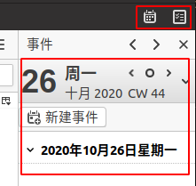

# VirtualBox安装

[VirtualBox下载地址](https://www.virtualbox.org/wiki/Linux_Downloads)。Windows系统的IOS，这个目前没有发现官方的，可以自行Baidu。

安装好后打开VirtualBox,开始创建虚拟系统。

- step1 输入名称，类型，版本等信息，下一步
- step2 内存大小设置，然后下一步
- step3 选择虚拟硬盘，然后选创建
- step4 选择虚拟硬盘文件类型（一般选择VDI），然后选下一步
- step5 选择存储在物理硬盘上（一般动态分配就好），然后下一步
- step6 选择文件位置和大小，最后点创建。
- step7 点击启动创建成功的虚拟设备，选择启动盘，选择下好的ISO镜像即可。如下图

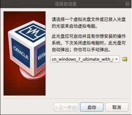

注：安装过程可能会出现，CPU不适配64位操作系统类似错误，如果能确定CPU是支持的，那么只需要去BIOS里设置一下 Intel VT为enable(名字可能因BIOS而不同，全称为Virtualization Technology)。如果你在BIOS里打开了后前面安装步骤需要重新做一遍，如下图所示例：

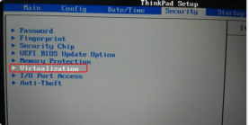

另外也需要注意是否在如下图版本上设置的是64位的。（点击VirtualBox界面的“设置就可以看到下图”或者在Step1.输入名称中可以看到）

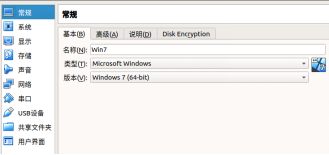

## 设置共享文件夹

- step1 启动指定虚拟设备后可以看到如下界面，选择“设备”-->”共享文件夹”

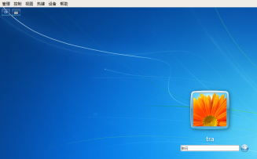

- step2 弹出如下图后，点击右边+

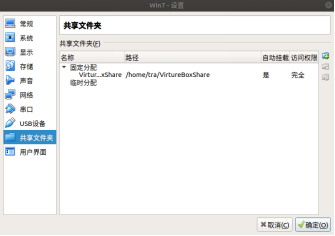

- step2 在弹出对话框，选择好共享文件路径和输入名字，把“自动挂载”和“固定分配”勾选。这样就可以生成一个上图所示的“固定分配”共享文件，这样不会因为重启而消失!

- step3 启动虚拟系统，2.进入我的电脑会看到“有可移动存储的设备”，如下图所示：

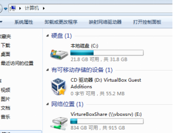

- step4 双击VirtualBox Guest进行，会有如下类似显示

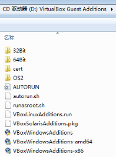

选择适合你电脑的安装，我本机选的是VBoxWindowsAdditions-amd64,然后一路同意即可。

*注：有的时候在使用网络位置共享文件的时候无法用copy可以直接用鼠标拖拽即可。*


# Postman

Windows平台下测试API的利器，尤其是开发后台RESTful接口的时候。方便、易用、可视化的测试接口。好消息是2019年10月23官方发布了snap的版本。现在只需要使用`sudo snap install postman`命令就可以方便快捷的在Ubuntu系统上使用。看着久违的界面，心情舒畅啊！

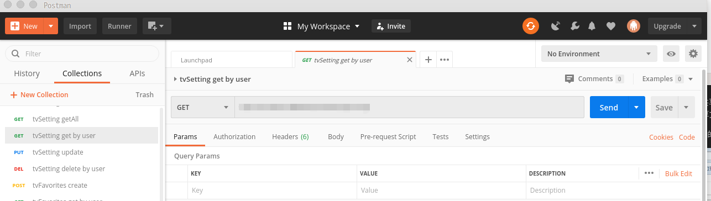

注：Ubuntu18.04下我目前测试可用的是`sudo snap install --channel=v6/stable postman`。目前最新版本latest/stable:    7.22.1 2020-04-09并不能正常启动

# 截屏

如果只需要获取一张屏幕截图，不对其进行编辑的话，那么键盘的默认快捷键就可以满足要求了。而且不仅仅是 Ubuntu ，绝大部分的 Linux 发行版和桌面环境都支持以下这些快捷键：

1.  PrtSc – 获取整个屏幕的截图并保存到 Pictures 目录。
2.  Shift + PrtSc – 获取屏幕的某个区域截图并保存到 Pictures 目录。
3.  Alt + PrtSc –获取当前窗口的截图并保存到 Pictures 目录。
4.  Ctrl + PrtSc – 获取整个屏幕的截图并存放到剪贴板。
5.  Shift + Ctrl + PrtSc – 获取屏幕的某个区域截图并存放到剪贴板。
6.  Ctrl + Alt + PrtSc – 获取当前窗口的 截图并存放到剪贴板。


## flameshot

用的是 Ubuntu 18.0.4，那么只需要在 Ubuntu 软件中心上搜索，就可以找到 Flameshot 进而完成安装了。要是你想使用终端来安装，可以执行以下命令：`sudo apt install flameshot`

但如果是16.0.4需要多一步添加PPA

```
sudo add-apt-repository ppa:harish2704/ppa1
sudo apt-get update
sudo apt install flameshot
```

flameshot PPA:  https://launchpad.net/~harish2704/+archive/ubuntu/ppa1

安装完成后按如下做快捷键配置：设置>设备>键盘，设置一个自定义快捷键ctrl+alt+a（拉到最下面）命令填写：flameshot gui。

新版本的基本和微信的截图功能很相似了！

# terminator

很好用的终端,可以方便的降终端分割开。这样就不用启动多个终端。只需要通过`sudo apt-get install terminator`命令安装即可，安装完成会自动配置成默认的终端。

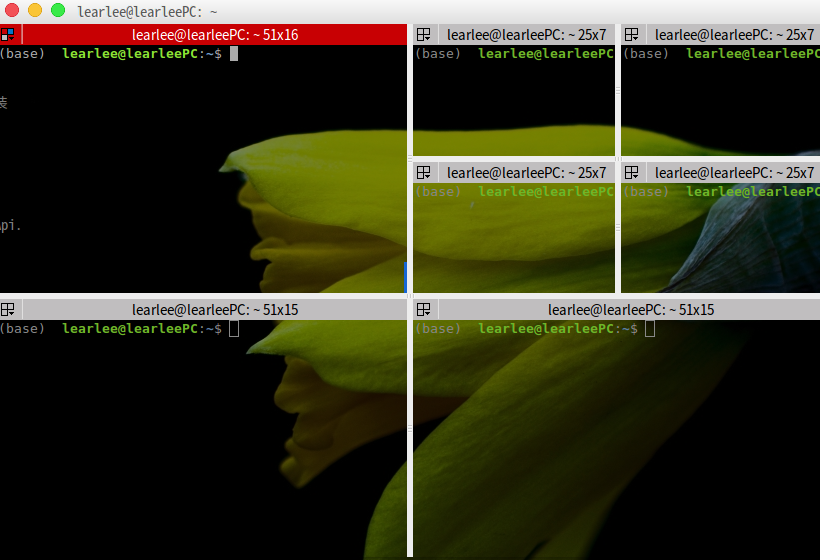

# 音乐播放器

Ubuntu18的用户首推的当然是网易云音乐，官方出品支持Linux系统。下载方式如下图：

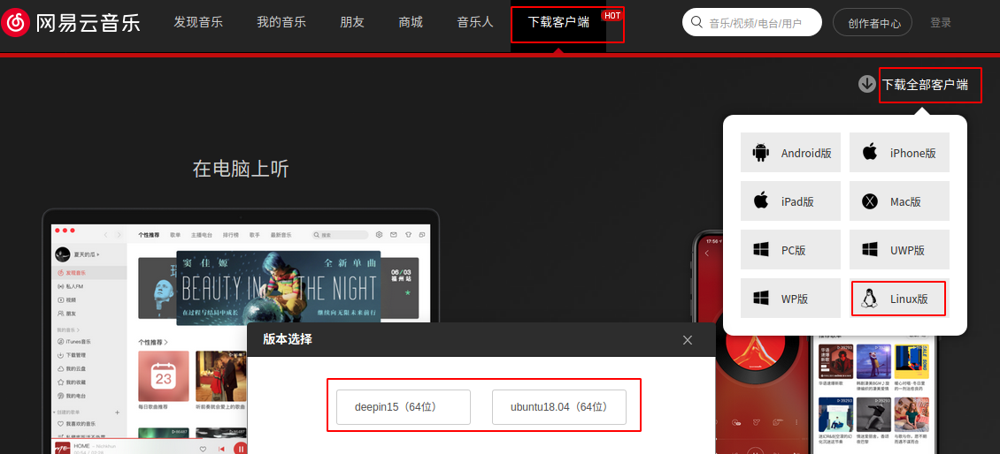


# 录屏工具RecordMyDesktop

RecordMyDesktop是一个屏幕播放应用程序，可以制作具有同步音频的视频，用户可以选择任何选定的桌面区域或整个屏幕。

在Ubuntu 16.04版本及以上版本只需要使用命令`sudo apt install gtk-recordmydesktop`

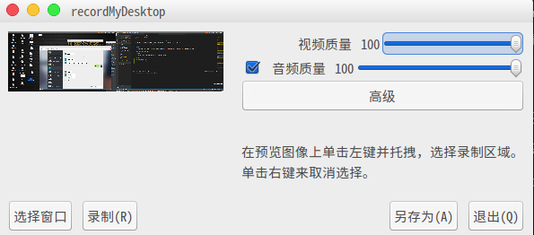

启动后先选择"另存为"选择好要存放的文件及位置。

然后点击右上角红色按键选择录制区域如下图

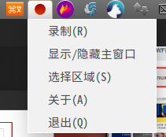

录制完成后在同样地方选择暂停，他会自动把录制转为ogv视频格式，如果需要mp4等就需要ffmpeg来处理了。转换mp4命令：`ffmpeg -i demo.ogv -f mp4 demo.mp4`

# FFmpeg

FFmpeg是一套可以用来记录、转换数字音频、视频，并能将其转化为流的开源计算机程序。采用LGPL或GPL许可证。它提供了录制、转换以及流化音视频的完整解决方案。它包含了非常先进的音频/视频编解码库libavcodec，为了保证高可移植性和编解码质量，libavcodec里很多code都是从头开发的。

可以通过snap安装：`sudo snap install ffmpeg`

转换音视频的利器，缺点就是没有界面！

# 百度网盘

百度推出了官方APP，但目前看到的只适合Ubuntu V18.04。安装过程很简单，先到[百度网盘下载页面](https://pan.baidu.com/download)下载deb文件。如果安装了Gdebi可以直接使用`sudo gdebi xxxx.deb`来安装。否者使用`sudo dpkg -i xxx.deb`安装，如果出现依赖失败，可以使用`sudo apt-get install -f` 来修正，然后再使用dpkg命令安装一次就好。

# MySQL客户端

在Ubuntu下有两个，一个可以使用官方的MySQL Workbench,另一个可以使用beekeeper-studio，beekeeper-studio安装`sudo snap install beekeeper-studio`。其界面如下，但功能上来说目前只是查询，相对MySQL Workbench要弱。但兼容SQLite、MySQL、MariaDB、Postgres、CockroachDB、SQL Server、Amazon Redshift。当然也是跨平台的，支持Linux、windows、MacOS


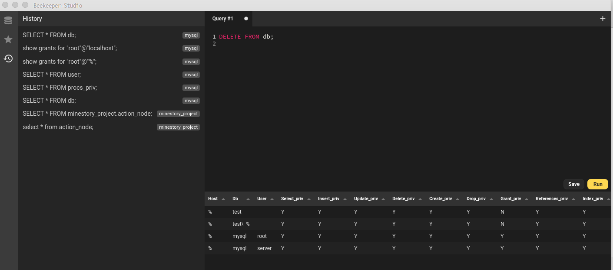

# Anaconda安装

Step1: [下载页面](https://www.anaconda.com/products/individual) ，拉到最下面找到Anaconda Installers。实际就是个sh文件，下载完成后运行Step2

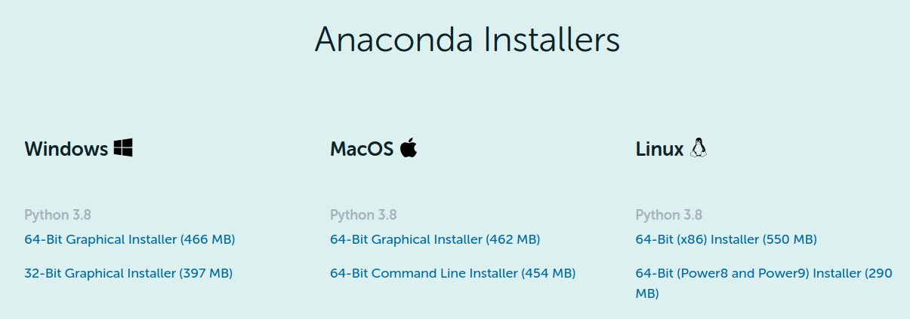

Step2: `bash Anaconda3-2020.07-Linux-x86_64.sh`  中间回答一些基本问题就安装好了

Step3: 重新启动teminal,安装完成的提示如下 `==> For changes to take effect, close and re-open your current shell. <==`，安装完成后会配置好.bashrc文件，所以需要重新启动teminal

# drawio

安装：`sudo snap install drawio`,可以用来绘制简单的软件图，比如UML等,如下图所示。

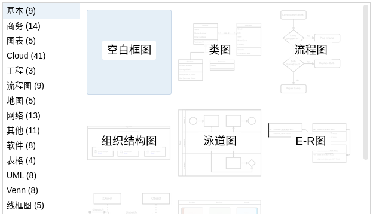


# VSCode

目前来看（2020/10/25）VSCode使用Snap安装有输入法无法切换问题，所以还是建议去官方网站下载deb文件使用`sudo dpkg -i xxx.deb`来安装

[下载地址](https://code.visualstudio.com/)

# VLC播放器

由于Ubuntu自带的播放器支持格式太少，使用该浏览器代替下，挺好用的。它支持的格式如下所示：

```
It notably plays MKV, MP4, MPEG, MPEG-2, MPEG-4, DivX, MOV, WMV, QuickTime, WebM, FLAC, MP3, Ogg/Vorbis files, BluRays, DVDs, VCDs, podcasts, and multimedia streams from various network sources. 
```

运行 `sudo snap install vlc`命令就可以简单安装了

