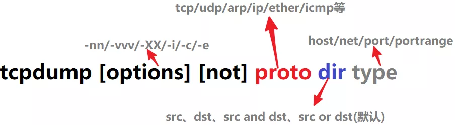

# ( ) { }作用

单独单括号()：另开命令组——小括号中的内容会开启一个子shell独立运行,括号中以分号连接，最后一个命令不需要`分号`。有的文章说各命令和括号无空格，但我在ubuntu下测试有空格也是可以的

```bash
$ a=6
$ echo $a
6
$ ( a=5; echo $a ) or (a=5; echo $a)
5
$ echo $a
6

```

单独大括号{}：创建匿名函数——不会新开进程，括号内变量余下仍可使用。括号内的命令间用`分号`隔开，最后一个也必须有`分号`。**{}的第一个命令和左括号之间必须要有一个空格**。

```bash
$ b=1
$ { b=2;echo $b; }
2
$ echo $b
2
```

双括号(())：省去$符号的算术运算

```bash
$ a=6
$ echo $a
6
$ ((a++))
$ echo $a
7
```

# Linux下在一行执行多条命令

要实现在一行执行多条Linux命令，分三种情况：

1. &&

```
示例：
lpr /tmp/t2 && rm /tmp/t2
第2条命令只有在第1条命令成功执行之后才执行。当&&前的命令“lpr /tmp/t2”成功执行后"rm /tmp/t2"才执行，根据命令产生的退出码判断是否执行成功（0成功，非0失败）。
```

2. ||

```
示例：
cp /tmp/t2 /tmp/t2.bak || rm /tmp/t2
只有||前的命令“cp /tmp/t2 /tmp/t2.bak”执行不成功（产生了一个非0的退出码）时，才执行后面的命令。
```

3. ;

```
示例：
cp /tmp/t2 /tmp/t2.bak; echo "hello world"
顺序执行多条命令，当‘;’号前的命令执行完（不管是否执行成功）才执行‘;’后的命令。
```

# linux后台运行命令nohup和&的区别

1. &的意思是在后台运行， 什么意思呢？  意思是说， 当你在执行 ./a.out & 的时候， 即使你用ctrl C,  那么a.out照样运行（因为对SIGINT信号免疫）。 但是要注意， 如果你直接关掉shell后， 那么， a.out进程同样消失。 可见， &的后台并不硬（因为对SIGHUP信号不免疫）。

2. nohup的意思是忽略SIGHUP信号， 所以当运行nohup ./a.out的时候， 关闭shell, 那么a.out进程还是存在的（对SIGHUP信号免疫）。 但是， 要注意， 如果你直接在shell中用Ctrl C, 那么, a.out进程也是会消失的（因为对SIGINT信号不免疫）

3. 所以， &和nohup没有半毛钱的关系， 要让进程真正不受shell中Ctrl C和shell关闭的影响， 那该怎么办呢？ 那就用nohua ./a.out &吧， 两全其美。

# update-alternatives

**介绍**

我们可能会同时安装有很多功能类似的程序和可选配置，可能会出现同一软件的多个版本并存的场景。比如像是一些编程语言工具，一些系统中自带的是python2.6，而现在python2.7和python3.4使用较多，还有java有1.6，1.7和1.8版本。

update-alternatives是Debian系统中专门维护系统命令链接符的工具，通过它可以很方便的设置系统默认使用哪个命令、哪个软件版本，比如系统中同时安装了open jdk和sun jdk两个版本，而我们又希望系统默认使用sun jdk，通过update-alternatives就可以方便实现管理。

**格式参数**

命令格式：update-alternatives [<选项> ...] <命令> 

主要参数：

```
Commands:
  --install <link> <name> <path> <priority>
    [--slave <link> <name> <path>] ...
                           在系统中加入一组替换项.
  --remove <name> <path>   从 <名称> 替换组中去除 <路径> 项.
  --remove-all <name>      从替换系统中删除 <名称> 替换组.
  --auto <name>            将 <名称> 的主链接切换到自动模式.
  --display <name>         显示关于 <名称> 替换组的信息.
  --query <name>           machine parseable version of --display <name>.
  --list <name>            列出 <名称> 替换组中所有的可用替换项.
  --get-selections         list master alternative names and their status.
  --set-selections         read alternative status from standard input.
  --config <name>          列出 <名称> 替换组中的可选项，并就使用其中
                                 哪一个，征询用户的意见.
  --set <name> <path>      将 <路径> 设置为 <名称> 的替换项.
  --all                    对所有可选项一一调用 --config 命令.

<link> 你希望使用的符号链接，比如/usr/bing/pager。最终会生成指向 /etc/alternatives/<名称> 的符号链接.
  (e.g. /usr/bin/pager指向/etc/alternatives/pager，而/etc/alternatives/page指向path参数位)如下所示:
创建/usr/bing/go符号链接管理/home/learlee/MyBin/go/bin/go。使用名字为go。但/etc/alternatives/go并不是你事先创建的，而是由update-alternatives创建。

$ sudo update-alternatives --install /usr/bin/go go /home/learlee/MyBin/go/bin/go 100
$ ll /usr/bin/go
lrwxrwxrwx 1 root root 20 6月  26 13:22 /usr/bin/go -> /etc/alternatives/go*
$ ll /etc/alternatives/go
lrwxrwxrwx 1 root root 29 6月  26 13:22 /etc/alternatives/go -> /home/learlee/MyBin/go/bin/go*

<name> 是该链接替换组的主控名.
  (e.g. pager)
<path> 是替换项目标文件的位置.
  (e.g. /home/learlee/MyBin/go/bin/go*)
<priority> 是一个整数，在自动模式下，这个数字越高的选项，其优先级也就越高.

Options:
  --altdir <directory>     指定不同的可选项目录.
  --admindir <directory>   指定不同的管理目录.
  --log <file>             设置log文件.
  --force                  allow replacing files with alternative links.
  --skip-auto              skip prompt for alternatives correctly configured
                           in automatic mode (relevant for --config only)
  --verbose                详尽的操作进行信息，更多的输出.
  --quiet                  安静模式，输出尽可能少的信息.
  --help                   显示本帮助信息.
  --version                显示版本信息.
```

**示例**

系统如果默认的python3是3.5，现在我要将自己安装的python3.6设置为默认的python3命令的默认版本，执行下面的代码：

```bash
sudo update-alternatives --install /usr/bin/python3 python3 /usr/bin/python3.5 100
sudo update-alternatives --install /usr/bin/python3 python3 /usr/bin/python3.6 200
```

然后执行下面代码选择我们安装的python版本，即序列1：

```bash
 learlee@learleePC:/usr/bin$ update-alternatives --config python3 
There are 2 choices for the alternative python3 (providing /usr/bin/python3).

  Selection    Path                Priority   Status
------------------------------------------------------------
  0            /usr/bin/python3.6   2         auto mode
* 1            /usr/bin/python3.5   1         manual mode
  2            /usr/bin/python3.6   2         manual mode

Press <enter> to keep the current choice[*], or type selection number: 2
```

现在我们在看下/usr/bin/python3的的实际连接情况：

```bash
$ ll /usr/bin/python3
lrwxrwxrwx 1 root root 25 3月  25 14:22 /usr/bin/python3 -> /etc/alternatives/python3
$ ll /etc/alternatives/python3
lrwxrwxrwx 1 root root 18 3月  25 14:22 /etc/alternatives/python3 -> /usr/bin/python3.5*
```

可以看到现在的/usr/bin/python3连接到得是/etc/alternatives/python3，而/etc/alternatives/python3是连接到实际的python可执行文件。而/etc/alternatives/python3连接是在通过update-alternatives --install创建的，在这里就相当一个桥一样。update-alternatives --config命令实际改变的是/etc/alternatives/python3的连接指向。

所以建议使用update-alternatives管理多个软件的不同版本！！！

# netstat

**介绍**

Netstat 命令用于显示各种网络相关信息，如网络连接，路由表，接口状态 (Interface Statistics)，masquerade 连接，多播成员 (Multicast Memberships) 等等。

**格式参数**

命令格式 

```bash
netstat  [address_family_options]  [--tcp|-t]  [--udp|-u]  [--raw|-w]  [--listening|-l]  [--all|-a]  [--numeric|-n]
[--numeric-hosts]  [--numeric-ports]  [--numeric-users]  [--symbolic|-N]  [--extend|-e[--extend|-e]]  [--timers|-o]
[--program|-p] [--verbose|-v] [--continuous|-c]
```

主要参数：

```
    -r, --route              display routing table
    -i, --interfaces         display interface table
    -g, --groups             display multicast group memberships
    -s, --statistics         display networking statistics (like SNMP)
    -M, --masquerade         display masqueraded connections

    -v, --verbose            be verbose
    -W, --wide               don't truncate IP addresses
    -n, --numeric            don't resolve names
    --numeric-hosts          don't resolve host names
    --numeric-ports          don't resolve port names
    --numeric-users          don't resolve user names
    -N, --symbolic           resolve hardware names
    -e, --extend             display other/more information
    -p, --programs           display PID/Program name for sockets
    -c, --continuous         continuous listing

    -l, --listening          display listening server sockets
    -a, --all, --listening   display all sockets (default: connected)
    -o, --timers             display timers
    -F, --fib                display Forwarding Information Base (default)
    -C, --cache              display routing cache instead of FIB

  <Socket>={-t|--tcp} {-u|--udp} {-w|--raw} {-x|--unix} --ax25 --ipx --netrom
  <AF>=Use '-6|-4' or '-A <af>' or '--<af>'; default: inet
  List of possible address families (which support routing):
    inet (DARPA Internet) inet6 (IPv6) ax25 (AMPR AX.25) 
    netrom (AMPR NET/ROM) ipx (Novell IPX) ddp (Appletalk DDP) 
    x25 (CCITT X.25) 
```

***NOTE : LISTEN和LISTENING的状态只有用-a或者-l才能看到***

**状态说明**

    LISTEN：侦听来自远方的TCP端口的连接请求
    SYN-SENT：再发送连接请求后等待匹配的连接请求（如果有大量这样的状态包，检查是否中招了）
    SYN-RECEIVED：再收到和发送一个连接请求后等待对方对连接请求的确认（如有大量此状态，估计被flood攻击了）
    ESTABLISHED：代表一个打开的连接
    FIN-WAIT-1：等待远程TCP连接中断请求，或先前的连接中断请求的确认
    FIN-WAIT-2：从远程TCP等待连接中断请求
    CLOSE-WAIT：等待从本地用户发来的连接中断请求
    CLOSING：等待远程TCP对连接中断的确认
    LAST-ACK：等待原来的发向远程TCP的连接中断请求的确认（不是什么好东西，此项出现，检查是否被攻击）
    TIME-WAIT：等待足够的时间以确保远程TCP接收到连接中断请求的确认
    CLOSED：没有任何连接状态

**示例** 

```bash
netstat -nltp  #禁用反向域名解析功能，列出tcp监听端口并显示进程号
(Not all processes could be identified, non-owned process info
 will not be shown, you would have to be root to see it all.)
Active Internet connections (only servers)
Proto Recv-Q Send-Q Local Address           Foreign Address         State       PID/Program name
tcp        0      0 127.0.0.1:27206         0.0.0.0:*               LISTEN      11376/code      
tcp        0      0 127.0.1.1:53            0.0.0.0:*               LISTEN      -               
tcp        0      0 127.0.0.1:631           0.0.0.0:*               LISTEN      -               
tcp        0      0 127.0.0.1:1080          0.0.0.0:*               LISTEN      31016/ss-qt5    
tcp6       0      0 ::1:631                 :::*                    LISTEN      


active 状态的套接字连接用 "ESTABLISHED" 字段表示，所以我们可以使用 grep 命令获得 active 状态的连接：
$ netstat -atnp | grep ESTA
(Not all processes could be identified, non-owned process info
will not be shown, you would have to be root to see it all.)
tcp 0 0 192.168.1.2:49156 173.255.230.5:80 ESTABLISHED 1691/chrome
tcp 0 0 192.168.1.2:33324 173.194.36.117:443 ESTABLISHED 1691/chrome


默认情况下 netstat 会通过反向域名解析技术查找每个 IP 地址对应的主机名。这会降低查找速度。如果你觉得 IP 地址已经足够，而没有必要知道主机名，就使用 -n 选项禁用域名解析功能。
netstat -ant  #列出所有tcp链接，禁用反向域名解析功能
```

# tee 

是在不影响原本 I/O 输出的情况下，将 stdout 复制一份到档案里

**格式参数**

命令格式：

tee [OPTION]... [FILE]...

参数说明：

```bash
-a, --append : append to the given FILEs, do not overwrite

-i, --ignore-interrupts : ignore interrupt signals
  
-p : diagnose errors writing to non pipes
      
--output-error[=MODE] : set behavior on write error.  See MODE below

--help : display this help and exit

--version : output version information and exit
```

**示例**

ls | tee test.txt,会在显示器中打出ls的结果，同时也会在test.txt里保存一份


# chown

chmod命令用来变更文件或目录的权限。在UNIX系统家族里，文件或目录权限的控制分别以读取、写入、执行3种一般权限来区分，另有3种特殊权限可供运用。用户可以使用chmod指令去变更文件与目录的权限，设置方式采用文字或数字代号皆可。符号连接的权限无法变更，如果用户对符号连接修改权限，其改变会作用在被连接的原始文件。

**格式参数**

命令格式：

chown [-R] 账号名称 文件或目录
chown [-R] 账号名称:用户组名称 文件或目录

参数：

```
-c或——changes：效果类似“-v”参数，但仅回报更改的部分；
-f或--quiet或——silent：不显示错误信息；
-R或——recursive：递归处理，将指令目录下的所有文件及子目录一并处理；常常用在更改某一目录的情况。
-v或——verbose：显示指令执行过程；
--reference=<参考文件或目录>：把指定文件或目录的所属群组全部设成和参考文件或目录的所属群组相同；
<权限范围>+<权限设置>：开启权限范围的文件或目录的该选项权限设置；
<权限范围>-<权限设置>：关闭权限范围的文件或目录的该选项权限设置；
<权限范围>=<权限设置>：指定权限范围的文件或目录的该选项权限设置；
```

权限范围的表示法如下：

* u User，即文件或目录的拥有者；
* g Group，即文件或目录的所属群组；
* o Other，除了文件或目录拥有者或所属群组之外，其他用户皆属于这个范围；
* a All，即全部的用户，包含拥有者，所属群组以及其他用户；
* r 读取权限，数字代号为“4”;
* w 写入权限，数字代号为“2”；
* x 执行或切换权限，数字代号为“1”；
* \- 不具任何权限，数字代号为“0”；
* s 特殊功能说明：变更文件或目录的权限。

Linux用 户分为：拥有者、组群(Group)、其他（other），Linux系统中，预设的情況下，系统中所有的帐号与一般身份使用者，以及root的相关信息，都是记录在/etc/passwd文件中。每个人的密码则是记录在/etc/shadow文件下。 此外，所有的组群名称记录在/etc/group內！

linux文件的用户权限的分析图如下图所示


**示例**

```
chmod u+x,g+w f01　　//为文件f01设置自己可以执行，组员可以写入的权限
chmod u=rwx,g=rw,o=r f01 //和上示例相同

chmod 764 f01 //给拥有者rwx权限,给组rw权限,给其它用户r权限

chmod a+x f01　　//对文件f01的u,g,o都设置可执行属性

文件的属主和属组属性设置
chown user:market f01　　//把文件f01给uesr，添加到market组
```

# usermod

usermod命令用于修改用户帐号。用来修改用户帐号的各项设定。

**格式参数**

命令格式：usermod [options] LOGIN

参数：

```
-a|--append     ##把用户追加到某些组中，仅与-G选项一起使用 
-c|--comment    ##修改/etc/passwd文件第五段comment 
-d|--home       ##修改用户的家目录通常和-m选项一起使用 
-e|--expiredate ##指定用户帐号禁用的日期，格式YY-MM-DD 
-f|--inactive   ##用户密码过期多少天后采用就禁用该帐号，0表示密码已过期就禁用帐号，-1表示禁用此功能，默认值是-1 
-g|--gid        ##修改用户的gid，改组一定存在
-G|--groups     ##把用户追加到某些组中，仅与-a选项一起使用 
-l|--login      ##修改用户的登录名称 
-L|--lock       ##锁定用户的密码 
-m|--move-home  ##修改用户的家目录通常和-d选项一起使用 
-s|--shell      ##修改用户的shell 
-u|--uid        ##修改用户的uid，该uid必须唯一 
-U|--unlock     ##解锁用户的密码
```

**示例**

```bash
#1,新建用户test，密码test,另外添加usertest组
$ useradd test 
$ echo "test" | passwd --stdin test 
$ groupadd usertest 
#2,把test用户加入usertest组
$ usermod -aG usertest test ##多个组之间用空格隔开 
$ id test 
  uid=500(test) gid=500(test) groups=500(test),501(usertest) 
#3,修改test用户的家目录
$ usermod -md /home/usertest 
$ ls /home 
  usertest 
#4,修改用户名
$ usermod -l testnew(新用户名称)  test(原来用户名称) 
$ id testnew 
  uid=500(testnew) gid=500(test) groups=500(test),501(usertest) 
#5,锁定testnew的密码
$ sed -n '$p' /etc/shadow 
  testnew:$6$1PwPVBn5$o.MIEYONzURQPvn/YqSp69kt2CIASvXhOnjv/t 
  Z5m4NN6bJyLjCG7S6vmji/PFDfbyITdm1WmtV45CfHV5vux/:15594:0:99999:7::: 
$ usermod -L testnew 
$ sed -n '$p' /etc/shadow 
  testnew:!$6$1PwPVBn5$o.MIEYONzURQPvn/YqSp69kt2CIASvXhOnjv/t 
  Z5m4NN6bJyLjCG7S6vmji/PFDfbyITdm1WmtV45CfHV5vux/:15594:0:99999:7::: 
#6,解锁testnew的密码
$ usermod -U testnew 
$ sed -n '$p' /etc/shadow 
  testnew:$6$1PwPVBn5$o.MIEYONzURQPvn/YqSp69kt2CIASvXhOnjv/t 
  Z5m4NN6bJyLjCG7S6vmji/PFDfbyITdm1WmtV45CfHV5vux/:15594:0:99999:7::: 
#7,修改用户的shell
$ sed '$!d' /etc/passwd 
  testnew:x:500:500::/home/usertest:/bin/bash 
$ usermod -s /bin/sh testnew 
$ sed -n '$p' /etc/passwd 
  testnew:x:500:500::/home/usertest:/bin/sh 
# 也可以手动编辑 vi /etc/passwd 找到testnew编辑保存即可
$ vi /etc/password

#8,修改用户的UID
$ usermod -u 578 testnew (UID必须唯一) 
$ id testnew 
  uid=578(testnew) gid=500(test) groups=500(test),501(usertest) 
#9,修改用户的GID
$ groupadd -g 578 test1 
$ usermod -g 578 testnew (578组一定要存在) 
$ id testnew 
  uid=578(testnew) gid=578(test1) groups=578(test1),501(usertest) 
#10,指定帐号过期日期
$ sed -n '$p' /etc/shadow 
  testnew:$6$1PwPVBn5$o.MIEYONzURQPvn/YqSp69kt2CIASvXhOnjv/t 
  Z5m4NN6bJyLjCG7S6vmji/PFDfbyITdm1WmtV45CfHV5vux/:15594:0:99999:7::: 
$ usermod -e 2012-09-11 testnew 
$ sed -n '$p' /etc/shadow 
  testnew:$6$1PwPVBn5$o.MIEYONzURQPvn/YqSp69kt2CIASvXhOnjv/t 
  Z5m4NN6bJyLjCG7S6vmji/PFDfbyITdm1WmtV45CfHV5vux/:15594:0:99999:7::15594: 
11,指定用户帐号密码过期多少天后，禁用该帐号
$ usermod -f 0 testnew 
$ sed -n '$p' /etc/shadow 
  testnew:$6$1PwPVBn5$o.MIEYONzURQPvn/YqSp69kt2CIASvXhOnjv/t 
  Z5m4NN6bJyLjCG7S6vmji/PFDfbyITdm1WmtV45CfHV5vux/:15594:0:99999:7:0:15594:
```

# lsof

在linux环境下，任何事物都以文件的形式存在，通过文件不仅仅可以访问常规数据，还可以访问网络连接和硬件。所以如传输控制协议 (TCP) 和用户数据报协议 (UDP) 套接字等，系统在后台都为该应用程序分配了一个文件描述符，无论这个文件的本质如何，该文件描述符为应用程序与基础操作系统之间的交互提供了通用接口。因为应用程序打开文件的描述符列表提供了大量关于这个应用程序本身的信息，因此通过lsof工具能够查看这个列表对系统监测以及排错将是很有帮助的。

**格式参数**

命令格式： lsof ［options］ filename

参数：

```
+d <目录>  列出目录下被打开的文件
+D <目录>  递归列出目录下被打开的文件
-a 列出打开文件存在的进程
-c <进程名> 列出指定进程所打开的文件
-g  列出GID号进程详情
-d <文件号> 列出占用该文件号的进程
-n <目录>  列出使用NFS的文件

-i <条件>  列出符合条件的进程。（4、6、协议、:端口、 @ip ）
  lsof -i [46] [protocol][@hostname|hostaddr][:service|port]
    46 --> IPv4 or IPv6
    protocol --> TCP or UDP
    hostname --> Internet host name
    hostaddr --> IPv4/IPv6地址
    service --> /etc/service中的 service name e.g., smtp (可以不止一个)
    port --> 端口号 (可以不止一个)

-p <进程号> 列出指定进程号所打开的文件

-u selects the listing of files for the user whose login names or user  ID  numbers  are  in  the  comma-separated set s - e.g.,``abe'', or ``548,root''.  (There should be no spaces  in  the set.)

-h 显示帮助信息
-v 显示版本信息
```

**示例**

```bash
lsof -u username  #列出某个用户打开的文件信息
lsof /filepath/file  #查看谁正在使用某个文件
lsof -c mysql  #列出某个程序所打开的文件信息
lsof -u test -c mysql  #列出某个用户以及某个程序所打开的文件信息
lsof -c -p 1234  #列出进程号为1234的进程所打开的文件
lsof -g gid  #显示归属gid的进程情况
lsof +d /usr/local/ #显示目录下被进程开启的文件
lsof +D /usr/local/# 同上，但是会搜索目录下的目录，时间较长
lsof -d 4 #显示使用fd为4的进程

```


# grep

（global search regular expression(RE) and print out the line，全面搜索正则表达式并把行打印出来）是一种强大的文本搜索工具，它能使用正则表达式搜索文本，并把匹配的行打印出来。 

**格式参数**

命令格式：
    grep [-abcEFGhHilLnqrsvVwxy][-A<显示列数>][-B<显示列数>][-C<显示列数>][-d<进行动作>][-e<范本样W式>][-f<范本文件>][--help][范本样式][文件或目录...]

参数：
```
-a 不要忽略二进制数据。
-A <显示列数> 除了显示符合范本样式的那一行之外，并显示该行之后的内容。
-b 在显示符合范本样式的那一行之外，并显示该行之前的内容。
-c 计算符合范本样式的列数。
-C <显示列数>或-<显示列数>  除了显示符合范本样式的那一列之外，并显示该列之前后的内容。
-d <进行动作> 当指定要查找的是目录而非文件时，必须使用这项参数，否则grep命令将回报信息并停止动作。
-e<范本样式> 指定字符串作为查找文件内容的范本样式。
-E 将范本样式为延伸的普通表示法来使用，意味着使用能使用扩展正则表达式。
-f<范本文件> 指定范本文件，其内容有一个或多个范本样式，让grep查找符合范本条件的文件内容，格式为每一列的范本样式。
-F 将范本样式视为固定字符串的列表。
-G 将范本样式视为普通的表示法来使用。
-h 在显示符合范本样式的那一列之前，不标示该列所属的文件名称。
-H 在显示符合范本样式的那一列之前，标示该列的文件名称。
-i 忽略字符大小写的差别。
-l 列出文件内容符合指定的范本样式的文件名称。
-L 列出文件内容不符合指定的范本样式的文件名称。
-n 在显示符合范本样式的那一列之前，标示出该列的编号。
-q 不显示任何信息。
-R/-r 此参数的效果和指定“-d recurse”参数相同。
-s 不显示错误信息。
-v 反转查找。
-w 只显示全字符合的列。
-x 只显示全列符合的列。
-y 此参数效果跟“-i”相同。
-o 只输出文件中匹配到的部分。
```

**示例**

```
在文件中搜索一个单词，命令会返回一个包含“match_pattern”的文本行：
grep match_pattern file_name
grep "match_pattern" file_name

在多个文件中查找：
grep "match_pattern" file_1 file_2 file_3 ...

输出除之外的所有行 -v 选项：
grep -v "match_pattern" file_name

标记匹配颜色 --color=auto 选项：
grep "match_pattern" file_name --color=auto

使用正则表达式 -E 选项：
grep -E "[1-9]+"
或
egrep "[1-9]+"

只输出文件中匹配到的部分 -o 选项：
echo this is a test line. | grep -o -E "[a-z]+\."
line.
echo this is a test line. | egrep -o "[a-z]+\."
line.

统计文件或者文本中包含匹配字符串的行数 -c 选项：
grep -c "text" file_name

输出包含匹配字符串的行数 -n 选项：
grep "text" -n file_name
或
cat file_name | grep "text" -n

#多个文件
grep "text" -n file_1 file_2

在多级目录中对文本进行递归搜索：
grep "text" . -r -n
# .表示当前目录。

忽略匹配样式中的字符大小写：
echo "hello world" | grep -i "HELLO"
hello

选项 -e 制动多个匹配样式：
echo this is a text line | grep -e "is" -e "line" -o
is
line
#也可以使用-f选项来匹配多个样式，在样式文件中逐行写出需要匹配的字符。
cat patfile
aaa
bbb
echo aaa bbb ccc ddd eee | grep -f patfile -o

在grep搜索结果中包括或者排除指定文件：
#只在目录中所有的.php和.html文件中递归搜索字符"main()"
grep "main()" . -r --include *.{php,html}

#在搜索结果中排除所有README文件
grep "main()" . -r --exclude "README"

#在搜索结果中排除filelist文件列表里的文件
grep "main()" . -r --exclude-from filelist
```

# tail

用于查看文件的内容，有一个常用的参数 -f 常用于查阅正在改变的日志文件。

**格式参数**

命令格式：
tail [参数] [文件]  

参数：
```
-f 循环读取,tail -f filename 会把 filename 文件里的最尾部的内容显示在屏幕上，并且不断刷新，只要 filename 更新就可以看到最新的文件内容。
-q 不显示处理信息
-v 显示详细的处理信息
-c <数目> 显示的字节数
-n <行数> 显示行数
--pid=PID 与-f合用,表示在进程ID,PID死掉之后结束.
-q, --quiet, --silent 从不输出给出文件名的首部
-s, --sleep-interval=S 与-f合用,表示在每次反复的间隔休眠S秒 
```

**示例**

```bash
tail notes.log #要显示 notes.log 文件的最后 10 行

tail -f notes.log #跟踪名为 notes.log 的文件的增长情况此命令显示 notes.log 文件的最后 10 行。当将某些行添加至 notes.log 文件时，tail 命令会继续显示这些行。 显示一直继续，直到您按下（Ctrl-C）组合键停止显示。

tail +20 notes.log #显示文件 notes.log 的内容，从第 20 行至文件末尾

tail -c 10 notes.log  #显示文件 notes.log 的最后 10 个字符
``` 

# xargs

xargs 是给命令传递参数的一个过滤器，也是组合多个命令的一个工具。

- xargs 可以将管道或标准输入（stdin）数据转换成命令行参数，也能够从文件的输出中读取数据。
- xargs 也可以将单行或多行文本输入转换为其他格式，例如多行变单行，单行变多行。
- xargs 默认的命令是 echo，这意味着通过管道传递给 xargs 的输入将会包含换行和空白，不过通过 xargs 的处理，换行和空白将被空格取代。
- xargs 是一个强有力的命令，它能够捕获一个命令的输出，然后传递给另外一个命令。

之所以能用到这个命令，关键是由于很多命令不支持|管道来传递参数，而日常工作中有有这个必要，所以就有了 xargs 命令，例如：

find /sbin -perm +700 | ls -l       #这个命令是错误的
find /sbin -perm +700 | xargs ls -l   #这样才是正确的

*xargs 一般是和管道一起使用。*

**格式参数**

命令格式： Some_command | xargs -item  command

参数：

```bash
-a file #从文件中读入作为sdtin
-e flag #注意有的时候可能会是-E，flag必须是一个以空格分隔的标志，当xargs分析到含有flag这个标志的时候就停止。
-p  #当每次执行一个argument的时候询问一次用户。
-n num #后面加次数，表示命令在执行的时候一次用的argument的个数，默认是用所有的。
-t #表示先打印命令，然后再执行。
-i #或者是-I，这得看linux支持了，将xargs的每项名称，一般是一行一行赋值给 {}，可以用 {} 代替。
-r no-run-if-empty #当xargs的输入为空的时候则停止xargs，不用再去执行了。
-s num #命令行的最大字符数，指的是 xargs 后面那个命令的最大命令行字符数。
-L num #从标准输入一次读取 num 行送给 command 命令。
-l #同 -L。
-d delim #分隔符，默认的xargs分隔符是回车，argument的分隔符是空格，这里修改的是xargs的分隔符。
-x #exit的意思，主要是配合-s使用。。
-P #修改最大的进程数，默认是1，为0时候为as many as it can ，这个例子我没有想到，应该平时都用不到的吧。
```

**示例**
```
定义一个测试文件，内有多行文本数据：
# cat test.txt
a b c d e f g
h i j k l m n
o p q
r s t
u v w x y z

多行输入单行输出：

# cat test.txt | xargs
a b c d e f g h i j k l m n o p q r s t u v w x y z

-n 选项多行输出：
# cat test.txt | xargs -n3
a b c
d e f
g h i
j k l
m n o
p q r
s t u
v w x
y z

-d 选项可以自定义一个定界符：
# echo "nameXnameXnameXname" | xargs -dX
name name name name

结合 -n 选项使用：
# echo "nameXnameXnameXname" | xargs -dX -n2
name name
name name

～～～～～～～～～～～～～～～～～～～～～～～～～～～～~~
读取 stdin，将格式化后的参数传递给命令
假设一个命令为 sk.sh 和一个保存参数的文件 arg.txt：

sk.sh文件内容
=======================
#!/bin/bash
#sk.sh命令内容，打印出所有参数。

echo $*
=======================

arg.txt文件内容：
=======================
# cat arg.txt
aaa
bbb
ccc
=======================

使用 -I 指定一个替换字符串 {}，这个字符串在 xargs 扩展时会被替换掉，当 -I 与 xargs 结合使用，每一个参数命令都会被执行一次：
# cat arg.txt | xargs -I{} ./sk.sh -p {} -l
-p aaa -l
-p bbb -l
-p ccc -l
～～～～～～～～～～～～～～～～～～～～～～～～～～～～～～

复制所有图片文件到 /data/images 目录下：
ls *.jpg | xargs -n1 -I{} cp {} /data/images/

xargs 结合 find 使用
用 rm 删除太多的文件时候，可能得到一个错误信息：/bin/rm Argument list too long. 用 xargs 去避免这个问题：
find . -type f -name "*.log" -print0 | xargs -0 rm -f
xargs -0 将 \0 作为定界符。

统计一个源代码目录中所有 php 文件的行数：
find . -type f -name "*.php" -print0 | xargs -0 wc -l

查找所有的 jpg 文件，并且压缩它们：
find . -type f -name "*.jpg" -print | xargs tar -czvf images.tar.gz

xargs 其他应用
假如你有一个文件包含了很多你希望下载的 URL，你能够使用 xargs下载所有链接：
# cat url-list.txt | xargs wget -c
```

# wget

**格式参数**

命令格式：wget [选项]... [URL]...

参数：

```
启动：
  -V,  --version           显示 Wget 的版本信息并退出。
  -h,  --help              打印此帮助。
  -b,  --background        启动后转入后台。
  -e,  --execute=COMMAND   运行一个“.wgetrc”风格的命令。

日志和输入文件：
  -o,  --output-file=FILE    将日志信息写入 FILE。
  -a,  --append-output=FILE  将信息添加至 FILE。
  -d,  --debug               打印大量调试信息。
  -q,  --quiet               安静模式 (无信息输出)。
  -v,  --verbose             详尽的输出 (此为默认值)。
  -nv, --no-verbose          关闭详尽输出，但不进入安静模式。
  -i,  --input-file=FILE     下载本地或外部 FILE 中的 URLs。
  -F,  --force-html          把输入文件当成 HTML 文件。
  -B,  --base=URL            解析与 URL 相关的
                             HTML 输入文件 (由 -i -F 选项指定)。
       --config=FILE         Specify config file to use.

下载：
  -t,  --tries=NUMBER            设置重试次数为 NUMBER (0 代表无限制)。
       --retry-connrefused       即使拒绝连接也是重试。
  -O,  --output-document=FILE    将文档写入 FILE。
  -nc, --no-clobber              skip downloads that would download to
                                 existing files (overwriting them).
  -c,  --continue                断点续传下载文件。
       --progress=TYPE           选择进度条类型。
  -N,  --timestamping            只获取比本地文件新的文件。
  --no-use-server-timestamps     不用服务器上的时间戳来设置本地文件。
  -S,  --server-response         打印服务器响应。
       --spider                  不下载任何文件。
  -T,  --timeout=SECONDS         将所有超时设为 SECONDS 秒。
       --dns-timeout=SECS        设置 DNS 查寻超时为 SECS 秒。
       --connect-timeout=SECS    设置连接超时为 SECS 秒。
       --read-timeout=SECS       设置读取超时为 SECS 秒。
  -w,  --wait=SECONDS            等待间隔为 SECONDS 秒。
       --waitretry=SECONDS       在获取文件的重试期间等待 1..SECONDS 秒。
       --random-wait             获取多个文件时，每次随机等待间隔
                                 0.5*WAIT...1.5*WAIT 秒。
       --no-proxy                禁止使用代理。
  -Q,  --quota=NUMBER            设置获取配额为 NUMBER 字节。
       --bind-address=ADDRESS    绑定至本地主机上的 ADDRESS (主机名或是 IP)。
       --limit-rate=RATE         限制下载速率为 RATE。
       --no-dns-cache            关闭 DNS 查寻缓存。
       --restrict-file-names=OS  限定文件名中的字符为 OS 允许的字符。
       --ignore-case             匹配文件/目录时忽略大小写。
  -4,  --inet4-only              仅连接至 IPv4 地址。
  -6,  --inet6-only              仅连接至 IPv6 地址。
       --prefer-family=FAMILY    首先连接至指定协议的地址
                                 FAMILY 为 IPv6，IPv4 或是 none。
       --user=USER               将 ftp 和 http 的用户名均设置为 USER。
       --password=PASS           将 ftp 和 http 的密码均设置为 PASS。
       --ask-password            提示输入密码。
       --no-iri                  关闭 IRI 支持。
       --local-encoding=ENC      IRI (国际化资源标识符) 使用 ENC 作为本地编码。
       --remote-encoding=ENC     使用 ENC 作为默认远程编码。
       --unlink                  remove file before clobber.

目录：
  -nd, --no-directories           不创建目录。
  -x,  --force-directories        强制创建目录。
  -nH, --no-host-directories      不要创建主目录。
       --protocol-directories     在目录中使用协议名称。
  -P,  --directory-prefix=PREFIX  以 PREFIX/... 保存文件
       --cut-dirs=NUMBER          忽略远程目录中 NUMBER 个目录层。

HTTP 选项：
       --http-user=USER        设置 http 用户名为 USER。
       --http-password=PASS    设置 http 密码为 PASS。
       --no-cache              不在服务器上缓存数据。
       --default-page=NAME     改变默认页
                               (默认页通常是“index.html”)。
  -E,  --adjust-extension      以合适的扩展名保存 HTML/CSS 文档。
       --ignore-length         忽略头部的‘Content-Length’区域。
       --header=STRING         在头部插入 STRING。
       --max-redirect          每页所允许的最大重定向。
       --proxy-user=USER       使用 USER 作为代理用户名。
       --proxy-password=PASS   使用 PASS 作为代理密码。
       --referer=URL           在 HTTP 请求头包含‘Referer: URL’。
       --save-headers          将 HTTP 头保存至文件。
  -U,  --user-agent=AGENT      标识为 AGENT 而不是 Wget/VERSION。
       --no-http-keep-alive    禁用 HTTP keep-alive (永久连接)。
       --no-cookies            不使用 cookies。
       --load-cookies=FILE     会话开始前从 FILE 中载入 cookies。
       --save-cookies=FILE     会话结束后保存 cookies 至 FILE。
       --keep-session-cookies  载入并保存会话 (非永久) cookies。
       --post-data=STRING      使用 POST 方式；把 STRING 作为数据发送。
       --post-file=FILE        使用 POST 方式；发送 FILE 内容。
       --content-disposition   当选中本地文件名时
                               允许 Content-Disposition 头部 (尚在实验)。
       --auth-no-challenge     发送不含服务器询问的首次等待
                               的基本 HTTP 验证信息。

HTTPS (SSL/TLS) 选项：
       --secure-protocol=PR     选择安全协议，可以是 auto、SSLv2、
                                SSLv3 或是 TLSv1 中的一个。
       --no-check-certificate   不要验证服务器的证书。
       --certificate=FILE       客户端证书文件。
       --certificate-type=TYPE  客户端证书类型，PEM 或 DER。
       --private-key=FILE       私钥文件。
       --private-key-type=TYPE  私钥文件类型，PEM 或 DER。
       --ca-certificate=FILE    带有一组 CA 认证的文件。
       --ca-directory=DIR       保存 CA 认证的哈希列表的目录。
       --random-file=FILE       带有生成 SSL PRNG 的随机数据的文件。
       --egd-file=FILE          用于命名带有随机数据的 EGD 套接字的文件。

FTP 选项：
       --ftp-user=USER         设置 ftp 用户名为 USER。
       --ftp-password=PASS     设置 ftp 密码为 PASS。
       --no-remove-listing     不要删除‘.listing’文件。
       --no-glob               不在 FTP 文件名中使用通配符展开。
       --no-passive-ftp        禁用“passive”传输模式。
       --retr-symlinks         递归目录时，获取链接的文件 (而非目录)。

递归下载：
  -r,  --recursive          指定递归下载。
  -l,  --level=NUMBER       最大递归深度 (inf 或 0 代表无限制，即全部下载)。
       --delete-after       下载完成后删除本地文件。
  -k,  --convert-links      让下载得到的 HTML 或 CSS 中的链接指向本地文件。
  -K,  --backup-converted   在转换文件 X 前先将它备份为 X.orig。
  -m,  --mirror             -N -r -l inf --no-remove-listing 的缩写形式。
  -p,  --page-requisites    下载所有用于显示 HTML 页面的图片之类的元素。
       --strict-comments    用严格方式 (SGML) 处理 HTML 注释。

递归接受/拒绝：
  -A,  --accept=LIST               逗号分隔的可接受的扩展名列表。
  -R,  --reject=LIST               逗号分隔的要拒绝的扩展名列表。
  -D,  --domains=LIST              逗号分隔的可接受的域列表。
       --exclude-domains=LIST      逗号分隔的要拒绝的域列表。
       --follow-ftp                跟踪 HTML 文档中的 FTP 链接。
       --follow-tags=LIST          逗号分隔的跟踪的 HTML 标识列表。
       --ignore-tags=LIST          逗号分隔的忽略的 HTML 标识列表。
  -H,  --span-hosts                递归时转向外部主机。
  -L,  --relative                  只跟踪有关系的链接。
  -I,  --include-directories=LIST  允许目录的列表。
  --trust-server-names             use the name specified by the redirection
                                   url last component.
  -X,  --exclude-directories=LIST  排除目录的列表。
  -np, --no-parent                 不追溯至父目录。
```

**示例**

```
wget -qO- get.docker.com | bash
-q的含义是：--quiet，安静模式，无信息输出。

-O的含义是把后面网址下载后，改成一个指定的名称，如果后面没有跟着一个名字，而是“-”，则表示将下载后的内容输出到标准输出，也就是输出到屏幕上。

-qO-的含义：把下载的内容输出到标准输出，但并不在屏幕显示，目的当然是直接传递给bash进行解析执行了。

# wget --limit-rate=300k http://192.168.1.10/abc.zip    #限速
# wget -b http://192.168.1.10/abc.zip   #后台下载

伪装代理名称下载
# wget --user-agent="Mozilla/5.0 (Windows NT 6.1; en-US) Chrome/10.0.648.204 Safari/534.16" http://192.168.1.10/abc.zip

# wget --spider http://192.168.1.10/abc.zip    #测试下载链接

# wget --tries=40 http://192.168.1.10/abc.zip    #重试次数
# wget -i http://192.168.1.10/abc.zip   #文件太大，存成多个小文件

# wget --ftp-user=USERNAME --ftp-password=PASSWORD ftp://192.168.1.10/   #下载FTP服务器的文件
```

curl和wget基础功能有诸多重叠，如下载等。

非要说区别的话，curl由于可自定义各种请求参数所以在模拟web请求方面更擅长；wget由于支持ftp和Recursive所以在下载文件方面更擅长。类比的话curl是浏览器，而wget是迅雷。
 
```
1.下载文件

curl -O http://man.linuxde.net/text.iso                    #O大写，不用O只是打印内容不会下载
wget http://www.linuxde.net/text.iso                       #不用参数，直接下载文件
 

2.下载文件并重命名

curl -o rename.iso http://man.linuxde.net/text.iso         #o小写
wget -O rename.zip http://www.linuxde.net/text.iso         #O大写
 

3.断点续传

curl -O -C -URL http://man.linuxde.net/text.iso            #C大写
wget -c http://www.linuxde.net/text.iso                    #c小写
 

4.限速下载

curl --limit-rate 50k -O http://man.linuxde.net/text.iso
wget --limit-rate=50k http://www.linuxde.net/text.iso
 

5.显示响应头部信息

curl -I http://man.linuxde.net/text.iso
wget --server-response http://www.linuxde.net/test.iso
 

6.wget利器--打包下载网站

wget --mirror -p --convert-links -P /var/www/html http://man.linuxde.net/
```

# curl

curl  is  a tool to transfer data from or to a server, using one of the supported protocols (DICT,FILE, FTP, FTPS, GOPHER, HTTP, HTTPS,  IMAP,IMAPS,LDAP,  LDAPS,  POP3,  POP3S,  RTMP, RTSP, SCP,SFTP,SMB, SMBS, SMTP, SMTPS, TELNET and TFTP)

**格式参数**

命令格式：curl [options...] <url>

参数：
```
-d, --data <data>   HTTP POST data
    --data-ascii <data> HTTP POST ASCII data
    --data-binary <data> HTTP POST binary data
    --data-raw <data> HTTP POST data, '@' allowed
    --data-urlencode <data> HTTP POST data url encoded
    --delegation <LEVEL> GSS-API delegation permission
    --digest        Use HTTP Digest Authentication
-i, --include       Include protocol response headers in the output
-I, --head          Show document info only
-P, --ftp-port <address> Use PORT instead of PASV
    --ftp-pret      Send PRET before PASV
    --ftp-skip-pasv-ip Skip the IP address for PASV
    --ftp-ssl-ccc   Send CCC after authenticating
    --ftp-ssl-ccc-mode <active/passive> Set CCC mode
    --ftp-ssl-control Require SSL/TLS for FTP login, clear for transfer
-G, --get           Put the post data in the URL and use GET
-H, --header <header/@file> Pass custom header(s) to server
-0, --http1.0       Use HTTP 1.0
    --http1.1       Use HTTP 1.1
    --http2         Use HTTP 2
    --http2-prior-knowledge Use HTTP 2 without HTTP/1.1 Upgrade
    --ignore-content-length Ignore the size of the remote resource
-4, --ipv4          Resolve names to IPv4 addresses
-6, --ipv6          Resolve names to IPv6 addresses
-x, --proxy [protocol://]host[:port] Use this proxy
-X, --request <command> Specify request command to use
    --request-target Specify the target for this request
    --resolve <host:port:address> Resolve the host+port to this address
    --retry <num>   Retry request if transient problems occur
    --retry-connrefused Retry on connection refused (use with --retry)
    --retry-delay <seconds> Wait time between retries
    --retry-max-time <seconds> Retry only within this period
    --sasl-ir       Enable initial response in SASL authentication
    --service-name <name> SPNEGO service name
-O, --remote-name   Write output to a file named as the remote file
-o, --output <file> Write to file instead of stdout
```

**示例**

```
POST请求
curl -X POST --header 'Content-Type: application/json' --header 'Accept: application/json' -d '{ \ 
   "kingdom": "family", \ 
   "parameters": {} \ 
 }' 'http://host:port/closerTV/ott/top?userId=ziju&ver=3&clientId=1001'

GET 请求
发送数据时，不仅可以使用 POST 方式，也可以使用 GET 方式
curl -X GET http://www.example.com/api -d “somedata”
或者使用 -G 选项：
curl -G http://www.example.com/api -d “somedata” 

DELETE请求
curl -X DELETE https://api.github.cim

显示HTTP头和文件内容
curl -i http://www.codebelief.com

只显示 HTTP 头，而不显示文件内容
curl -I http://www.codebelief.com

将链接保存到文件
方法1： 我们可以使用 > 符号将输出重定向到本地文件中。
curl http://www.codebelief.com > index.html

方法2：也可以通过 curl 自带的 -o/-O 选项将内容保存到文件中。
-o（小写的 o）：结果会被保存到命令行中提供的文件名
-O（大写的 O）：URL 中的文件名会被用作保存输出的文件名
curl -o index.html http://www.codebelief.com
curl -O http://www.codebelief.com/page/2/
注意：使用 -O 选项时，必须确保链接末尾包含文件名，否则 curl 无法正确保存文件。如果遇到链接中无文件名的情况，应该使用 -o 选项手动指定文件名，或使用重定向符号。
```

# wc

该命令统计给定文件中的字节数、字数、行数。如果没有给出文件名，则从标准输入读取。wc同时也给出所有指定文件的总统计数。字是由空格字符区分开的最大字符串。 

**格式参数**

命令格式：
    wc [选项] 文件… 

参数：
```
- c 统计字节数。 
- l 统计行数。 
- w 统计字数。  
```

**示例**

```bash
~$ wc -lcw get-pip.py examples.desktop 
  22374   23043 1780465 get-pip.py
    240     569    8980 examples.desktop
  22614   23612 1789445 total
```

# command

command命令在shell脚本里面，如果发现有个函数和我们需要执行的命令同名，我们可以用command用来强制执行后面的命令，而不是同名函数，然后我们也可以在shell脚本里面判断莫个命令是否存在，我们平时一般用which命令也行。

**测试代码**

```bash
#!/bin/bash
function pwd()
{
    echo "I am pwd function"
}
  
echo "shell run pwd"
pwd
  
echo "shell command pwd"
command pwd
  
if  command -v pwd > /dev/null; then
    echo "pwd command has found"
else
    echo "pwd command has not found"
fi
  
if  command -v pwd1 > /dev/null; then
    echo "pwd1 command has found"
else
    echo "pwd1 command has not found"
fi
```
*NOTE: command -v pwd > /dev/null目的是把输出重定向到/dev/null中, -v是为了屏蔽掉command -v pwd1找不到会输出 pwd1: command not found类似错误*

输出：

```
shell run pwd
I am pwd function
shell command pwd
/home/chenyu/Desktop/linux/dabian/python
pwd command has found
pwd1 command has not found
```

# awk

awk是行处理器: 相比较屏幕处理的优点，在处理庞大文件时不会出现内存溢出或是处理缓慢的问题，通常用来格式化文本信息。

awk处理过程: 依次对每一行进行处理，然后输出;输入可以是文件也可以通过命令以管道型式输入

**格式参数**

命令格式： awk [-F|-f|-v] 'BEGIN{} //{command1; command2} END{}' file

主要由三部分组成：
- 参数：[-F|-f|-v] -F指定分隔符，-f调用脚本，-v定义变量 var=value
- Awk代码块：'  '引用代码块，这里有四部分，BEGIN{};//匹配;{}命令块;END{}结尾命令块
- 处理文件：file

说明：

- BEGIN 初始化代码块，在对每一行进行处理之前，初始化代码，主要是引用全局变量，设置FS分隔符
- // 匹配代码块，可以是字符串或正则表达式，例：/mysql/匹配mysql
- {} 命令代码块，包含一条或多条命令，例：{print $1; print $2},'；'为多条命令使用分号分隔
- END 结尾代码块，在对每一行进行处理之后再执行的代码块，主要是进行最终计算或输出结尾摘要信息

特殊要点:

```
$0   表示整个当前行
$1   每行第一个字段
NF   字段数量变量
NR   每行的记录号，多文件记录递增
FNR  与NR类似，不过多文件记录不递增，每个文件都从1开始
\t   制表符
\n   换行符
FS   BEGIN时定义分隔符
RS   输入的记录分隔符， 默认为换行符(即文本是按一行一行输入)
~    匹配，与==相比不是精确比较
!~   不匹配，不精确比较
==   等于，必须全部相等，精确比较
!=   不等于，精确比较
&&　 逻辑与
||   逻辑或
+    匹配时表示1个或1个以上
/[0-9][0-9]+/   两个或两个以上数字
/[0-9][0-9]*/   一个或一个以上数字
FILENAME  文件名
OFS  输出字段分隔符， 默认也是空格，可以改为制表符等
ORS  输出的记录分隔符，默认为换行符,即处理结果也是一行一行输出到屏幕
-F'[:#/]'  定义三个分隔符
print & $0
print 是awk打印指定内容的主要命令
awk '{print}'  /etc/passwd与awk '{print $0}'  /etc/passwd相同功能
```

**示例**

```
awk '{print " "}' /etc/passwd  #不输出passwd的内容，而是输出相同个数的空行，进一步解释了awk是一行一行处理文本
awk '{print "a"}'   /etc/passwd  #输出相同个数的a行，一行只有一个a字母
awk -F":" '{print $1}'  /etc/passwd  #以：号分隔每行数据并打出第1列
awk -F":" '{print $1; print $2}'   /etc/passwd   #将每一行的前二个字段，分行输出，进一步理解一行一行处理文本
awk  -F":" '{print $1,$3,$6}' OFS="\t" /etc/passwd  #输出字段1,3,6，以制表符作为分隔符
 
-f指定脚本文件
awk -f script.awk  file
BEGIN{
FS=":"
}
{print $1}   
#效果与awk -F":" '{print $1}'相同,只是分隔符使用FS在代码自身中指定

计算空行： 
awk 'BEGIN{X=0} /^$/{ X+=1 } END{print "I find",X,"blank lines."}' test 
I find 4 blank lines.

计算文件大小：
ls -l|awk 'BEGIN{sum=0} !/^d/ {sum+=$5} END{print "total size is",sum}'   
total size is 17487
 
-F指定分隔符
$1 指指定分隔符后，第一个字段，$3第三个字段， \t是制表符
一个或多个连续的空格或制表符看做一个定界符，即多个空格看做一个空格
awk -F":" '{print $1}'  /etc/passwd
awk -F":" '{print $1 $3}'  /etc/passwd  #$1与$3相连输出，不分隔
awk -F":" '{print $1,$3}'  /etc/passwd  #多了一个逗号，$1与$3使用空格分隔
awk -F":" '{print $1 " " $3}'  /etc/passwd  #$1与$3之间手动添加空格分隔
awk -F":" '{print "Username:" $1 "\t\t Uid:" $3 }' /etc/passwd   #自定义输出  
awk -F":" '{print NF}' /etc/passwd   #显示每行有多少字段
awk -F":" '{print $NF}' /etc/passwd   #将每行第NF个字段的值打印出来
awk -F":" 'NF==4 {print }' /etc/passwd   #显示只有4个字段的行
awk -F":" 'NF>2{print $0}' /etc/passwd   #显示每行字段数量大于2的行
awk '{print NR,$0}' /etc/passwd   #输出每行的行号
awk -F: '{print NR,NF,$NF,"\t",$0}' /etc/passwd  #依次打印行号，字段数，最后字段值，制表符，每行内容
awk -F: 'NR==5{print}' /etc/passwd   #显示第5行
awk -F: 'NR==5 || NR==6{print}'  /etc/passwd   #显示第5行和第6行
route -n|awk 'NR!=1{print}'  #不显示第一行
 
//匹配代码块
//纯字符匹配   !//纯字符不匹配   ~//字段值匹配    !~//字段值不匹配
awk '/mysql/' /etc/passwd
awk '/mysql/{print }' /etc/passwd
awk '/mysql/{print $0}' /etc/passwd               #以上三条指令结果一样
awk '!/mysql/{print $0}' /etc/passwd command/README.md#  #输出不匹配mysql的行command/README.md#
awk '/mysql|mail/{print}' /etc/passwdcommand/README.md#
awk '!/mysql|mail/{print}' /etc/passwcommand/README.md#d
awk -F":" '/mail/,/mysql/{print}' /etcommand/README.md#c/passwd     
command/README.md#
//区间匹配command/README.md#
awk '/[2][7][7]*/{print $0}' /etc/pascommand/README.md#swd   #匹配包含27为数字开头的行，如27，277，2777..command/README.md#.
awk -F":" '$1~/mail/{print $1}' /etc/command/README.md#passwd  #$1匹配指定内容才显示command/README.md#
awk -F: '{if($1~/mail/) print $1}' /ecommand/README.md#tc/passwd  #/与上面相同
awk -F: '$1!~/mail/{print $1}' /etc/passwd  #不匹配
awk -F: '$1!~/mail|mysql/{print $1}' /etc/passwd        
 
IF语句
必须用在{}中，且比较内容用()扩起来
awk -F: '{if($1~/mail/) print $1}' /etc/passwd  #简写
awk -F: '{if($1~/mail/) {print $1}}'  /etc/passwd  #全写
awk -F: '{if($1~/mail/) {print $1} else {print $2}}' /etc/passwd    #if...else...
 
 
条件表达式 （==   !=   >   >=）  
awk -F":" '$1=="mysql"{print $3}' /etc/passwd  
awk -F":" '{if($1=="mysql") print $3}' /etc/passwd    #与上面相同 
awk -F":" '$1!="mysql"{print $3}' /etc/passwd   #不等于
awk -F":" '$3>1000{print $3}' /etc/passwd   #大于
awk -F":" '$3>=100{print $3}' /etc/passwd   #大于等于
awk -F":" '$3<1{print $3}' /etc/passwd   #小于
awk -F":" '$3<=1{print $3}' /etc/passwd   #小于等于
 
逻辑运算符 （&&　||） 
awk -F: '$1~/mail/ && $3>8 {print }' /etc/passwd  #逻辑与，$1匹配mail，并且$3>8
awk -F: '{if($1~/mail/ && $3>8) print }' /etc/passwd
awk -F: '$1~/mail/ || $3>1000 {print }' /etc/passwd     #逻辑或
awk -F: '{if($1~/mail/ || $3>1000) print }' /etc/passwd 
 
数值运算
awk -F":" '$3 > 100' /etc/passwd    
awk -F":" '$3 > 100 || $3 < 5' /etc/passwd  
awk -F":" '$3+$4 > 200' /etc/passwd
awk -F":" '/mysql|mail/{print $3+10}' /etc/passwd  #第三个字段加10打印 
awk -F":" '/mysql/{print $3-$4}' /etc/passwd   #减法
awk -F":" '/mysql/{print $3*$4}' /etc/passwd   #求乘积
awk '/MemFree/{print $2/1024}' /proc/meminfo   #除法
awk '/MemFree/{print int($2/1024)}' /proc/meminfo #取整
 
输出分隔符OFS
awk '$6 ~ /FIN/ || NR==1 {print NR,$4,$5,$6}' OFS="\t" netstat.txt
awk '$6 ~ /WAIT/ || NR==1 {print NR,$4,$5,$6}' OFS="\t" netstat.txt        
#输出字段6匹配WAIT的行，其中输出每行行号，字段4，5,6，并使用制表符分割字段
 
输出处理结果到文件
①在命令代码块中直接输出  route -n|awk 'NR!=1{print > "./fs"}'   
②使用重定向进行输出  route -n|awk 'NR!=1{print}'  > ./fs
 
格式化输出
netstat -anp|awk '{printf "%-8s %-8s %-10s\n",$1,$2,$3}' 
printf表示格式输出
%格式化输出分隔符
-8长度为8个字符
s表示字符串类型
打印每行前三个字段，指定第一个字段输出字符串类型(长度为8)，第二个字段输出字符串类型(长度为8),
第三个字段输出字符串类型(长度为10)
netstat -anp|awk '$6=="LISTEN" || NR==1 {printf "%-10s %-10s %-10s \n",$1,$2,$3}'
netstat -anp|awk '$6=="LISTEN" || NR==1 {printf "%-3s %-10s %-10s %-10s \n",NR,$1,$2,$3}'
 
IF语句
awk -F":" '{if($3>100) print "large"; else print "small"}' /etc/passwd
small
small
small
large
small
small

awk -F":" 'BEGIN{A=0;B=0} {if行处理器: 相比较屏幕处理的优点，在处理庞大文件时不会出现内存溢出或是处理缓慢的问题，通常用来格式化文本信息。($3>100) {A++; print "large"} else {B++; print "sm行处理器: 相比较屏幕处理的优点，在处理庞大文件时不会出现内存溢出或是处理缓慢的问题，通常用来格式化文本信息。all"}} END{print A,"\t",B}' /etc/passwd 行处理器: 相比较屏幕处理的优点，在处理庞大文件时不会出现内存溢出或是处理缓慢的问题，通常用来格式化文本信息。
#ID大于100,A加1，否则B加1行处理器: 相比较屏幕处理的优点，在处理庞大文件时不会出现内存溢出或是处理缓慢的问题，通常用来格式化文本信息。
行处理器: 相比较屏幕处理的优点，在处理庞大文件时不会出现内存溢出或是处理缓慢的问题，通常用来格式化文本信息。
awk -F":" '{if($3<100) next; 行处理器: 相比较屏幕处理的优点，在处理庞大文件时不会出现内存溢出或是处理缓慢的问题，通常用来格式化文本信息。else print}' /etc/passwd   #小于100跳过，否则显行处理器: 相比较屏幕处理的优点，在处理庞大文件时不会出现内存溢出或是处理缓慢的问题，通常用来格式化文本信息。示
awk -F":" 'BEGIN{i=1} {if(i<N行处理器: 相比较屏幕处理的优点，在处理庞大文件时不会出现内存溢出或是处理缓慢的问题，通常用来格式化文本信息。F) print NR,NF,i++ }' /etc/passwd   行处理器: 相比较屏幕处理的优点，在处理庞大文件时不会出现内存溢出或是处理缓慢的问题，通常用来格式化文本信息。
awk -F":" 'BEGIN{i=1} {if(i<N行处理器: 相比较屏幕处理的优点，在处理庞大文件时不会出现内存溢出或是处理缓慢的问题，通常用来格式化文本信息。F) {print NR,NF} i++ }' /etc/passwd行处理器: 相比较屏幕处理的优点，在处理庞大文件时不会出现内存溢出或是处理缓慢的问题，通常用来格式化文本信息。
另一种形式行处理器: 相比较屏幕处理的优点，在处理庞大文件时不会出现内存溢出或是处理缓慢的问题，通常用来格式化文本信息。
awk -F":" '{print ($3>100 ? "yes":"no")}'  /etc/passwd #第三列>100输出yes否则no
awk -F: '{print ($3>100 ? $3":\t yes":$3":\t no")}'  /etc/passwd #第三列>100输出第三列+制表符+yes否则输出第三列+制表符+no
 
while语句
awk -F: 'BEGIN{i=1} {while(i<NF) print NF,$i,i++}' /etc/passwd 
7 root 1
7 x 2
7 0 3
7 0 4
7 root 5
7 /root 6
 
数组
netstat -anp|awk 'NR!=1 {a[$6]++} END{for (i in a) print i,"\t",a[i]}'
netstat -anp|awk 'NR!=1 {a[$6]++} END{for (i in a) printf "%-20s %-10s %-5s \n", i,"\t",a[i]}'
9523                               1     
9929                               1     
LISTEN                            6     
7903                               1     
3038/cupsd                   1     
7913                               1     
10837                             1     
9833                               1     
 
应用1
awk -F":" '{print NF}' helloworld.sh   #输出文件每行有多少字段
awk -F: '{print $1,$2,$3,$4,$5}' helloworld.sh   #输出前5个字段(-F后的:号可以不用引号)
awk -F: '{print $1,$2,$3,$4,$5}' OFS='\t' helloworld.sh   #输出前5个字段并使用制表符分隔输出
awk -F: '{print NR,$1,$2,$3,$4,$5}' OFS='\t' helloworld.sh   #制表符分隔输出前5个字段，并打印行号,OFS不能移到代码块前
 
应用2
awk -F'[:#]' '{print NF}'  helloworld.sh   #指定多个分隔符: #，输出每行多少字段
awk -F'[:#]' '{print $1,$2,$3,$4,$5,$6,$7}' OFS='\t' helloworld.sh  #制表符分隔输出多字段,OFS设为制表符
 
应用3
awk -F'[:#/]' '{print NF}' helloworld.sh  #指定三个分隔符，并输出每行字段数
awk -F'[:#/]' '{print $1,$2,$3,$4,$5,$6,$7,$8,$9,$10,$11,$12}' helloworld.sh   #制表符分隔输出多字段
 
应用4
计算/home目录下，普通文件的大小，使用KB作为单位
ls -l|awk 'BEGIN{sum=0} !/^d/{sum+=$5} END{print "total size is:",sum/1024,"KB"}'
ls -l|awk 'BEGIN{sum=0} !/^d/{sum+=$5} END{print "total size is:",int(sum/1024),"KB"}'    #int是取整的意思
 
应用5
统计netstat -anp 状态为LISTEN和CONNECT的连接数量分别是多少
netstat -anp|awk '$6~/LISTEN|CONNECTED/ {sum[$6]++} END{for (i in sum) printf "%-10s %-6s %-3s \n", i," ",sum[i]}'
 
应用6
统计/home目录下不同用户的普通文件的总数是多少？
ls -l|awk 'NR!=1 && !/^d/{sum[$3]++} END{for (i in sum) printf "%-6s %-5s %-3s \n",i," ",sum[i]}'   
mysql        199 
root         374 

统计/home目录下不同用户的普通文件的大小总size是多少？
ls -l|awk 'NR!=1 && !/^d/ {sum[$3]+=$5} END{for (i in sum) printf "%-6s %-5s %-3s %-2s \n",i," ",sum[i]/1024/1024,"MB"}'
 
应用7
输出成绩表
awk 'BEGIN{math=0;eng=0;com=0;printf "Lineno.   Name    No.    Math   English   Computer    Total\n";printf "------------------------------------------------------------\n"}{math+=$3; eng+=$4; com+=$5;printf "%-8s %-7s %-7s %-7s %-9s %-10s %-7s \n",NR,$1,$2,$3,$4,$5,$3+$4+$5} END{printf "------------------------------------------------------------\n";printf "%-24s %-7s %-9s %-20s \n","Total:",math,eng,com;printf "%-24s %-7s %-9s %-20s \n","Avg:",math/NR,eng/NR,com/NR}' test0

[root@localhost home]# cat test0 
Marry   2143 78 84 77
Jack    2321 66 78 45
Tom     2122 48 77 71
Mike    2537 87 97 95
Bob     2415 40 57 62
```
 
awk手册
http://www.chinaunix.net/old_jh/7/16985.html


# sudo

以其它用户身份执行一个命令，其相关配置文件在/etc/sudoers文件中或在/etc/sudoers.d目录下的文件中，两者功能是一样的，只是在/etc/sudoers.d目录下的文件需要使用visudo -f /etc/sudoers.d/somefilename来做配置，而sudoers本身直接用visudo即可。

**为什么要使用/etc/sudoers.d/目录**

一般来讲/etc/sudoers是由版本发布管理者来控制的。假设你直接修改了/etc/sudoers文件，而这时管理者发布了新的版本，这时候你需要手动的检查更改并且使你的修改在新的版本中生效。但如果你把你的更改放到/etc/sudoers.d目录下的文件中的话，你就不必这样做，升级并不影响你之前的配置。但要注意，该目录下的文件名不能以’～’结尾，文件名不能包含’.’;且所有的文件应该是 0440（即-r--r----- ）
如何让/etc/sudoers.d中的配置文件生效
将/etc/sudoers文件中注掉的下行打开即可

```#includedir /etc/sudoers.d```

如何知道该用户可以执行哪些命令：sudo -l

## 如何配置sudoers文件

1.配置别名：这个在配置项很多且需要重复为多用户配置的时候很有用,别名规则定义格式如下：
Alias_Type NAME = item1, item2, ...
或Alias_Type NAME = item1, item2, item3 : NAME = item4, item5 

别名类型（Alias_Type）：别名类型包括如下四种 

- Host_Alias 定义主机别名； 
- User_Alias 用户别名，别名成员可以是用户，用户组（前面要加%号） 
- Runas_Alias 用来定义runas别名，这个别名指定的是“目的用户”，即sudo允许切换至的用户； 
- Cmnd_Alias 定义命令别名； 

NAME 就是别名了，NMAE的命名是包含大写字母、下划线以及数字，但**必须以一个大写字母开头**，比如SYNADM、SYN_ADM或SYNAD0是合法的，sYNAMDA或1SYNAD是不合法的；

**授权格式：**

授权用户 主机=[(切换到哪些用户：用户组)] [是否需要密码验证：] 命令1,[(切换到哪些用户：用户组)] [是否需要密码验证：] [命令2],[(切换到哪些用户：用户组)] [是否需要密码验证：] [命令3]...... 
凡是[ ]中的内容，是可以省略；命令与命令之间用,号分隔；通过本文的例子，可以对照着看哪些是省略了，哪些地方需要有空格； 
在[(切换到哪些用户：用户组)] ，如果省略，则默认为root用户；如果是ALL，则代表能切换到所有用户；注意要切换到的目的用户必须用()号括起来，比如(ALL)、(beinan) 

**一个完整的示例：**

假如我们就一台主机localhost，能通过hostname来查看，我们在这里就不定义主机别名了，用ALL来匹配所有可能出现的主机名；并且有 beinan、linuxsir、lanhaitun 用户；主要是通过小例子能更好理解；sudo虽然简单好用，但能把说的明白的确是件难事；最好的办法是多看例子和man soduers ； 

```
User_Alias SYSADER=beinan,linuxsir,%beinan 
User_Alias DISKADER=lanhaitun 
Runas_Alias OP=root 
Cmnd_Alias SYDCMD=/bin/chown,/bin/chmod,/usr/sbin/adduser,/usr/bin/passwd [A-Za-z]*,!/usr/bin/passwd root 
Cmnd_Alias DSKCMD=/sbin/parted,/sbin/fdisk 注：定义命令别名DSKCMD，下有成员parted和fdisk ； 
SYSADER ALL= SYDCMD,DSKCMD 
DISKADER ALL=(OP) DSKCMD 

注解： 
第一行：定义用户别名SYSADER 下有成员 beinan、linuxsir和beinan用��组下的成员，用户组前面必须加%号； 
第二行：定义用户别名 DISKADER ，成员有lanhaitun 
第三行：定义Runas用户，也就是目标用户的别名为OP，下有成员root 
第四行：定义SYSCMD命令别名，成员之间用,号分隔，最后的!/usr/bin/passwd root 表示不能通过passwd 来更改root密码； 
第五行：定义命令别名DSKCMD，下有成员parted和fdisk ； 
第六行： 表示授权SYSADER下的所有成员，在所有可能存在的主机名的主机下运行或禁止 SYDCMD和DSKCMD下定义的命令。更为明确的说， beinan、linuxsir和beinan用户组下的成员能以root身份运行 chown 、chmod 、adduser、passwd，但不能 更改root的密码；也可以以root身份运行 parted和fdisk ，本条规则的等价规则是； 

beinan,linuxsir,%beinan ALL= /bin/chown,/bin/chmod,/usr/sbin/adduser,/usr/bin/passwd [A-Za-z]*,!/usr/bin/passwd root,/sbin/parted,/sbin/fdisk

第七行：表示授权DISKADER 下的所有成员，能以OP的身份，来运行 DSKCMD ，不需要密码；更为明确的说 lanhaitun 能以root身份运行 parted和fdisk 命令；其等价规则是： 

lanhaitun ALL=(root) /sbin/parted,/sbin/fdisk 

可能有的弟兄会说我想不输入用户的密码就能切换到root并运行SYDCMD和DSKCMD 下的命令，那应该把把NOPASSWD:加在哪里为好？理解下面的例子吧，能明白的； 

SYSADER ALL= NOPASSWD: SYDCMD, NOPASSWD: DSKCMD 
```

# apt和Apt-get

**apt与apt-get之间的区别**

 通过 apt 命令，用户可以在同一地方集中得到所有必要的工具，apt 的主要目的是提供一种以「让终端用户满意」的方式来处理 Linux 软件包的有效方式。

apt 具有更精减但足够的命令选项，而且参数选项的组织方式更为有效。除此之外，它默认启用的几个特性对最终用户也非常有帮助。特性如下:

- 可以在使用 apt 命令安装或删除程序时看到进度条。

```
Progress: [  8%] [#####.....................................................] 
```
- apt 还会在更新存储库数据库时提示用户可升级的软件包个数。(52 packages can be upgraded)

```bash
learlee@learleePC:~$ sudo apt update
[sudo] password for learlee: 
Hit:1 http://mirrors.aliyun.com/ubuntu xenial InRelease
... ...
InRelease
Reading package lists... Done 
Building dependency tree       
Reading state information... Done
52 packages can be upgraded. Run 'apt list --upgradable' to see them.
```

- 彩色字符支持等

|apt 命令| 	取代的命令 |	命令的功能|
| -------- | -----: | :---: | 
|apt install| 	apt-get install| 	安装软件包 |
|apt remove |	apt-get remove |	移除软件包 |
|apt purge |	apt-get purge  |	移除软件包及配置文件 |
|apt update |	apt-get update |	刷新存储库索引 |
|apt upgrade |	apt-get upgrade | 升级所有可升级的软件包 |
|apt autoremove |	apt-get autoremove |	自动删除不需要的包 |
|apt full-upgrade |	apt-get dist-upgrade |	在升级软件包时自动处理依赖关系 |
|apt search |	apt-cache search |	搜索应用程序 |
|apt show |	apt-cache show |  显示示装细节 |


apt 还有一些自己的命令(apt 命令也还在不断发展中)：

| apt 命令 | 命令的功能 |
| -------- | :---: | 
| apt list |	列出包含条件的包（已安装，可升级等）|
| apt edit-sources | 编辑源列表 (vim /etc/apt/sources.list)|

**apt-get已弃用?**

目前还没有任何 Linux 发行版官方放出 apt-get 将被停用的消息，至少它还有比 apt 更多、更细化的操作功能。对于低级操作，仍然需要 apt-get。

## 与命令相关的目录

**/var/lib/dpkg/available**

文件的内容是软件包的描述信息, 该软件包括当前系统所使用的 ubuntu 安装源中的所有软件包,其中包括当前系统中已安装的和未安装的软件包。其内容格式和/var/lib/apt/lists文件夹下文件内容格式一样。通过对比即可以知道那些安装了那些需要升级等，也可以通过该文件知道如何删除软件。

**/var/lib/dpkg/status**

安装过程中软件安装状态，个人认为```apt-get intsall -f```的修复即是通过该文件完成

**/var/lib/apt/lists**

使用```apt-get update```命令会从/etc/apt/sources.list中下载软件列表文件，里面包含了软件依赖关系，并保存到该目录

**/var/cache/apt/archives**

目录是在用 ```apt-get install``` 安装软件时，软件包的临时存放路径

**/etc/apt/sources.list**

存放的是软件源站点入口信息
sources.list文件格式：
deb http://cn.archive.ubuntu.com/ubuntu/ precise main restricted

说明：
- 第一列：档案类型(Archive type) deb 或是 deb-src 表明了所获取的软件包档案类型。*deb:档案类型为二进制预编译软件包，一般我们所用的档案类型。deb-src:档案类型为用于编译二进制软件包的源代码。*

- 第二列：仓库地址 (Repository URL)，是软件包所在仓库的地址。我们可以更换仓库地址为其他地理位置更靠近自己的镜像来提高下载速度。

- 第三列：发行版 (Distribution)。发行版有两种分类方法，一类是发行版的具体代号，如 xenial,trusty, precise 等；还有一类则是发行版的发行类型，如oldstable, stable, testing 和 unstable。另外，在发行版后还可能有进一步的指定，如 xenial-updates, trusty-security, stable-backports 等。

- 第三列后：软件包分类 (Component)跟在发行版之后的就是软件包的具体分类了，可以有一个或多个。示例有两个，main和restricted。不同的 Linux 发行版对软件有着不同的分类，如：

```
Debian下：
- main：包含符合 DFSG 指导原则的自由软件包，而且这些软件包不依赖不符合该指导原则的软件包。这些软件包被视为 Debian 发型版的一部分。
- contrib：包含符合 DFSG 指导原则的自由软件包，不过这些软件包依赖不在 main 分类中的软件包。
- non-free：包含不符合 DFSG 指导原则的非自由软件包。
  
Ubuntu下：
- main：官方支持的自由软件。
- restricted：官方支持的非完全自由的软件。
- universe：社区维护的自由软件。
- multiverse：非自由软件。
```

**/etc/apt/sources.list.d目录**

作用和sources.list文件一样。只是该目录下的文件都是以“软件名.list”组成。内容格式也同sources.list

```bash
/etc/apt/sources.list.d$ cat kubernetes.list
deb https://mirrors.aliyun.com/kubernetes/apt kubernetes-xenial main
```

**Note:如果要从sources.list的仓库地址找到发行版本，需要添加dists默认项，比如示例要看precise下有多少软件包分类的完整链接是http://cn.archive.ubuntu.com/ubuntu/dists/precise/ 从下图可以看到里面包含了main restricted两种软件包**


## 工作原理：

Ubuntu采用集中式的软件仓库机制，将各式各样的软件包分门别类地存放在软件仓库中，进行有效地组织和管理。然后，将软件仓库置于许许多多的镜像服务器中，并保持基本一致。这样，所有的Ubuntu用户随时都能获得最新版本的安装软件包。因此，对于用户，这些镜像服务器就是他们的软件源（Reposity）。
然而，由于每位用户所处的网络环境不同，不可能随意地访问各镜像站点。为了能够有选择地访问，在Ubuntu系统中，使用软件源配置文件/etc/apt/sources.list列出最合适访问的镜像站点地址。

### apt-key

apt-key命令用于管理Debian Linux系统中的软件包密钥。每个发布的deb包，都是通过密钥认证的

语法

apt-key(参数)

参数
```
操作指令：APT密钥操作指令。
apt-key list          #列出已保存在系统中key。
apt-key add keyname   #把下载的key添加到本地trusted数据库中。
apt-key del keyname   #从本地trusted数据库删除key。
apt-key update        #更新本地trusted数据库，删除过期没用的key。
apt-key adv --keyserver server_host --recv NO_PUBKEY_ERROR_VALUE
```

### apt-get update

程序分析/etc/apt/sources.list自动连网寻找list中对应的Packages/Sources/Release列表文件，如果有更新则下载之，存入/var/lib/apt/lists/目录
例：在sources.list有一个入口条目为：
deb http://mirrors.aliyun.com/ubuntu/ xenial-security universe那么在update后会在/var/lib/apt/lists中存入cn.archive.ubuntu.com_ubuntu_dists_bionic-updates_xxx相关文件，其中dists默认添加字段。示例如下：

```bash
learlee@learleePC:/var/lib/apt/lists$ ls | grep -i mirrors.aliyun.com_ubuntu_dists_xenial-security_universe_

mirrors.aliyun.com_ubuntu_dists_xenial-security_universe_binary-amd64_Packages
mirrors.aliyun.com_ubuntu_dists_xenial-security_universe_binary-i386_Packages
mirrors.aliyun.com_ubuntu_dists_xenial-security_universe_dep11_Components-amd64.yml.gz
mirrors.aliyun.com_ubuntu_dists_xenial-security_universe_dep11_icons-64x64.tar.gz
mirrors.aliyun.com_ubuntu_dists_xenial-security_universe_i18n_Translation-en

```

从上会发现其把url指定地址下所有的类型的数据包描述全部下载下来，每一个“_”符代表一级网址目录。以mirrors.aliyun.com_ubuntu_dists_xenial-security_universe_binary-amd64_Packages为例 ，其对应到URL地址为hhttp://mirrors.aliyun.com/ubuntu/dists/xenial-security/universe/binary-amd64/  在该地址下有两个Packages文件，一个是.gz，另一个是.xz

如果出现NO_PUBKEY xxxx错误，如下示例

```
ERRORINFO:NO_PUBKEY 76F1A20FF987672F
sudo apt-key adv --keyserver hkp://keyserver.ubuntu.com:80 --recv 76F1A20FF987672F

或者
从对应的资源库根目下找.key文件（个人遇到的都是在根目录下）
wget -nc host/xxx.key
sudo apt-key add xxx.key

下载下来的key第一行为：-----BEGIN PGP PUBLIC KEY BLOCK-----
```

### apt-get install

apt-get install每次都会从/var/lib/apt/lists读取相应的文件，从而获取的Packages.gz包的信息。

Packages.gz中包含的信息有: 包名、优先级、类型、维护者、架构、源文件（source）、版本号、依赖包、冲突性信息、包大小、文件的下载路径、MD5sum、SHA1、包描述、Xul-Appid—应用程序id、Bugs信息、Origin、Supported等

/var/lib/apt/lists目录存储Packages文件中的一个包信息实例：

```
Package: accountwizard
Architecture: amd64
Version: 4:15.12.3-0ubuntu1.1
Priority: optional
Section: universe/utils
Source: kdepim
Origin: Ubuntu
Maintainer: Ubuntu Developers <ubuntu-devel-discuss@lists.ubuntu.com>
Original-Maintainer: Debian/Kubuntu Qt/KDE Maintainers <debian-qt-kde@lists.debi
an.org>
Bugs: https://bugs.launchpad.net/ubuntu/+filebug
Installed-Size: 2126
Depends: kdepim-runtime, libc6 (>= 2.14), libgcc1 (>= 1:3.0), libkf5akonadicore5
 (>= 15.07.90), libkf5akonadiwidgets5 (>= 15.07.90), libkf5codecs5 (>= 5.4.0+git
20141202.0008+15.04), libkf5configcore5 (>= 4.98.0), libkf5coreaddons5 (>= 4.100
.0), libkf5dbusaddons5 (>= 4.97.0), libkf5i18n5 (>= 5.0.0), libkf5identitymanage
ment5 (>= 15.07.90), libkf5itemviews5 (>= 4.96.0), libkf5kcmutils5 (>= 4.96.0), 
libkf5kiocore5 (>= 4.96.0), libkf5krosscore5 (>= 4.96.0), libkf5ldap5 (>= 15.07.
90), libkf5libkdepim5 (= 4:15.12.3-0ubuntu1.1), libkf5mailtransport5 (>= 15.08.1
), libkf5mime5 (>= 15.07.90), libkf5newstuff5 (>= 4.95.0), libkf5wallet-bin, lib
kf5wallet5 (>= 4.96.0), libkf5widgetsaddons5 (>= 4.98.0), libkf5xmlgui5 (>= 4.96
.0), libqt5core5a (>= 5.5.0), libqt5dbus5 (>= 5.0.2), libqt5gui5 (>= 5.0.2) | li
bqt5gui5-gles (>= 5.0.2), libqt5widgets5 (>= 5.3.0), libqt5xml5 (>= 5.0.2), libs
tdc++6 (>= 4.1.1)
Breaks: kdepim-runtime (<< 4:15.07.90~)
Replaces: kdepim-runtime (<< 4:15.07.90~)
Filename: pool/universe/k/kdepim/accountwizard_15.12.3-0ubuntu1.1_amd64.deb
Size: 357630
MD5sum: 55f5895b2b37b583eed6d417edb47961
SHA1: c0ee80464848c3b8798090f845983a3dc90645d3
SHA256: a4bba5c03df2e2b459436f69fcd38dc0a93c5209f297d48249d9fdf2788be05d
Homepage: http://pim.kde.org/
Description: wizard for KDE PIM applications account setup
Task: kubuntu-desktop, kubuntu-full
Description-md5: cb40f9c1dd4e29fdc2afadecae895725
Supported: 3y
```

- 从/etc/apt/sources.list中的配置```deb http://mirrors.aliyun.com/ubuntu/ xenial-security universe``` 第二项再加上上述中Filename的值可以直接得到下载链接 ```http://mirrors.aliyun.com/ubuntu/pool/universe/k/kdepim/accountwizard_15.12.3-0ubuntu1.1_amd64.deb```

- 从Depends项可以看到该包依赖关系

使用“apt-get install”下载软件包大体分为4步：

- 第一步： 扫描本地存放的软件包更新列表（由“apt-get update”命令刷新更新列表，也就是/var/lib/apt/lists/），找到软件包；
- 第二步： 进行软件包依赖关系检查，找到支持该软件正常运行的所有软件包；
- 第三步： 从软件源所指 的镜像站点中，下载相关软件包；
- 第四步： 解压软件包，并自动完成应用程序的安装和配置。

### apt-get upgrade

使用“apt-get install”命令能够安装或更新指定的软件包。而在Ubuntu Linux中，只需一条命令就可以轻松地将系统中的所有软件包一次性升级到最新版本，这个命令就是“apt-get upgrade”，它可以很方便的完成在相同版本号的发行版中更新软件包。在依赖关系检查后，命令列出了目前所有需要升级的软件包，在得到用户确认后，便开始更新软件包的下载和安装。当然，apt- get upgrade命令会在最后以合理的次序，安装本次更新的软件包。系统更新需要用户等待一段时间。

### apt-cache pkgnames

查询以指定名字开头的安装包，比如:

```
tra@tra:~$ apt-cache pkgnames shadows
shadowsocks-libev
Shadowsocks
```

### apt-cache search
查询名字或描述中包含指定关键字的安装包，比如：

```
tra@tra:~$ apt-cache search shadowsocks
libshadowsocks-libev-dev - lightweight and secure socks5 proxy (development files)
libshadowsocks-libev2 - lightweight and secure socks5 proxy (shared library)
shadowsocks - Fast tunnel proxy that helps you bypass firewalls
shadowsocks-libev - lightweight and secure socks5 proxy
simple-obfs - simple obfusacting plugin for shadowsocks-libev
```

### apt-cache madison

以表格形式显示可用包版本。但只显示APT已经能获取到的包列表


# apt-mark 

在正式运行环境中，有时候，因为程序设直或依赖套件关系，不适合让其跟著 Ubuntu 或是它使用的储存库发布更新的時候就自動一起更新。所以，建议的做法，就是告诉 Ubuntu那几个套件不要更新它們，然后，其它的，也許就可以考虑让 Ubuntu 自动更新或由系统管理手动更新 ! 而要设定套件为不更新的方式有二种，一個是用 dpkg 指令，另一個則是使用 apt-mark 這個指令來操作。

一般操作步骤如下：

```
#Step1 找出套件名:套件名原则和安装时所使用的相同，但不一定能完全记住。下面以找出 mongodb 套件为例
$ dpkg --get-selections | grep mongodb 

#Step2 设定为停止自动更新，使用apt-mark hold
# 下面這一行是設定停止更新 mongodb 和 mongodb-dev 套件
$ sudo apt-mark hold mongodb mongodb-dev
# 使用 * 號的方式
$ sudo apt-mark hold mongodb*

# 如果想改回自动更新，只是把 hold 选项改成 unhold 或 auto 选项就可以了，而 unhold 和 auto 选项的差別，主要是在 unhold 只是解除 hold 的狀态，而 auto 則是回復交由套件管理系統自動管理，但 unhold 只是單純的取消掉 hold 的狀態而已 !
# 回復成自動狀態 
$ sudo apt-mark auto mongodb-dev
# 取消 hold 狀態
$ sudo apt-mark unhold mongodb-dev

#设定為不被自动移除
#當套件的更新狀态被设定为 auto 时，當系统发现某个套件沒有人用到它时，就會自动把它移除，如果你不希望系统幫你自動移掉某個你想用的套件時，就可以用 manual 選項來把防止被自動移除 !
$ sudo apt-mark manual mongodb-dev

```

#  apt-fast

apt-fast实际上是一个围绕apt-get和aptitude所写的shell脚本容器，它能加速包的下载速度。apt-fast本质上采用aria2下载工具，这款工具能够以“块”的方式从多个镜像并行下载一个文件（就像BitTorrent下载）。

安装：
```bash
$ sudo add-apt-repository ppa:apt-fast/stable
$ sudo apt install -y apt-fast
```

安装过程中需要设置，使用用哪个包管理器（apt-get/apt/aptitude,我一般不安装aptitude所以选前两个任何一个）；设置并发数；设置是否在确认前开始下载安装软件包（我选否）

使用的时候和用apt-get,apt没区别就是改了个名字。毕竟核心还是apt-get。比如：

```bash
$ sudo apt-fast update
$ apt-fast install softe-name
$ sudo apt-fast dist-update #执行发行版升级（发布或者强制内核升级）
$ sudo apt-fast remove pkg #删除包
```

# gdebi

有的时候我们下载deb安装包，比如sogou输入法。直接用`sudo dpkg -i xxx`安装会出现依赖错误问题，需要使用`sudo apt-get install -f`来修复依赖，然后再用dpkg安装。这个时候我们可以选择使用gdebi来帮我们，安装`sudo gdebi xxx`他会帮忙处理deb安装包依赖缺失。

安装： `sudo apt install gdebi`

# sed

Linux sed命令是利用script来处理文本文件。

sed可依照script的指令，来处理、编辑文本文件。

Sed主要用来自动编辑一个或多个文件；简化对文件的反复操作；编写转换程序等。

**格式参数**

命令格式： sed [-hnV][-e\<script\>][-f\<script文件\>][文本文件]

参数说明：

```
-e<script>或--expression=<script> 以选项中指定的script来处理输入的文本文件。
-f<script文件>或--file=<script文件> 以选项中指定的script文件来处理输入的文本文件。
-h或--help 显示帮助。
-n或--quiet或--silent 仅显示script处理后的结果。
-V或--version 显示版本信息。
```

动作说明：

```
a ：新增， a 的后面可以接字串，而这些字串会在新的一行出现(目前的下一行)
c ：取代， c 的后面可以接字串，这些字串可以取代 n1,n2 之间的行！
d ：删除，因为是删除啊，所以 d 后面通常不接任何咚咚；
i ：插入， i 的后面可以接字串，而这些字串会在新的一行出现(目前的上一行)；
p ：打印，亦即将某个选择的数据印出。通常 p 会与参数 sed -n 一起运行～
s ：取代，可以直接进行取代的工作哩！通常这个 s 的动作可以搭配正规表示法！例如 1,20s/old/new/g 就是啦！

同时也要注意的是， sed 后面接的动作，请务必以 '' 两个单引号括住喔！
$ 代表的是最后一行，
```

示例

```bash
#在testfile文件的第四行后添加一行，并将结果输出到标准输出，在命令行提示符下输入如下命令：
sed -e 4a\newLine testfile 

#将 /etc/passwd 的内容列出并且列印行号，同时，请将第 2~5 行删除！
nl /etc/passwd | sed '2,5d'   #原本应该是要下达 sed -e 才对，没有 -e 也行

# 删除第 3 到最后一行
nl /etc/passwd | sed '3,$d'    #原本应该是要下达 sed -e 才对，没有 -e 也行

# 搜索 /etc/passwd有root关键字的行，但该命令如果root找到，除了输出所有行，还会输出匹配行。
nl /etc/passwd | sed '/root/p'  
# 使用-n的时候将只打印包含模板的行。
nl /etc/passwd | sed -n '/root/p'

#仅列出 /etc/passwd 文件内的第 5-7 行
nl /etc/passwd | sed -n '5,7p'

#搜索/etc/passwd,找到root对应的行，执行后面花括号中的一组命令，每个命令之间用分号分隔，这里把bash替换为blueshell，再输出这行：
nl /etc/passwd | sed -n '/root/{s/bash/blueshell/;p;q}' #最后的q是退出。

#多命令操作：一条sed命令，删除/etc/passwd第三行到末尾的数据，并把bash替换为blueshell
nl /etc/passwd | sed -e '3,$d' -e 's/bash/blueshell/'
```

# Linux服务管理两种方式service和systemctl

两个都可以管理系统上运行的服务，比如启停等。

## service

service命令其实是去/etc/init.d目录下，去执行相关程序

```bash
# service命令启动redis脚本
service redis start
# 直接启动redis脚本
/etc/init.d/redis start
# 开机自启动 
update-rc.d redis defaults

# 以上三个命令在systemctl中分别对应start enable
```

**阅读service脚本**

结论：通过阅读service（/usr/sbin/service  ubuntu位置）自身脚本脚本可以知道其实是通过is_systemd变量来控制是否是用SysV的方式调用脚本还是通过systemctl来调用。如果是sysv方式则会从/etc/init.d下对应的脚本来运行。

如何选择sysv还是systemctl看下面脚本可以得出通过/run/systemd/system目录是否存在来设置is_systemd的值。

```bash
if [ -d /run/systemd/system ]; then
   is_systemd=1
fi
```

如果is_systemd的字串长不为0则使用systemctl来调用,简化后代码如下：

```bash
# When this machine is running systemd, standard service calls are turned into
# systemctl calls.
if [ -n "$is_systemd" ]
then
   UNIT="${SERVICE%.sh}.service"
   # avoid deadlocks during bootup and shutdown from units/hooks
   # which call "invoke-rc.d service reload" and similar, since
   # the synchronous wait plus systemd's normal behaviour of
   # transactionally processing all dependencies first easily
   # causes dependency loops
   if ! systemctl --quiet is-active multi-user.target; then
       sctl_args="--job-mode=ignore-dependencies"
   fi

   case "${ACTION}" in
      restart|status)
         exec systemctl $sctl_args ${ACTION} ${UNIT}
      ;;
      start|stop)
         # Follow the principle of least surprise for SysV people:
         # When running "service foo stop" and foo happens to be a service that
         # has one or more .socket files, we also stop the .socket units.
         # Users who need more control will use systemctl directly.
         for unit in $(systemctl list-unit-files --full --type=socket 2>/dev/null | sed -ne 's/\.socket\s*[a-z]*\s*$/.socket/p'); do
             if [ "$(systemctl -p Triggers show $unit)" = "Triggers=${UNIT}" ]; then
                systemctl $sctl_args ${ACTION} $unit
             fi
         done
         exec systemctl $sctl_args ${ACTION} ${UNIT}
      ;;
      reload)
         _canreload="$(systemctl -p CanReload show ${UNIT} 2>/dev/null)"
         if [ "$_canreload" = "CanReload=no" ]; then
            # The reload action falls back to the sysv init script just in case
            # the systemd service file does not (yet) support reload for a
            # specific service.
            run_via_sysvinit
         else
            exec systemctl $sctl_args reload "${UNIT}"
         fi
         ;;
      force-stop)
         exec systemctl --signal=KILL kill "${UNIT}"
         ;;
      force-reload)
         _canreload="$(systemctl -p CanReload show ${UNIT} 2>/dev/null)"
         if [ "$_canreload" = "CanReload=no" ]; then
            exec systemctl $sctl_args restart "${UNIT}"
         else
            exec systemctl $sctl_args reload "${UNIT}"
         fi
         ;;
      *)
         # We try to run non-standard actions by running
         # the init script directly.
         run_via_sysvinit
         ;;
   esac
fi
```

如果is_systemd的字串长为0则是通过/etc/init.d下对应的脚本来运行

```bash

SERVICEDIR="/etc/init.d"
... ...
run_via_sysvinit() {
   # Otherwise, use the traditional sysvinit
   if [ -x "${SERVICEDIR}/${SERVICE}" ]; then
      exec env -i LANG="$LANG" LANGUAGE="$LANGUAGE" LC_CTYPE="$LC_CTYPE" LC_NUMERIC="$LC_NUMERIC" LC_TIME="$LC_TIME" LC_COLLATE="$LC_COLLATE" LC_MONETARY="$LC_MONETARY" LC_MESSAGES="$LC_MESSAGES" LC_PAPER="$LC_PAPER" LC_NAME="$LC_NAME" LC_ADDRESS="$LC_ADDRESS" LC_TELEPHONE="$LC_TELEPHONE" LC_MEASUREMENT="$LC_MEASUREMENT" LC_IDENTIFICATION="$LC_IDENTIFICATION" LC_ALL="$LC_ALL" PATH="$PATH" TERM="$TERM" "$SERVICEDIR/$SERVICE" ${ACTION} ${OPTIONS}
   else
      echo "${SERVICE}: unrecognized service" >&2
      exit 1
   fi
}
```

init.d目录下脚本示例：

```bash
$ ll
total 364
drwxr-xr-x   2 root root  4096 5月  15 13:49 ./
drwxr-xr-x 148 root root 12288 5月  15 14:02 ../
-rwxr-xr-x   1 root root  2243 2月  10  2016 acpid*
-rwxr-xr-x   1 root root  5336 4月  15  2016 alsa-utils*
-rwxr-xr-x   1 root root  2014 12月 29  2014 anacron*
-rwxr-xr-x   1 root root  8087 6月  11  2018 apache2*
... ...
```

## systemctl

systemd是Linux系统最新的初始化系统(init),作用是提高系统的启动速度，尽可能启动较少的进程，尽可能更多进程并发启动。

systemd对应的进程管理命令是systemctl, systemctl命令兼容了service即systemctl也会去/etc/init.d目录下，查看，执行相关程序

```bash
# service命令启动redis脚本
systemctl redis start
# 直接启动redis脚本
/etc/init.d/redis start
# 开机自启动
systemctl enable redisser
```

命令格式： systemctl [command] [unit]

command 主要有：
```bash
start：立刻启动后面接的 unit。
stop：立刻关闭后面接的 unit。
restart：立刻关闭后启动后面接的 unit，亦即执行 stop 再 start 的意思。
reload：不关闭 unit 的情况下，重新载入配置文件，让设置生效。
enable：设置下次开机时，后面接的 unit 会被启动。
disable：设置下次开机时，后面接的 unit 不会被启动。
status：目前后面接的这个 unit 的状态，会列出有没有正在执行、开机时是否启动等信息。
is-active：目前有没有正在运行中。
is-enable：开机时有没有默认要启用这个 unit。
kill ：不要被 kill 这个名字吓着了，它其实是向运行 unit 的进程发送信号。
show：列出 unit 的详细配置情况。
mask：注销 unit，注销后你就无法启动这个 unit 了。
static：这个 unit 不可以自己启动，不过可能会被其它的 enabled 的服务来唤醒。
unmask：取消对 unit 的注销。
```

**status命令输出解释**

```bash
$ sudo systemctl status docker.service 
[sudo] password for learlee: 
● docker.service - Docker Application Container Engine
   Loaded: loaded (/lib/systemd/system/docker.service; enabled; vendor preset: enabled)
   Active: active (running) since 一 2019-05-27 08:55:27 CST; 1 day 6h ago
     Docs: https://docs.docker.com
 Main PID: 1905 (dockerd)
    Tasks: 16
   Memory: 98.5M
      CPU: 45.362s
   CGroup: /system.slice/docker.service
           └─1905 /usr/bin/dockerd -H fd:// --containerd=/run/containerd/containerd.sock

5月 27 08:55:15 learleePC dockerd[1905]: time="2019-05-27T08:55:15.514185630+08:00" level=warning msg="Your kernel does not support cgroup rt runtime"
5月 27 08:55:15 learleePC dockerd[1905]: time="2019-05-27T08:55:15.880244855+08:00" level=info msg="Loading containers: start."
5月 27 08:55:23 learleePC dockerd[1905]: time="2019-05-27T08:55:23.073134325+08:00" level=info msg="Default bridge (docker0) is assigned with an IP address 172.17.0.0/16. Daemon option --bip can be used to s
5月 27 08:55:24 learleePC dockerd[1905]: time="2019-05-27T08:55:24.292615190+08:00" level=info msg="Loading containers: done."
```

1. 输出内容的第一行是对 unit 的基本描述。
2. 第二行中的 Loaded 描述操作系统启动时会不会启动这个服务，enabled 表示开机时启动，disabled 表示开机时不启动。而启动该服务的配置文件路径为：/lib/systemd/system/docker.service。
3. 第三行 中的 Active 描述服务当前的状态，active (running) 表示服务正在运行中。如果是 inactive (dead) 则表示服务当前没有运行。后面则是服务的启动时间。
4. 第四行的 Docs 提供了在线文档的地址。
5. 下面的 Main PID 表示进程的 ID，接下来是任务的数量，占用的内存和 CPU 资源。
6. 再下面的 Cgroup 描述的是 cgrpup 相关的信息。
7. 最后是输出的日志信息。

**相关的目录和文件**

在不同的发行版中与 systemd 相关的文件路径可能会不太一样，强调一下，本文介绍的是 ubuntu 16.04 。

/lib/systemd/system/ 大多数 unit 的配置文件都放在这个目录下。 

/run/systemd/system/ 系统运行过程中产生的脚本，比如用户相关的脚本和会话相关的脚本。

/etc/systemd/system/ 这个目录中主要的文件都是指向 /lib/systemd/system/ 目录中的链接文件。

*注意，在我们自己创建 unit 配置文件时，既可以把配置文件放在 /lib/systemd/system/ 目录下，也可以放在 /etc/systemd/system/ 目录下。*

/etc/default/ 这个目录中放置很多服务默认的配置文件。

/var/lib/ 一些会产生数据的服务都会将他的数据写入到 /var/lib/ 目录中，比如 docker 相关的数据文件就放在这个目录下。

/run/ 这个目录放置了好多服务运行时的临时数据，比如 lock file 以及 PID file 等等。


```
systemd 里管理了很多会用到本机 socket 的服务，所以系统中肯定会产生很多的 socket 文件。那么，这些 socke 文件都存放在哪里呢？我们可以使用 systemctl 进行查看：

$ systemctl list-sockets
LISTEN                          UNIT                            ACTIVATES
/dev/rfkill                     systemd-rfkill.socket           systemd-rfkill.service
/run/acpid.socket               acpid.socket                    acpid.service
/run/snapd-snap.socket          snapd.socket                    snapd.service
/run/snapd.socket               snapd.socket                    snapd.service
/run/systemd/fsck.progress      systemd-fsckd.socket            systemd-fsckd.service
```

**enable做了什么**

所谓的 enable 就是在 /etc/systemd/system/multi-user.target.wants 目录下面创建了一个链接文件：

```bash
learlee@learleePC:/etc/systemd/system/multi-user.target.wants$ ll docker.service 
lrwxrwxrwx 1 root root 34 5月   8 09:12 docker.service -> /lib/systemd/system/docker.service
```

```
管理开机启动项

查看开机启动的服务：systemctl list-unit-files --type=service|grep enabled
禁用掉该服务：sudo systemctl disable apache2.service
```

**systemctl相关文件**

在/lib/systemd/system和/etc/systemd/system目录下主要有四种类型文件.mount,.service,.target,.wants

.mount文件： 定义了一个挂载点，Mount节点里配置了What,Where,Type三个数据项等同于以下命令：mount -t What Where Type

.service文件: 定义了一个服务，分为[Unit]，[Service]，[Install]三个小节

.target文件：定义了一些基础的组件，供.service文件调用

.wants文件：定义了要执行的文件集合，每次执行，.wants文件夹里面的文件都会执行


**查看系统上所有的服务**

命令格式：systemctl [command] [--type=TYPE] [--all]

command： 
- list-units：依据unit列出所有启动的unit。
- --all 会列出没启动的unit; 
- list-unit-files，列出启动文件列表
- --type=TYPE  主要有service, socket, target
  
名称 | 说明
:---|:---
systemctl|	列出所有的系统服务
systemctl list-units |	列出所有启动unit
systemctl list-unit-files	| 列出所有启动文件
systemctl list-units --type=service --all|	列出所有service类型的unit
systemctl list-units --type=service --all grep cpu	|列出 cpu电源管理机制的服务
systemctl list-units --type=target --all |	列出所有target


**检查 unit 之间的依赖性**

很多服务之间是有依赖关系的，systemd 的一大亮点就是可以管理 unit 之间的依赖关系。我们可以通过下面的命令来查看 unit 间的依赖关系：

systemctl list-dependencies [unit] [--reverse] 选项 --reverse 会反向追踪是谁在使用这个 unit。

```bash
$ sudo systemctl list-dependencies docker.service 
docker.service
● ├─containerd.service
● ├─docker.socket
● ├─docker.socket
● ├─system.slice
● ├─network-online.target
● │ ├─networking.service
● │ └─NetworkManager-wait-online.service
● └─sysinit.target
●   ├─apparmor.service
●   ├─brltty.service
●   ├─console-setup.service
●   ├─dev-hugepages.mount
●   ├─dev-mqueue.mount
●   ├─ebtables.service
●   ├─keyboard-setup.service
●   ├─kmod-static-nodes.service
```

**service 命令与 systemctl 命令对比**

service | systemctl|说明
:---|:--- |:---
service [服务] start	|systemctl start [服务]	启动服务
service [服务] stop	|systemctl stop [服务]	停止服务
service [服务] restart	|systemctl restart [服务]	重启服务
service [服务] status	|systemctl status [服务]	查看服务状态


**systemctl daemon-reload 子命令**

daemon-reload 是一个很容易被误用的子命令，主要是因为它名字中包含的 daemon 一词很容易让它和 reload 子命令混淆。

reload 子命令，它的作用是重新加载某个服务程序的配置文件。这里的程序指的是服务类型 unit 的配置中指定的程序，也就是我们常说的 daemon(提供某种服务的应用程序)。比如服务类型的 unit prometheus.service，提供服务的 daemon 程序在我的机器上是 /usr/local/share/prometheus/prometheus，所以 reload 子命令重新加载的是 prometheus 的配置文件。

如果把 daemon-reload 子命令中的 daemon 理解为 systemd 程序，就可以把这个命令解释为重新加载 systemd 程序的配置文件。而所有的 unit 配置文件都是作为 systemd 程序的配置文件存在的。这样得出的结论就是：

- 新添加 unit 配置文件时需要执行 daemon-reload 子命令
- 有 unit 的配置文件发生变化时也需要执行 daemon-reload 子命令

daemon-reload 命令会做很多的事情，其中之一是重新生成依赖树(也就是 unit 之间的依赖关系)，所以当你修改了 unit 配置文件中的依赖关系后如果不执行 daemon-reload 命令是不会生效的。


# exec source 区别

 exec和source都属于bash内部命令（builtins commands），在bash下输入man exec或man source可以查看所有的内部命令信息。
    
bash shell的命令分为两类：外部命令和内部命令。外部命令是通过系统调用或独立的程序实现的，如sed、awk等等。内部命令是由特殊的文件格式（.def）所实现，如cd、history、exec等等。
    
在说明exe和source的区别之前，先说明一下fork的概念。
- fork是linux的系统调用，用来创建子进程（child process）。子进程是父进程(parent process)的一个副本，从父进程那里获得一定的资源分配以及继承父进程的环境。子进程与父进程唯一不同的地方在于pid（process id）。
- 环境变量（传给子进程的变量，遗传性是本地变量和环境变量的根本区别）只能单向从父进程传给子进程。不管子进程的环境变量如何变化，都不会影响父进程的环境变量。

shell script:有两种方法执行shell scripts，一种是新产生一个shell，然后执行相应的shell scripts；一种是在当前shell下执行，不再启用其他shell。
    
- 新产生一个shell然后再执行scripts的方法是在scripts文件开头加入以下语句#!/bin/sh。一般的script文件(.sh)即是这种用法。这种方法先启用新的sub-shell（新的子进程）,然后在其下执行命令。

- 另外一种方法就是上面说过的source命令，不再产生新的shell，而在当前shell下执行一切命令。
source:source命令即点(.)命令。在bash下输入man source，找到source命令解释处，可以看到解释"Read and execute commands from filename in the current shell environment and ..."。从中可以知道，source命令是在当前进程中执行参数文件中的各个命令，而不是另起子进程(或sub-shell),所以source扩行脚本时，修改的上下文会影响当前shell

- exec:在bash下输入man exec，找到exec命令解释处，可以看到有"No new process is created. 和 replaces the current process image with a new process image"这样的解释，这就是说exec命令不产生新的子进程。那么exec与source的区别是什么呢？使用exec command方式，会用command进程替换当前shell进程，**并且保持PID不变**。执行完毕，直接退出，不回到之前的shell环境。docker里面就用了这样的特性启动主进程，docker先启动配置进程，然后使用exec启用主进程把配置进程进行替换，但pid确不变，要不然主进程会成为配置进程的子进程。

# cat

cat命令是Linux下的一个文本输出命令，通常是用于观看某个文件的内容的；但实际上有三种功能。

```bash
#1.一次显示整个文件。
$ cat   filename
#2.从键盘创建一个文件。只能创建新文件,不能编辑已有文件.
$ cat  >  filename
#3.将几个文件合并为一个文件。
$cat   file1   file2  > file
```

cat具体命令格式为 : cat [-AbeEnstTuv] [--help] [--version] fileName
说明：把档案串连接后传到基本输出(屏幕或加 > fileName 到另一个档案)

参数：

```
-n 或 –number 由 1 开始对所有输出的行数编号
-b 或 –number-nonblank 和 -n 相似，只不过对于空白行不编号
-s 或 –squeeze-blank 当遇到有连续两行以上的空白行，就代换为一行的空白行
-v 或 –show-nonprinting
```

示例：

```bash
#把 linuxfile1 的档案内容加上行号后输入 linuxfile2 这个档案里
cat -n linuxfile1 > linuxfile2 

#把 linuxfile1和linuxfile2的档案内容加上行号(空白行不加)之后将内容附加到linuxfile3 里。
cat -b linuxfile1 linuxfile2 >> linuxfile3 

#清空/etc/test.txt档案内容
cat /dev/null > /etc/test.txt 
```

在linux shell脚本中我们经常见到类似于cat << EOF的语句，不熟悉的童鞋可能觉得很奇怪：EOF好像是文件的结束符，用在这里起到什么作用？EOF是“end of file”，表示文本结束符。

```
<<EOF
（内容）
EOF
```

首先必须要说明的是EOF在这里没有特殊的含义，你可以使用FOE或OOO等（当然也不限制在三个字符或大写字符）。

几种常见的使用方式及其作用：

```bash
#在命令行中使用
cat << EOF > test.sh
> #!/bin/bash             #“shell脚本”
> #you Shell script writes here.
> EOF

cat test.sh
#!/bin/bash
#you Shell script writes here.
#可以看到，test.sh的内容就是cat生成的内容。


#在脚本中使用,创建a.sh脚本，内容如下
#!/bin/bash 

cat << EOF > test.sh
#!/bin/bash   
#you Shell script writes here.
EOF
#运行后会产生一个test.sh脚本，内容是
#!/bin/bash   
#you Shell script writes here.


#追加文件
cat << EOF >> test.sh  内容  EOF

```

# iptables

Firewall：防火墙，隔离工具；工作于主机或网络的边缘，对于进出本地或网络的报文根据实现定义好的检查规则做匹配检查，对于能够被规则所匹配到的报文作出相应处理的组件；

**功能**

1. filter：过滤，防火墙；
2. nat：网络地址转换；
3. mangle：拆解报文，作出修改，封装报文；
4. raw：关闭nat表上启用的连接追踪机制；

**链**

PREROUTING INPUT  FORWARD  OUTPUT POSTROUTING 

 * 流入：PREROUTING –> INPUT
 * 流出：OUTPUT –> POSTROUTING
 * 转发：PREROUTING –> FORWARD –> POSTROUTING


**四表与键对应关系**

- filter：INPUT，FORWARD，OUTPUT
- nat：PREROUTING（DNAT），OUTPUT，POSTROUTING（SNAT）
- mangle：PREROUTING，INPUT，FORWARD，OUTPUT，POSTROUTING
- raw：PREROUTING，OUTPUT

功能的优先级次序：raw–> mangle –> nat –> filter

综上所述，数据包通过防火墙流程如下图：


**添加规则时的考量点：**

1. 要实现哪种功能：判断添加在哪张表上；
2. 报文流经的路径：判断添加在哪条链上；

链：链上规则的次序，即为检查的次序：因此隐含一定的法则

1. 同类规则（访问同一应用），匹配范围小的放在上面；
2. 不同类规则（访问不同的应用），匹配到报文频率较大的放上面；
3. 将那些可由以调规则描述的多条规则合并为一个；
4. 设置默认策略；

iptable

参数

```bash
#链管理：
-F：flush，清空规则链；省略链，表示清空指定表上的所有链；
-N：new，创建新的自定义规则链；
-X：drop，删除用户自定义的空的规则链；
-P：Policy，为指定链设置默认策略；对filter表中的链而言，默认策略通常有ACCEPT，DROP，REJECT
-E：rEname，重命名自定义链；引入计数不为0的自定义链，无法改名，也无法删除； 

#规则管理：
-A：append，将新规则追加于指定链的尾部；
-I：insert，将新规则插入至指定链的指定位置；
-D：delete，删除指定链上的指定规则；
-R：replace，替换指定链上的指定规则；

#查看：
-L：list，列出指定链上的所有规则；
-n：numberic，以数字格式显示地址和端口号；
-v：verbose，显示详细信息；
-line-numbers：显示规则编号；
-x：exactly，显示即数其计数结果的精确值； 

#目标:-j TARFET：jump至指定的TARGET
ACCEPT：接受
DROP：丢弃，不给任何回应，客户端过了如果设置了超时，会收到TIMEOUT
REJECT：拒绝，客户端会收到拒绝信息
RETURN：返回调用链
REDIRECT：端口重定向，在本机做端口映射
LOG：记录日志，然后将数据包传给下一条规则，也就是说不做任何操作，仍然让下一条规则去匹配
MARK：做防火墙标记
DNAT：目标地址转换
SNAT：源地址转换，解决内网用户同一个公网地址上网问题
MASQUEPADE：地址伪装，作用是，从服务器的网卡上，自动获取当前ip地址来做NAT。
... ...
自定义链：有自定义链上的规则进行匹配检查

#匹配条件
[!] -s, –src, –source IP|Netaddr：检查报文中源IP地址是否符合此处指定的地址范围；
[!] -d, –dst, –destination IP|Netaddr：检查报文中源IP地址是否符合此处指定的地址范围；
-p, –protocol {tcp|udp|icmp}：检查报文中的协议，即ip首部中的protocols所标识的协议；
-i, –in-interface IFACE：数据报文的流入接口；仅能用于PREROUTING，INPUT及FORWARD链上；
-o, –out-interface IFACE：数据报文的流出接口；仅能用于FORWARD，OUTPUT及POSTROUTING链上；
```

示例：

```bash
#下面只打开22端口,默认操作的是filter表
iptables -A INPUT -p tcp --dport 22 -j ACCEPT
iptables -A OUTPUT -p tcp --sport 22 -j ACCEPT

#ip来源于 192.168.1.2 tcp访问拒绝
iptables -A INPUT -p tcp -s 192.168.1.2 -j DROP

#如何删除规则
#首先我们要知道 这条规则的编号，每条规则都有一个编号。如下
iptables -L -n --line-number
num target     prot opt source               destination
1    DROP       tcp -- 0.0.0.0/0            0.0.0.0/0           tcp dpt:3306
2    DROP       tcp -- 0.0.0.0/0            0.0.0.0/0           tcp dpt:21
3    DROP       tcp -- 0.0.0.0/0            0.0.0.0/0           tcp dpt:80

#删除INPUT链编号为2的规则
iptables -D INPUT 2

```

```
NOTE：这就是SNAT的使用方法，即可以NAT成一个地址，也可以NAT成多个地址，但是，对于SNAT，不管是几个地址，必须明确的指定要SNAT的ip，假如当前系统用的是ADSL动态拨号方式，那么每次拨号，出口ip都会改变，而且改变的幅度很大，不一定在设定的多个地址上，这个时候如果按照现在的方式来配置iptables就会出现问题了，因为每次拨号后，服务器地址都会变化，而iptables规则内的ip是不会随着自动变化的，每次地址变化后都必须手工修改一次iptables，把规则里边的固定ip改成新的ip，这样是非常不好用的。

MASQUERADE就是针对这种场景而设计的，他的作用是，从服务器的网卡上，自动获取当前ip地址来做NAT。

iptables -t nat -A POSTROUTING -s 10.8.0.0/255.255.255.0 -o eth0 -j MASQUERADE

如此配置的话，不用指定SNAT的目标ip了，不管现在eth0的出口获得了怎样的动态ip，MASQUERADE会自动读取eth0现在的ip地址然后做SNAT出去，这样就实现了很好的动态SNAT地址转换

```

## 自定义链

当默认链中的规则非常多时，不方便我们管理。想象一下，如果INPUT链中存放了200条规则，这200条规则有针对httpd服务的，有针对sshd服务的，有针对私网IP的，有针对公网IP的，假如，我们突然想要修改针对httpd服务的相关规则，难道我们还要从头看一遍这200条规则，找出哪些规则是针对httpd的吗？这显然不合理。

我们自定义一条链，链名叫IN_WEB，我们可以将所有针对80端口的入站规则都写入到这条自定义链中，当以后想要修改针对web服务的入站规则时，就直接修改IN_WEB链中的规则就好了，即使默认链中有再多的规则，我们也不会害怕了，因为我们知道，所有针对80端口的入站规则都存放在IN_WEB链中，同理，我们可以将针对sshd的出站规则放入到OUT_SSH自定义链中，将针对Nginx的入站规则放入到IN_NGINX自定义链中，这样，我们就能想改哪里改哪里，再也不同担心找不到规则在哪里了。

**但是需要注意的是，自定义链并不能直接使用，而是需要被默认链引用才能够使用。**

**创建自定义链**：使用```-N```参数```iptables -t filter -N IN_WEB```;参数```-t filter```表示操作的表为filter表，与之前的示例相同，省略-t选项时，缺省操作的就是filter表。


```bash
$ sudo iptables -t filter -L IN_WEB
Chain IN_WEB (0 references)
target     prot opt source               destination         
```

如上所示，这条自定义链的引用计数为0 (0 references)，也就是说，这条自定义链还没有被任何默认链所引用，所以，即使IN_WEB中配置了规则，也不会生效！

**给自定义键加规则**：对自定义链的操作与对默认链的操作并没有什么不同，一切按照操作默认链的方法操作自定义链即可。

```bash
iptables -t filter -I IN_WEB -s 192.168.1.123 -j REJECT
iptables -t filter -I IN_WEB -s 192.168.1.121 -j REJECT
```

**默认链引用**：通过```-j```参数在设置规则的时候引用默认链接，如下用INPUT链去引用IN_WEB链

```bash
iptables -I INPUT -p tcp -dport 80 -j IN_WEB

$ sudo iptables -L
Chain INPUT (policy ACCEPT)
target     prot opt source               destination         
IN_WEB     tcp  --  anywhere             anywhere             tcp dpt:http
```

**删除自定义链**

使用"-X"选项可以删除自定义链，但是删除自定义链时，需要满足两个条件：

1. 自定义链没有被任何默认链引用，即自定义链的引用计数为0。
2. 自定义链中没有任何规则，即自定义链为空。

如果有默认链引用则会出现下面错误：

```bash
$ sudo iptables -X IN_WEB
iptables: Too many links.
```
所以需要使用```iptables -D ```来删掉默认链中的引用，比如本文中是在INPUT的第一个如下所示

```bash
$ sudo iptables -L -n --line-number
Chain INPUT (policy ACCEPT)
num  target     prot opt source               destination         
1    IN_WEB     tcp  --  0.0.0.0/0            0.0.0.0/0            tcp dpt:80

#删除默认链引用
$ sudo iptables -D INPUT 1
```

如果自定义链接不为空会出现下面错：

```bash
$ sudo iptables -X IN_WEB
iptables: Directory not empty.

#这个时候需要清掉默认链规则,然后再删掉即可
$ sudo iptables -t filter -F IN_WEB
$ sudo iptables -X IN_WEB
```


[参考1](https://blog.csdn.net/qq_36462472/article/details/80332143 ) | [参考2](http://www.zsythink.net/archives/1199/) | [参考3](https://www.cnblogs.com/wanstack/p/8393282.html) 


# rsync

是一个远程数据同步工具，可通过LAN/WAN快速同步多台主机间的文件。rsync使用所谓的“rsync算法”来使本地和远程两个主机之间的文件达到同步，这个算法只传送两个文件的不同部分，而不是每次都整份传送，因此速度相当快。

rsync和scp在文件夹均不存在时，执行时间相差不大，但是文件夹存在的情况下差异很大。原因是scp是复制：若文件不存在则新建，若存在则覆盖。可以理解为scp为“复制”。而rsync则在文件在存在于两主机时，如果源地址文件有改动，则直接更新目标地址文件，如果没有则什么都不做。即只把修改的文件同步过去。

**rsync特点：**

-  可以镜像保存整个目录树和文件系统
-  可以保留原有的权限(permission,mode)，owner,group,时间(修改时间,modify time)，软硬链接，文件acl,文件属性(attributes)信息等
-  传输效率高，使用同步算法，只比较变化的
-  支持匿名传输，方便网站镜像；也可以做验证，加强安全

*由于可以保留原有的权限(permission,mode)，owner,group所以在使用的时候切记别指定错目录，会导致该目录的权限变成源地址目录权限。Linux有的目录权限是不可随意更改，比如用户目录、.ssh目录，这些目录发生权限变更后会导致登录问题*

命令格式

```
rsync [OPTION] … SRC   DEST
rsync [OPTION] … SRC   [user@]host:DEST
rsync [OPTION] … [user@]host:SRC   DEST


在指定复制源时，路径是否有最后的 “/” 有不同的含义，例如：
/home ： 表示将整个 /home 目录复制到目标目录，即会在远端建立该目录
/home/ ： 表示将 /home 目录中的所有内容复制到目标目录
当然如果要复制目录内容都是需要-a或-r参数

对于目的地址，rsync会判断是否为文件或者目录，如果源地址是目录，而指定的目标地址是一个存在的文件会报错。如果目标地址在目标机器上不存在，不论文件名是否带有文件类型都会在目标机器上创建以该名字命名的目录，如下命令会有目标机器上创建dyp1.txt目录

# localdir是一个本地目录，dyp1.txt会在目标机器上建成目录而非文件

   rsync -r localdir [user@]host:~/dyp1.txt

   #[user@]host下：
   $ ll dyp1.txt
   total 0
   drwxrwxr-x. 2 centos centos 35 Jun 17 08:35 localdir
```

常用参数
```bash
-a, ––archive	归档模式，表示以递归方式传输文件，并保持所有文件属性，等价于 -rlptgoD (注意不包括 -H)
-r, ––recursive	对子目录以递归模式处理
-l, ––links	保持符号链接文件
-H, ––hard-links	保持硬链接文件
-p, ––perms	保持文件权限
-t, ––times	保持文件时间信息
-g, ––group	保持文件属组信息
-o, ––owner	保持文件属主信息 (super-user only)
-D	保持设备文件和特殊文件 (super-user only)
-z, ––compress	在传输文件时进行压缩处理
```

# \$( )与\` \`（反引号）

在bash中，\$( )与\` \`（反引号）都是用来作命令替换的。先完成$() or \` \`里的命令行，然后将其结果替换出来，再重组成新的命令行。

在操作上，这两者都是达到相应的效果，但是建议使用\$( )，理由如下：

｀｀很容易与' '搞混乱，尤其对初学者来说，而\$( )比较直观。最后，$( )的弊端是，并不是所有的类unix系统都支持这种方式，但反引号是肯定支持的。

```bash
# echo today is $(date "+%Y-%m-%d")
today is 2017-11-07
# echo today is `date "+%Y-%m-%d"`
today is 2017-11-07
```

# ${}

## 变量替换

一般情况下，$var与${var}是没有区别的，但是用${ }会比较精确的界定变量名称的范围

```bash
# A=Linux
# echo $AB    #表示变量AB
# echo ${A}B    #表示变量A后连接着B
LinuxB
```

## 截取字符串及替换

```bash
先赋值一个变量为一个路径，如下：
file=/dir1/dir2/dir3/my.file.txt

命令    解释    结果
${file#*/}    拿掉第一条 / 及其左边的字符串    dir1/dir2/dir3/my.file.txt
[root@localhost ~]# echo ${file#*/}
dir1/dir2/dir3/my.file.txt

${file##*/}    拿掉最后一条 / 及其左边的字符串    my.file.txt
[root@localhost ~]# echo ${file##*/}
my.file.txt

${file%/*}    拿掉最后一条 / 及其右边的字符串    /dir1/dir2/dir3
[root@localhost ~]# echo ${file%/*}
/dir1/dir2/dir3

${file%%/*}    拿掉第一条 / 及其右边的字符串    (空值)
[root@localhost ~]# echo ${file%%/*}
(空值)

记忆方法如下：

# 是去掉左边(在键盘上 # 在 $ 之左边)
% 是去掉右边(在键盘上 % 在 $ 之右边)
单一符号是最小匹配;两个符号是最大匹配
*是用来匹配不要的字符，也就是想要去掉的那部分
还有指定字符分隔号，与*配合，决定取哪部分

${file:0:5}            　　　提取最左边的 5 个字节    　　　　　　　　　　　　/dir1
${file:5:5}            　　　提取第 5 个字节右边的连续 5 个字节    　　　　　/dir2
${file/dir/path}            将第一个 dir 提换为 path    　　　　　　　　　 /path1/dir2/dir3/my.file.txt
${file//dir/path}    　　　　将全部 dir 提换为 path    　　　　　　　　　　　/path1/path2/path3/my.file.txt
${#file}    　　　　　　　　　 获取变量长度    　　　　　　　　　　　　　　　　　27 
```

## 设置默认值

修改原变量(username)值
```
:=    变量username未定义或者空值,则被替换
= 未定义则被替换
```
不修改变量值,只在${}中替换变量值
```
:-  username未定义或者空值,则${}输出被替换,变量值不变
-  username未定义,则${}输出被替换,变量值不变
```
脚本会从出错行退出，而且会显示出错误行行号
```
:?   username未定义或者空值  并且脚本退出执行
? username未定义则替换 并且脚本退出执行
```
不修改变量值,只有当变量已被定义而不是未定义的时候，“${}”表达式才执行替换
```
:+ 如果变量被定义而且非空,则替换${} 输出值
+  如果变量已被定义,则替换${} 输出值
```

## dd命令

因为ubuntu 18.04老莫名的弹出光驱，找到的教程是需要把/proc/sys/dev/cdrom/autoeject文件内容改成1，但如过直接使用vi会报“E667: Fsync failed”错误。

另一篇文章给出的解释和命令方式如下。

files in /proc are not actual files, they're an interface to lower-levels of the operating system. While the change is probably working okay, the usual way of updating things in proc is directly with a shell command, like:

```bash
echo 1 | sudo dd of=/proc/sys/dev/cdrom/autoeject
```

我个人尝试`sudo echo 1 > /proc/sys/dev/cdrom/autoeject`会报Permission denied

dd:用指定大小的块拷贝一个文件，并在拷贝的同时进行指定的转换。

dd参数解释

1. if=文件名：输入文件名，缺省为标准输入。即指定源文件。< if=input file >
2. of=文件名：输出文件名，缺省为标准输出。即指定目的文件。< of=output file >
3. ibs=bytes：一次读入bytes个字节，即指定一个块大小为bytes个字节。
    obs=bytes：一次输出bytes个字节，即指定一个块大小为bytes个字节。
    bs=bytes：同时设置读入/输出的块大小为bytes个字节。
4. cbs=bytes：一次转换bytes个字节，即指定转换缓冲区大小。
5. skip=blocks：从输入文件开头跳过blocks个块后再开始复制。
6. seek=blocks：从输出文件开头跳过blocks个块后再开始复制。
注意：通常只用当输出文件是磁盘或磁带时才有效，即备份到磁盘或磁带时才有效。
7. count=blocks：仅拷贝blocks个块，块大小等于ibs指定的字节数。
8. conv=conversion：用指定的参数转换文件。
    ```
    ascii：转换ebcdic为ascii
    ebcdic：转换ascii为ebcdic
    ibm：转换ascii为alternate ebcdic
    block：把每一行转换为长度为cbs，不足部分用空格填充
    unblock：使每一行的长度都为cbs，不足部分用空格填充
    lcase：把大写字符转换为小写字符
    ucase：把小写字符转换为大写字符
    swab：交换输入的每对字节
     noerror：出错时不停止
     notrunc：不截短输出文件
    sync：将每个输入块填充到ibs个字节，不足部分用空（NUL）字符补齐。
    ```

**dd应用实例**

1.将本地的/dev/hdb整盘备份到/dev/hdd

```bash
$dd if=/dev/hdb of=/dev/hdd
```
2.将/dev/hdb全盘数据备份到指定路径的image文件

```bash
$dd if=/dev/hdb of=/root/image
```
3.将备份文件恢复到指定盘
```bash
$dd if=/root/image of=/dev/hdb
```
4.备份/dev/hdb全盘数据，并利用gzip工具进行压缩，保存到指定路径
```bash
$dd if=/dev/hdb | gzip > /root/image.gz
```
5.将压缩的备份文件恢复到指定盘
```bash
$gzip -dc /root/image.gz | dd of=/dev/hdb
```
6.备份与恢复MBR
备份磁盘开始的512个字节大小的MBR信息到指定文件：
```bash
$dd if=/dev/hda of=/root/image count=1 bs=512
#count=1指仅拷贝一个块；bs=512指块大小为512个字节。

#恢复：
$dd if=/root/image of=/dev/had
#将备份的MBR信息写到磁盘开始部分
```
7.备份软盘
```bash
$dd if=/dev/fd0 of=disk.img count=1 bs=1440k (即块大小为1.44M)
```
8.拷贝内存内容到硬盘
```bash
$dd if=/dev/mem of=/root/mem.bin bs=1024 (指定块大小为1k)
```  
9.拷贝光盘内容到指定文件夹，并保存为cd.iso文件
```bash
$dd if=/dev/cdrom(hdc) of=/root/cd.iso
```
10.增加swap分区文件大小
```bash
#第一步：创建一个大小为256M的文件：
$dd if=/dev/zero of=/swapfile bs=1024 count=262144
#第二步：把这个文件变成swap文件：
$mkswap /swapfile
#第三步：启用这个swap文件：
$swapon /swapfile
#第四步：编辑/etc/fstab文件，使在每次开机时自动加载swap文件：
/swapfile    swap    swap    default   0 0
```
11.销毁磁盘数据
```bash
$dd if=/dev/urandom of=/dev/hda1
```

# shift 命令

Shell在不知道变量个数的情况下，逐个处理参数。在未运行shift命令之前$1是可用的，当使用shift命令之后，原来的$2会变成$1，并且原有的$1变得不可用，通过$#命令获得的参数个数也会少1。

```bash
until [ $# -eq 0 ]
   do
   echo "第一个参数为: $1 参数个数为: $#"
   shift
done

# 结果
$ ./shift.sh  1 2 3 4
第一个参数为: 1 参数个数为: 4
第一个参数为: 2 参数个数为: 3
第一个参数为: 3 参数个数为: 2
第一个参数为: 4 参数个数为: 1

```

一个下载循环脚本

```bash
#!/bin/bash
set -eux;
TOMCAT_MAJOR=9
TOMCAT_VERSION=9.0.31
TOMCAT_SHA512=75045ce54ad1b6ea66fd112e8b2ffa32a0740c018ab9392c7217a6dd6b829e8645b6810ab4b28dd186c12ce6045c1eb18ed19743c5d4b22c9e613e76294f22f5

ddist() { \
   local f="$1"; shift; \
   local distFile="$1"; shift; \
   local success=; \
   local distUrl=; \
   for distUrl in \
      'https://www.apache.org/dyn/closer.cgi?action=download&filename=' \
      'https://www-us.apache.org/dist/' \
      'https://www.apache.org/dist/' \
      'https://archive.apache.org/dist/';  \
   do \
      if curl -fL -o "$f" "$distUrl$distFile" && [ -s "$f" ]; then \
         success=0; \
         break; \
      fi; \
   done; \
   [ -n "$success" ]; \
};

#下载
ddist 'tomcat.tar.gz' "tomcat/tomcat-$TOMCAT_MAJOR/v$TOMCAT_VERSION/bin/apache-tomcat-$TOMCAT_VERSION.tar.gz";

#sha-512校验
echo "$TOMCAT_SHA512 *tomcat.tar.gz" | sha512sum --strict --check -;
```

# [] [[]] -n -z 的含义解析

-z 判断 变量的值，是否为空； zero = 0
- 变量的值，为空，返回0，为true
- 变量的值，非空，返回1，为false
  
-n 判断变量的值，是否为空   name = 名字
- 变量的值，为空，返回1，为false
- 变量的值，非空，返回0，为true

## 变量加不加双引号

pid="123"
[ -z "$pid" ]  单对中括号变量必须要加双引号

[[ -z $pid ]]   双对括号，变量不用加双引号

[ -n "$pid" ]  单对中括号，变量必须要加双引号

[[ -z  $pid ]]  双对中括号，变量不用加双引号


## 是否能使用 -a 或者 -o的参数

**[[  ]]  双对中括号，是不能使用 -a 或者 -o的参数进行比较的**

[[  ]]   条件判断 &&  ||

[[ 5 -lt 3 || 3 -gt 6 ]]    一个条件满足，就成立

[[ 5 -lt 3 ]]  ||   [[3 -gt 6 ]]       写在外面也可以

*&&同理*

[[ 5 -lt 3]]  -o [[ 3 -gt 6 ]

[[ 5 -lt 3 -o 3 -gt 6 ]]会报如下错误

bash: syntax error in conditional expression
bash: syntax error near `-o'

-a 和 -o就不成立了，是因为，[[]]  双对中括号，不能使用 -o和 -a的参数

 **[ ]  可以使用 -a   -o的参数，但是必须在 [ ] 中括号内，判断条件**

[ 5 -lt 3  -o  3 -gt 2 ]

[5 -lt 3 ] -o [ 3 -gt 2] 会报如下错误

[5: command not found

# Tcpdump

cpdump是Linux自带的抓包工具，可以详细看到计算机通信中详细报文内容。它可以抓取涵盖整个 TCP/IP 协议族的数据包，支持针对网络层、协议、主机、端口的过滤，并提供 and、or、not 等逻辑语句来过滤无用的信息。



参数说明：

```
-i 指定要抓取数据包的网卡名称
-c 指定抓取包的个数
-w 把抓取到的数据存放到文件中供以后分析
```

示例：

```
$ tcpdump -i eth0 # 抓取eth0网卡的数据包 
$ tcpdump -i eth0 -c 10 # 只抓取10个包 
$ tcpdump -i eth0 -c 10 -w my-packets.pcap  
# file my-packets.pcap  
my-packets.pcap: tcpdump capture file .... 

#指定过滤端口(port)和主机名(host)
$ tcpdump -n -i eth0 port 80  
$ tcpdump -n -i eth0 host baidu.com  
```